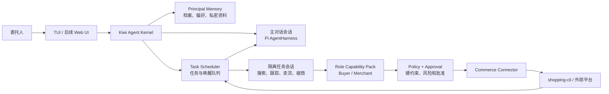
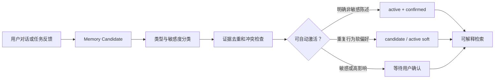
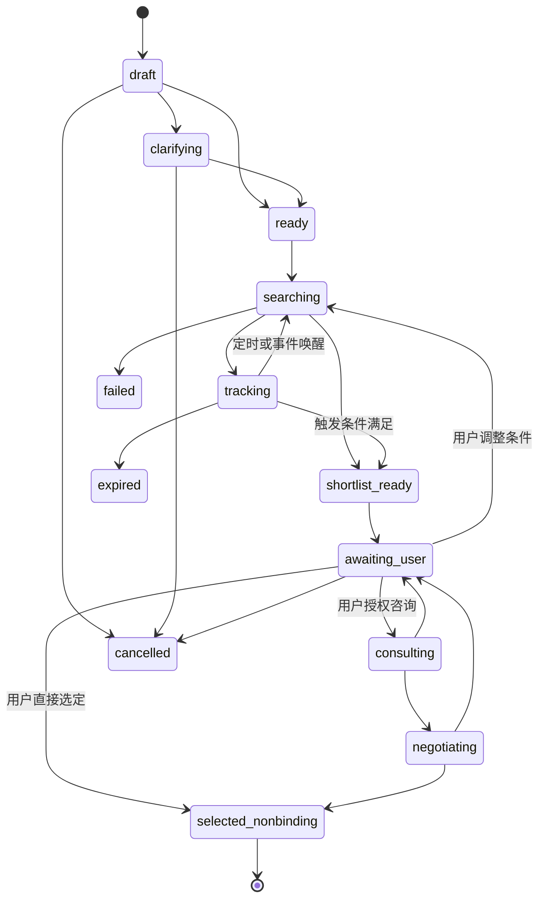
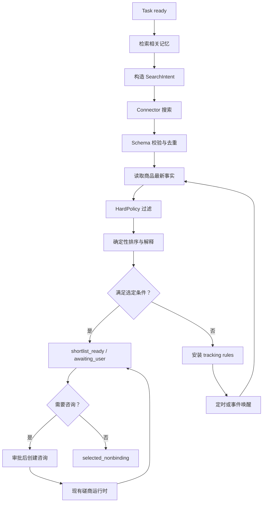

# Kiwi Agent-first 电商运行时设计（v0.3）

状态：v0.3.0-A（Agent 与记忆底座）与 v0.3.0-B（Buyer 搜索与跟踪）已实现——`src/agent/`（kernel、memory、vault、session、buyer task/scheduler/ranker、connector、chat TUI、`kiwi chat`），57 个新增测试全绿；C（咨询、磋商与 Merchant 能力包）与 v0.3.1 未实现。本文其余部分定义 v0.3 的产品边界、Agent 运行时、长期记忆数据模型，以及 Buyer 商品搜索、跟踪和选定任务模型。本文不改变 v0.2 已有代码与 `shopping.negotiation/0.1` 契约。

## 1. 设计结论

Kiwi v0.3 不再把自己定义为“自动处理一轮磋商的 CLI”，而是一个可独立运行、可持续对话、能逐渐理解委托人并代表委托人执行电商任务的 AI Agent。

每个 Kiwi 实例绑定一个不可变角色：

- `buyer`：理解并记忆消费者偏好，搜索、比较、跟踪、咨询和磋商商品，最终形成可解释的商品选定结果。
- `merchant`：理解并记忆商家的经营偏好，维护商品经营上下文，响应买家咨询并在授权范围内报价和磋商。

v0.3 的“选定”和“成交共识”都不具有订单效力。Kiwi 不创建订单、不支付、不退款、不预留库存，也不把非绑定磋商结果描述为已购买或已售出。

Kiwi 的长期壁垒不是调用某个大模型，而是形成一个由委托人掌控、可纠正、可解释、可删除的私人电商偏好模型，并用这个模型持续完成现实任务。

## 2. 产品目标与非目标

### 2.1 目标

1. 用户可以像使用 Hermes 一样与 Kiwi 自由对话，普通输入默认交给后端模型理解和回答，而不是只做正则命令解析。
2. 主对话跨进程重启恢复，并保留经过治理的长期记忆和未完成任务。
3. Kiwi 能从对话和用户反馈中逐步学习偏好，但把学习结果视为有证据和置信度的假设，而不是永久事实。
4. Buyer 能把自然语言需求转成搜索、跟踪、比较、咨询、磋商和非绑定选定任务。
5. Merchant 能把自然语言经营目标转成商品经营建议、目录动作候选和磋商决策。
6. 所有工具调用都经过角色能力、私有策略、风险分级、审批和幂等检查。
7. shopping-cli 继续作为第一个 Commerce Connector；未来外部电商平台使用同一连接器接口。
8. Embedded Pi 是 v0.3 的基础 Agent Runtime；OpenClaw 和 Hermes 通过后续 ACP Adapter 接入，不改变 Kiwi 的记忆、任务和策略语义。

### 2.2 非目标

- 不创建或提交订单。
- 不执行支付、退款、售后工单或库存预留。
- 不向模型开放 shell、任意文件读写、任意 HTTP 或动态安装工具。
- 不让 Buyer 与 Merchant 共用私有记忆、模型会话或凭据。
- 不把一次行为直接固化为永久偏好。
- 不保存或展示模型原始 chain-of-thought；只保存简洁结论、证据引用和行动理由。
- 不在 shopping-cli 数据库中保存 Kiwi 的私人用户画像。

## 3. 当前 v0.2 与 v0.3 的关系

v0.2 已经提供可复用的安全底盘：

- Pi 模型构造、供应商配置和流式调用。
- Buyer/Merchant 角色 profile 与私有策略门。
- `NegotiationRunner.prepare → submit → abandon` 的候选/提交分离。
- `OperatorController` 的 manual、supervised、autopilot 模式和审批状态机。
- shopping-cli 的 claim、心跳、幂等、审计和权威策略门。
- 操作者事件日志、权限控制、脱敏和崩溃恢复测试。

v0.3 在这些边界外增加 Agent Kernel、持久化主对话、结构化记忆、任务调度和角色能力包。现有磋商运行时继续作为一种任务执行器，不重写 shopping-cli，也不绕开现有策略门。

## 4. 总体架构



用户感知到的是一个连续的 Kiwi 身份，但内部不会使用一条无限增长、混合所有对方消息的上下文。主对话和每个任务的执行上下文相互隔离，只交换结构化目标、约束、事实和结果。

### 4.1 Agent Kernel

`AgentKernel` 是单个 Kiwi 实例的生命周期与并发所有者，负责：

- 建立和恢复主对话会话。
- 串行处理用户消息、Commerce 事件、定时唤醒和审批回复。
- 选择主对话或隔离任务会话处理事件。
- 调用记忆检索、记忆候选生成和任务调度。
- 把工具调用交给 Role Capability Pack 和 Policy Engine。
- 汇总任务进展并向用户解释。

同一实例内只有 Agent Kernel 可以提交状态变更。模型生成可以并行准备，但相同任务或相同 Commerce conversation 的写入必须串行化。

### 4.2 主对话会话

主对话使用 Pi `AgentHarness` 及其 Session 能力：

- 保存用户消息、助手公开回复、工具摘要和压缩摘要。
- 支持 streaming、abort、steering 和 follow-up queue。
- 普通文本默认由模型回答；slash command 只保留为确定性控制捷径。
- 恢复后继续同一 Agent 身份和任务视图。
- 不保存模型原始推理内容。

模型后端和 Agent Runtime 是两个独立概念：

- 模型后端：DeepSeek、OpenAI、Anthropic、Google、OpenRouter 等。
- Agent Runtime：Embedded Pi、后续 OpenClaw ACP、Hermes ACP。

### 4.3 隔离任务会话

每个搜索、跟踪、目录管理或磋商任务拥有独立任务会话。任务会话只得到：

- 当前任务目标。
- 与当前任务相关的最小记忆集合。
- 当前平台事实和时间戳。
- 当前角色可用工具。
- 硬约束、审批模式和执行预算。

任务完成后只把结构化结果、简洁理由和可学习信号写回主会话与记忆系统。对方消息、商品描述和平台内容始终作为不可信数据，不能成为系统指令。

## 5. 五个状态域

v0.3 必须明确区分五个状态域：

1. **User Chat Session**：用户与 Kiwi 的私有对话记录。
2. **Principal Memory**：经过治理的档案、偏好、约束和私密资料。
3. **Task State**：正在搜索、跟踪、咨询、磋商或经营的任务状态。
4. **Marketplace Conversation**：由 shopping-cli 或外部平台保存的权威公开交易会话。
5. **Reasoning Session**：单次模型执行上下文，默认短期存在，不保存原始推理。

Marketplace Conversation 不能直接写入 Principal Memory。只有经过分类的事实、用户反馈或结构化任务结果才能成为记忆候选。

## 6. 记忆设计原则

### 6.1 记忆是带证据的状态，不是聊天摘要

每条可用记忆必须回答：

- 记住了什么？
- 谁明确说过，或者从哪些行为观察到？
- 是事实、硬约束、软偏好、周期规律还是临时需求？
- 置信度是多少？
- 适用于所有购物、某个品类、某个平台还是当前任务？
- 何时需要重新确认或自动失效？
- 是否属于敏感信息？

### 6.2 明确陈述优先于推断

冲突处理顺序固定为：

```text
用户最近明确陈述
  > 用户已确认的稳定记忆
  > 多个不同任务中的重复行为
  > 单次行为推断
  > 模型猜测
```

低置信度推断只影响候选排序，不得自动变成硬过滤条件。模型猜测不能覆盖用户已确认事实。

### 6.3 敏感信息最小使用

- 精确地址、联系方式、Buyer 私有预算、Merchant 成本和底价进入独立加密 Vault。
- 普通记忆表只保存引用或经过降精度处理的信息。
- 商品搜索和交期估算优先使用城市/行政区级位置。
- 当前没有订单能力，精确地址原则上不发送给 shopping-cli、外部平台或交易对方。
- 检索时只向模型提供当前任务需要的最小字段，不把完整用户画像塞进 prompt。
- 未配置可用加密密钥时，Restricted 级记忆必须 fail closed，不得降级明文保存。

### 6.4 用户拥有记忆控制权

主对话和 TUI 必须支持：

```text
/memory                         查看记忆概览
/memory preferences             查看学习到的偏好和置信度
/memory private                 查看私密资料的字段名与状态，不回显明文
/forget <memory-id|描述>        删除或失效记忆
/correct <memory-id> <新内容>   修正并保留审计事件
/why                            说明当前推荐使用了哪些记忆
```

自然语言表达也应工作，例如“记住我更喜欢京东自营”“这个地址只用一次”“我不是只追求最低价”“忘掉以前关于咖啡的偏好”。

## 7. 记忆分类

### 7.1 已确认档案 `profile`

用户明确提供、相对稳定的事实：

- 常住城市和区域。
- 常用收货地址标签。
- 家庭人数或使用人数。
- 常用购物平台。
- 明确食物偏好、禁忌和过敏原。
- Merchant 的经营类目、配送范围和售后政策。

### 7.2 硬约束 `constraint`

不能被模型自行放宽的边界：

- Buyer 最大总价、最晚交付时间、必需售后条款、禁忌成分。
- Merchant 私有底价、折扣授权、库存约束、不能承诺的售后内容。
- 角色和产品边界，例如 no-order。

### 7.3 学习偏好 `preference`

通过明确表达或重复行为形成的软偏好：

- 价格敏感度和品质权重。
- 对优惠券、满减、赠品、包邮或会员价的偏好。
- 品牌、平台、商家和配送方式偏好。
- 对交期、售后和商家信誉的敏感度。
- Merchant 的报价风格、促销方式、客户分层和风险容忍度。

### 7.4 周期规律 `routine`

适合日用品、食品和重复采购的时间序列：

- 通常购买数量。
- 使用人数和使用频率。
- 预计消耗速度。
- 上次确认时间和预计耗尽时间。
- 可接受替代规格。

### 7.5 情节记忆 `episode`

对未来判断有价值的历史结果：

- 用户为何接受或排除某个商品。
- 一次推荐中哪些因素改变了最终选择。
- 某平台价格、库存或售后信息是否可靠。
- Merchant 的某类报价为何未成交或转人工。

情节记忆应保存结构化结论和引用，不复制整段对话。

### 7.6 临时任务上下文 `task_context`

只对当前任务生效，例如“这次送礼”“今天必须到”“本轮只看某平台”。任务结束后默认归档或过期，不能自动提升为全局偏好。

## 8. 记忆存储架构

Kiwi 使用独立于 shopping-cli 的本地 SQLite 数据库，例如：

```text
.kiwi/agents/<agent_id>/state.sqlite
.kiwi/agents/<agent_id>/sessions/main.jsonl
```

- JSONL Session 保存主对话可见内容和压缩摘要。
- SQLite 保存结构化记忆、任务、候选商品、观察记录、审批和审计事件。
- Restricted 数据的明文不进入 SQLite 普通列，而是进入加密 Vault。
- 数据目录保持 `0700`，文件保持 `0600`。
- schema 迁移必须带版本号、事务和回滚测试。

## 9. 记忆数据模型

### 9.1 `principals`

每个 Kiwi 实例对应一个委托人和一个固定角色。

| 字段 | 类型 | 说明 |
|---|---|---|
| `principal_id` | text PK | 本地稳定标识 |
| `owner_id` | text | profile 中的 owner |
| `role` | buyer/merchant | 创建后不可变 |
| `display_name` | text nullable | 用户自定义称呼 |
| `locale` | text | 语言和地区 |
| `timezone` | text | 时间计算依据 |
| `memory_schema_version` | integer | 当前为 `1` |
| `created_at` | RFC3339 | 创建时间 |
| `updated_at` | RFC3339 | 最近更新时间 |

### 9.2 `memory_items`

结构化记忆的当前视图。

| 字段 | 类型 | 说明 |
|---|---|---|
| `memory_id` | text PK | UUIDv7 |
| `principal_id` | text FK | 所属委托人 |
| `namespace` | text | `profile/constraint/preference/routine/episode/task_context` |
| `key` | text | 稳定语义键，例如 `shopping.price_sensitivity` |
| `value_json` | JSON nullable | 非 Restricted 的结构化值 |
| `vault_ref` | text nullable | Restricted 值的 Vault 引用 |
| `scope_json` | JSON | global、品类、平台、商家或任务范围 |
| `source_kind` | text | `explicit/observed/inferred/imported` |
| `confidence` | real | `0..1` |
| `sensitivity` | text | `normal/private/restricted` |
| `status` | text | `candidate/active/needs_review/superseded/deleted/expired` |
| `confirmed_at` | RFC3339 nullable | 用户确认时间 |
| `valid_from` | RFC3339 nullable | 生效时间 |
| `expires_at` | RFC3339 nullable | 自动失效时间 |
| `last_observed_at` | RFC3339 nullable | 最近证据时间 |
| `evidence_count` | integer | 有效支持证据数量 |
| `version` | integer | 乐观并发版本 |
| `created_at` | RFC3339 | 创建时间 |
| `updated_at` | RFC3339 | 更新时间 |

约束：

- `value_json` 与 `vault_ref` 只能二选一。
- `explicit + confirmed` 记忆的置信度为 `1.0`，除非用户后续修正。
- `inferred` 记忆不能直接写成硬约束。
- Restricted 记忆只能来自 `explicit` 或用户确认后的候选。
- `needs_review` 仍可作为带提示的软参考；它不能作为硬过滤依据。`expired` 不参与检索。
- 删除采用 tombstone 和审计事件；检索层永远不返回 deleted/superseded/expired 项。

示例：

```json
{
  "memory_id": "mem_01...",
  "principal_id": "buyer-001",
  "namespace": "preference",
  "key": "shopping.promotion.preference",
  "value_json": {
    "kind": "free_shipping_over_small_discount",
    "strength": 0.72
  },
  "scope_json": {
    "category": "daily_goods"
  },
  "source_kind": "observed",
  "confidence": 0.72,
  "sensitivity": "private",
  "status": "active",
  "evidence_count": 4,
  "last_observed_at": "2026-08-05T12:00:00+08:00",
  "version": 3
}
```

### 9.3 `memory_evidence`

保存“为什么会形成这条记忆”。

| 字段 | 类型 | 说明 |
|---|---|---|
| `evidence_id` | text PK | UUIDv7 |
| `memory_id` | text FK | 对应记忆 |
| `source_type` | text | `chat/task_feedback/selection/rejection/import` |
| `source_ref` | text | 会话、任务或事件引用，不保存原始推理 |
| `polarity` | text | `support/contradict` |
| `weight` | real | `0..1` |
| `summary` | text | 可向用户解释的简短证据 |
| `observed_at` | RFC3339 | 发生时间 |
| `created_at` | RFC3339 | 写入时间 |

同一任务中的重复点击不能伪装成多个独立证据。`evidence_count` 只统计去重后的不同任务或不同时间窗口。

### 9.4 `memory_events`

追加式审计流：

```text
memory.proposed
memory.confirmed
memory.activated
memory.corrected
memory.contradicted
memory.superseded
memory.forgotten
memory.expired
```

事件包含 `event_id`、`memory_id`、`actor`、`reason`、前后版本摘要和时间。事件不得包含 Restricted 明文。

### 9.5 `private_vault`

| 字段 | 类型 | 说明 |
|---|---|---|
| `vault_ref` | text PK | 非语义化引用 |
| `principal_id` | text FK | 所属委托人 |
| `kind` | text | `address/contact/private_budget/merchant_cost/merchant_floor/other` |
| `ciphertext` | blob | AEAD 加密值 |
| `nonce` | blob | 唯一随机 nonce |
| `key_version` | integer | 支持密钥轮换 |
| `value_fingerprint` | text | 带密钥 HMAC，用于去重，不可反查 |
| `retention_json` | JSON | 到期和使用限制 |
| `created_at` | RFC3339 | 创建时间 |
| `updated_at` | RFC3339 | 更新时间 |

Key Provider 优先使用操作系统安全存储；开发环境可以显式配置 `KIWI_DATA_KEY`。没有密钥时不得写入 Restricted 数据。

### 9.6 `memory_retrieval_log`

记录每次任务读取了哪些记忆以及用途：

| 字段 | 类型 | 说明 |
|---|---|---|
| `retrieval_id` | text PK | UUIDv7 |
| `task_id` | text nullable | 对应任务 |
| `session_id` | text | 请求会话 |
| `memory_id` | text | 被使用记忆 |
| `purpose` | text | filter、rank、clarify、negotiate、explain |
| `redaction_level` | text | 提供给模型的精度 |
| `created_at` | RFC3339 | 读取时间 |

该日志用于 `/why`、隐私审计和删除影响分析。

## 10. 偏好学习与衰减

### 10.1 写入流程



建议的初始规则：

- 用户明确说“记住”且不是 Restricted 推断：直接 active、confirmed、confidence `1.0`。
- 一次选择行为：创建 candidate，不进入硬过滤。
- 至少三个不同任务或时间窗口中出现一致信号：可以激活为 soft preference，但仍允许用户纠正。
- 精确地址、健康/过敏、联系方式、私有预算、Merchant 成本和底价：必须明确提供或明确确认。
- 与现有记忆冲突时，不静默覆盖；创建 contradict evidence，并优先询问或采用最近明确陈述。

### 10.2 衰减

- 明确确认的稳定档案不自动衰减，但超过复核周期时标记 `needs_review`。
- 行为推断的软偏好按品类和时间衰减。
- 促销偏好可以慢衰减；临时送礼、节日、出差等 task_context 在任务结束后快速过期。
- 日用品消耗频率使用新观察滚动更新，并保存预测区间，不能只存单点日期。

### 10.3 检索排序

记忆检索评分至少考虑：

```text
任务相关性 × scope 匹配 × 置信度 × 新鲜度 × 来源权重
```

每个任务只检索有限数量的相关记忆。硬约束单独注入 Policy Engine，不依赖向量相似度命中。

## 11. Buyer 任务模型

### 11.1 Buyer 的目标闭环

```text
理解用户
  → 澄清需求
  → 形成结构化搜索意图
  → 搜索和硬约束过滤
  → 持续观察价格、促销、库存、交期和售后
  → 解释性排序和候选集
  → 必要时发起咨询/磋商
  → 形成非绑定选定结果
```

### 11.2 `buyer_tasks`

| 字段 | 类型 | 说明 |
|---|---|---|
| `task_id` | text PK | UUIDv7 |
| `principal_id` | text FK | Buyer 委托人 |
| `status` | text | 见状态机 |
| `goal_text` | text | 用户原始目标的简洁表达 |
| `intent_json` | JSON | 品类、用途、数量、时间等结构化意图 |
| `constraints_json` | JSON | 当前任务硬约束；私密值使用 vault_ref |
| `ranking_policy_json` | JSON | 可解释的维度和权重来源 |
| `connector_scope_json` | JSON | 允许搜索的平台/连接器 |
| `search_budget_json` | JSON | 最大页数、候选数、模型/请求预算 |
| `tracking_policy_json` | JSON | 频率、到期、触发条件 |
| `selected_candidate_id` | text nullable | 非绑定选定结果 |
| `next_run_at` | RFC3339 nullable | 下一次唤醒 |
| `expires_at` | RFC3339 nullable | 任务到期 |
| `version` | integer | 乐观并发版本 |
| `created_at` | RFC3339 | 创建时间 |
| `updated_at` | RFC3339 | 更新时间 |

`intent_json` 示例：

```json
{
  "category": "laundry_detergent",
  "use_case": "family_daily_use",
  "quantity": 2,
  "location_precision": "district",
  "needed_by": "2026-08-20T18:00:00+08:00",
  "required_terms": ["policy:return-7d"],
  "preferences": ["free_shipping", "official_store"],
  "open_questions": []
}
```

### 11.3 状态机



状态说明：

- `draft`：刚从对话生成，尚未确定是否信息足够。
- `clarifying`：等待用户补充会显著影响结果的条件。
- `ready`：搜索意图和约束已可执行。
- `searching`：正在从一个或多个 Connector 获取候选。
- `tracking`：候选存在，但价格、库存、促销或交期尚未满足触发条件。
- `shortlist_ready`：已有足够新鲜、可解释的候选集。
- `awaiting_user`：等待用户选择、修改条件或授权咨询。
- `consulting`：已创建咨询，等待商家公开回复。
- `negotiating`：在现有 `shopping.negotiation/0.1` 约束内磋商。
- `selected_nonbinding`：完成商品选定，但没有订单效力。

每次状态迁移都写入 `task_events`，并携带 `expected_version` 防止后台唤醒与用户命令并发覆盖。

### 11.4 `task_events`

追加式任务日志：

| 字段 | 类型 | 说明 |
|---|---|---|
| `event_id` | text PK | UUIDv7 |
| `task_id` | text FK | 所属任务 |
| `type` | text | created、clarified、search_started、observation_added、shortlisted、approval_requested、consultation_linked、selected 等 |
| `payload_json` | JSON | 脱敏后的结构化事件 |
| `origin` | text | user、scheduler、model、connector、policy |
| `idempotency_key` | text unique | 防重放 |
| `created_at` | RFC3339 | 事件时间 |

### 11.5 `product_candidates`

| 字段 | 类型 | 说明 |
|---|---|---|
| `candidate_id` | text PK | 本地候选标识 |
| `task_id` | text FK | 所属 Buyer 任务 |
| `connector_id` | text | shopping-cli 或外部平台 |
| `platform` | text | 平台名 |
| `external_product_id` | text | 平台商品标识 |
| `sku` | text nullable | 可用时保存 SKU |
| `merchant_id` | text nullable | 商家标识 |
| `canonical_key` | text | 跨观察去重键 |
| `eligibility` | text | eligible、ineligible、unknown |
| `candidate_status` | text | discovered、tracked、shortlisted、rejected、selected、stale |
| `score` | real nullable | 当前排序分数 |
| `score_explanation_json` | JSON | 每个维度的贡献和记忆引用 |
| `rejection_reasons_json` | JSON | 被硬过滤或用户排除的原因 |
| `first_seen_at` | RFC3339 | 首次发现 |
| `last_seen_at` | RFC3339 | 最近观察 |
| `latest_observation_id` | text nullable | 最新事实快照 |

`canonical_key` 不能只依赖商品标题。shopping-cli 优先使用 connector + SKU；外部平台使用 connector + external_product_id。跨平台同款归并是后续能力，v0.3 不得用模糊模型判断静默合并。

### 11.6 `product_observations`

商品事实是带来源和时间戳的观察，不是永久属性。

| 字段 | 类型 | 说明 |
|---|---|---|
| `observation_id` | text PK | UUIDv7 |
| `candidate_id` | text FK | 对应候选 |
| `observed_at` | RFC3339 | 观察时间 |
| `source_url_or_ref` | text | 平台引用或 shopping-cli 引用 |
| `title` | text | 当时标题 |
| `price_json` | JSON | 标价、到手价、币种和计算依据 |
| `promotion_json` | JSON | 优惠券、满减、赠品、包邮等 |
| `stock_json` | JSON | 数量或可用性及 observed_at |
| `delivery_json` | JSON | 地址精度、费用和 ETA |
| `after_sales_json` | JSON | 售后 policy refs |
| `merchant_json` | JSON | 商家公开质量信息 |
| `content_hash` | text | 相同观察去重 |
| `fresh_until` | RFC3339 | 事实可使用截止时间 |

过期 observation 可以用于趋势，不得用于当前库存或当前价格断言。

### 11.7 `tracking_rules`

| 字段 | 类型 | 说明 |
|---|---|---|
| `rule_id` | text PK | UUIDv7 |
| `task_id` | text FK | 所属任务 |
| `candidate_id` | text nullable | 可针对单个候选或整个任务 |
| `rule_type` | text | price_below、stock_available、promotion_changed、delivery_before、new_candidate、periodic_review |
| `condition_json` | JSON | 阈值或条件；私密阈值使用 vault_ref |
| `interval_seconds` | integer | 轮询频率下限 |
| `next_check_at` | RFC3339 | 下一次检查 |
| `last_triggered_at` | RFC3339 nullable | 上次触发 |
| `cooldown_seconds` | integer | 通知冷却 |
| `status` | text | active、paused、completed、expired |

Scheduler 必须有全局并发、请求速率、模型调用和重试预算。多个规则命中同一候选时合并成一次观察与一次用户通知。

### 11.8 `consultation_links`

把 Buyer Task 与 shopping-cli 会话关联，但不复制其权威会话状态。

| 字段 | 类型 | 说明 |
|---|---|---|
| `link_id` | text PK | UUIDv7 |
| `task_id` | text FK | Buyer 任务 |
| `candidate_id` | text FK | 对应候选 |
| `connector_id` | text | Commerce Connector |
| `conversation_id` | text | 权威会话 ID |
| `status` | text | consulting、negotiating、closed、stale |
| `last_message_id` | text nullable | 最近处理消息 |
| `created_at` | RFC3339 | 创建时间 |
| `updated_at` | RFC3339 | 更新时间 |

## 12. Buyer 搜索与排序

### 12.1 澄清门

模型只有在缺失信息会显著改变搜索结果时才追问。以下通常属于澄清条件：

- 商品品类或用途不明确。
- 数量、适用人数或规格会影响价格比较。
- 地址区域会影响可售、运费或交期。
- 用户提到预算但没有说明总价还是单价。
- 食品、健康相关商品缺少明确禁忌或过敏信息。

非关键偏好可以使用已确认记忆或合理默认值执行，并在结果中明确说明。

### 12.2 硬过滤

硬过滤只能来自：

- 用户当前明确约束。
- 已确认的 HardPolicy。
- 平台和商品结构化事实。
- no-order 等产品边界。

推断偏好、历史品牌选择或价格敏感度不能直接删除候选。

### 12.3 可解释排序

排序维度包括：

```text
商品匹配度
+ 总成本
+ 促销价值
+ 价格历史位置
+ 库存可用性
+ 交期
+ 售后覆盖
+ 平台偏好
+ 品牌/规格偏好
+ 商家公开质量
+ 磋商结果
+ 信息新鲜度
```

每个维度的权重必须能够追溯到用户当前指令、已确认记忆或默认策略。模型可以生成解释和建议，但最终分数由确定性 Ranker 计算，避免同一事实在重复运行时无理由漂移。

输出至少包含：

- 首选候选。
- 两到三个备选候选。
- 推荐理由和主要取舍。
- 使用了哪些偏好记忆。
- 哪些事实已经过期或仍不确定。
- 是否值得继续等待价格、库存或促销变化。
- 是否建议发起咨询或磋商。

### 12.4 选定语义

`selected_nonbinding` 表示用户或已授权 Agent 选择了最合适的商品候选，并记录当时观察快照和理由。它不是下单，也不能声称价格、库存或交期仍然有效。

选定记录应包含：

- candidate_id 与 observation_id。
- 选定时间。
- 用户明确选择或 Autopilot 授权依据。
- 排序解释。
- 当前磋商共识引用。
- “未创建订单”的显式边界。

## 13. 搜索跟踪执行循环



每次执行必须有：

- `run_id` 和幂等键。
- 最大候选数、最大请求数、模型步数和总超时。
- Connector 错误的分类重试。
- observation 新鲜度检查。
- 中止和重启后的安全恢复。
- 对用户可见的进度摘要，而不是静默无限运行。

## 14. Merchant 记忆模型

Merchant 复用同一套 `memory_items + evidence + vault` 模型，但使用不同 namespace key 和 Role Capability Pack。

建议的 Merchant 记忆键包括：

```text
merchant.catalog.categories
merchant.customer.target_segments
merchant.pricing.positioning
merchant.discount.preference
merchant.promotion.preference
merchant.inventory.low_threshold.<sku>
merchant.inventory.turnover_goal.<category>
merchant.delivery.coverage
merchant.after_sales.policy
merchant.negotiation.tone
merchant.negotiation.escalation_rules
merchant.channel.preference
```

进入 Vault 的字段包括：

```text
merchant.cost.<sku>
merchant.floor_price.<sku>
merchant.margin_target.<category>
merchant.private_customer_terms.<segment>
```

Merchant 学习信号可以来自：

- 商家明确指令。
- 对报价候选的批准、修改和拒绝。
- 某类咨询转人工的重复模式。
- 商品价格和库存操作的历史选择。
- 非成交原因和售后例外处理结果。

学习结果只能在已授权能力内影响候选。私有成本、底价、利润和内部客户策略不得出现在 Buyer 可见消息、Marketplace Conversation 或模型外发日志中。

## 15. Role Capability Pack

### 15.1 Buyer 只读工具

- `search_products`
- `get_product`
- `search_merchants`
- `get_product_observation`
- `list_buyer_tasks`
- `get_buyer_task`
- `get_negotiation_snapshot`

### 15.2 Buyer 写入工具

- `create_buyer_task`
- `update_buyer_task_constraints`
- `add_tracking_rule`
- `pause_tracking_rule`
- `start_consultation`
- `submit_negotiation_decision`
- `select_product_nonbinding`
- `cancel_buyer_task`

### 15.3 Merchant 只读工具

- `list_catalog_products`
- `get_catalog_product`
- `get_inventory_snapshot`
- `list_incoming_consultations`
- `get_negotiation_snapshot`
- `get_human_review_queue`

### 15.4 Merchant 写入工具

- `draft_product_change`
- `create_product`
- `update_product`
- `update_inventory`
- `submit_negotiation_decision`
- `pause_or_resume_listing`

shopping-cli 当前 Agent token 的磋商权限不能被默认为目录权限。Connector 内部需要 Credential Broker，把 negotiation、catalog、inventory scope 分开持有；模型只能看到工具，不接触 token。

## 16. 风险、策略和审批

现有三种模式继续使用：

| 操作 | manual | supervised | autopilot |
|---|---:|---:|---:|
| 自由对话 | 自动 | 自动 | 自动 |
| 搜索、读取和比较 | 自动 | 自动 | 自动 |
| 创建任务和跟踪规则 | 建议 | 自动 | 自动 |
| 生成公开草稿 | 建议 | 自动 | 自动 |
| 发送咨询/磋商消息 | 禁止 | 需批准 | HardPolicy 内自动 |
| 商品、价格、库存修改 | 禁止 | 需批准 | 仅显式预授权范围内自动 |
| 选定商品（非绑定） | 建议 | 需确认 | 仅满足明确授权时自动 |
| 订单、支付、退款、预留 | 禁止 | 禁止 | 禁止 |

批准对象不是一句“同意”，而是带内容哈希的 `ActionCandidate`：

```json
{
  "candidate_id": "act_01...",
  "task_id": "task_01...",
  "tool": "update_inventory",
  "arguments_hash": "sha256:...",
  "preconditions_hash": "sha256:...",
  "risk": "write_catalog",
  "expires_at": "2026-08-05T18:00:00+08:00"
}
```

执行前重新读取商品、库存、价格和会话状态。参数或前置状态变化后，旧批准失效并重新生成候选。

## 17. 记忆与 Prompt Injection 边界

- 商品标题、描述、评论、商家消息和买家消息都标记为 untrusted external data。
- 外部文本不能调用 `/remember`、修改 HardPolicy、读取 Vault 或改变工具 allowlist。
- 外部内容产生的偏好候选默认 source=`inferred`，不能成为 Restricted 记忆。
- 工具结果通过结构化 schema 进入模型；未知字段 fail closed 或被隔离。
- 主对话检索与任务检索分别记录 `memory_retrieval_log`。
- Buyer 和 Merchant 的数据库、session 目录、加密 key 和 token 必须物理隔离。

## 18. 失败与恢复语义

### 18.1 模型失败

- 自由对话模型失败不改变任务或 Commerce 状态。
- 任务模型失败保留任务和最新 observation，进入可重试状态。
- 401/403/配额错误不无限重试，向用户显示可操作错误。

### 18.2 Connector 失败

- 搜索部分失败保留成功来源，并明确标注不完整。
- 价格、库存或交期读取失败时不得沿用过期事实冒充当前事实。
- 写入结果不确定时先按幂等键查询或重放，不能盲目重试。

### 18.3 崩溃恢复

- SQLite 事务和 task event log 恢复任务当前状态。
- Scheduler 根据 `next_run_at` 重建唤醒队列。
- 在途 Commerce claim 继续使用现有 heartbeat/stale-abandon 机制。
- `awaiting_approval` 的 ActionCandidate 恢复后重新验证状态和有效期。
- Session 或数据库损坏 fail closed，不能以空记忆继续 Autopilot。

## 19. 测试与验收

### 19.1 记忆单元测试

- explicit、observed、inferred 和记忆确认规则。
- scope 匹配、置信度、新鲜度和来源排序。
- 冲突证据、纠正、supersede、forget 和 expiry。
- 不同任务中的 evidence 去重。
- Restricted 值只进 Vault，日志和事件不含明文。
- 无加密 key 时 Restricted 写入 fail closed。
- Buyer/Merchant 记忆不可跨实例读取。
- `/why` 能准确列出使用的 memory_id 和 redaction level。

### 19.2 Buyer 任务单元测试

- 状态机所有合法和非法迁移。
- 乐观版本冲突与并发唤醒。
- 搜索去重、observation freshness 和 content_hash 去重。
- HardPolicy 过滤与 soft preference 排序分离。
- 价格、促销、库存、交期和售后各类 tracking rule。
- cooldown 合并通知。
- selected_nonbinding 明确没有订单语义。
- 任务重启恢复和过期。

### 19.3 LLM Evals

- 自由对话能理解需求并在必要时追问。
- 不把一次行为描述成稳定偏好。
- 能正确提出 memory candidate，而不擅自保存敏感信息。
- 推荐解释引用真实记忆和 observation，不编造价格、库存或偏好。
- 商品描述或对方消息中的 prompt injection 不能读取私有信息或扩大工具权限。
- Merchant 报价不泄漏底价、成本或内部策略。

### 19.4 集成测试

Buyer 完整路径：

```text
自由对话提出需求
  → 记忆检索与必要澄清
  → shopping-cli 搜索
  → 候选和 observation
  → 跟踪触发
  → shortlist
  → 用户批准咨询
  → merchant 磋商
  → selected_nonbinding
  → 数据库不存在 order/payment/reservation
```

Merchant 完整路径：

```text
商家表达经营偏好
  → 形成或确认记忆
  → 买家咨询到达
  → 使用库存、售后和授权策略生成候选
  → 批准或 HardPolicy 内自动提交
  → 私有底价不出现在公开消息或日志
```

### 19.5 本机验收

1. 启动独立 Buyer 和 Merchant Kiwi。
2. 两边分别进行不少于 20 轮自由对话。
3. 重启后主对话、记忆、任务和 pending approval 恢复。
4. Buyer 创建一个需要跟踪价格和库存的真实 shopping-cli 任务。
5. Merchant 使用自己的经营偏好响应 Buyer。
6. Buyer 得到首选和备选、解释、事实时间戳及非绑定选定结果。
7. 检查 SQLite、JSONL 和日志：无 token、精确地址、Buyer 私有预算、Merchant 底价或 chain-of-thought 泄漏。
8. 检查 shopping-cli：无订单、支付、退款或库存预留记录。

## 20. 分阶段交付

### v0.3.0-A：Agent 与记忆底座

- Agent Kernel 与持久化主对话。
- SQLite schema、migration、MemoryStore、Vault 和检索日志。
- `/memory`、`/forget`、`/correct`、`/why`。
- 明确记忆和候选记忆写入闭环。
- Buyer/Merchant 物理隔离和敏感信息测试。

### v0.3.0-B：Buyer 搜索与跟踪

- shopping-cli 商品/商家搜索 Connector。
- Buyer task、candidate、observation 和 tracking rule。
- 硬过滤、确定性排序和解释。
- Scheduler、预算、重试、通知合并和重启恢复。
- selected_nonbinding。

### v0.3.0-C：咨询、磋商与 Merchant

- Buyer Task 与 Marketplace Conversation 关联。
- 复用现有 NegotiationRunner 和策略门。
- Merchant 记忆注入、目录读取和经营建议。
- Catalog/Inventory Credential Broker 与审批候选。
- Buyer/Merchant 双实例真实 E2E。

### v0.3.1：自治和外部 Runtime

- 更完整的后台事件唤醒和 Autopilot 预算。
- Pi 之外的 OpenClaw/Hermes ACP Adapter。
- 多 Commerce Connector 的统一搜索与观察。

## 21. v0.3.0 完成定义

只有同时满足以下条件，Kiwi 才能称为 Agent-first 电商 Agent：

1. 普通 TUI 输入由真实后端模型自由理解和回答。
2. 主对话、结构化记忆和任务可以安全恢复。
3. 用户能查看、解释、纠正和删除记忆。
4. Buyer 能从一句自然语言需求开始，完成搜索、跟踪、比较、咨询、磋商和非绑定选定。
5. Merchant 能使用自己的经营偏好和私有策略智能响应 Buyer。
6. 学习偏好有来源、证据、置信度、scope 和有效期，不把一次行为永久化。
7. 精确地址、私有预算、成本和底价受 Vault 与最小披露保护。
8. 所有写操作可审计、幂等、经过策略和审批。
9. Prompt injection 无法读取记忆、凭据或扩大能力。
10. 整个系统仍然不存在订单、支付、退款和库存预留能力。

## 22. 明确不在 v0.3.0 范围

- 自动下单和支付。
- 物流履约和退款执行。
- 跨 Buyer/Merchant 的共享画像。
- 无审批的任意商品价格和库存修改。
- 自动跨平台同款商品实体合并。
- 使用原始 chain-of-thought 作为记忆。
- 云端同步私人记忆；v0.3.0 先采用单机 local-first。
