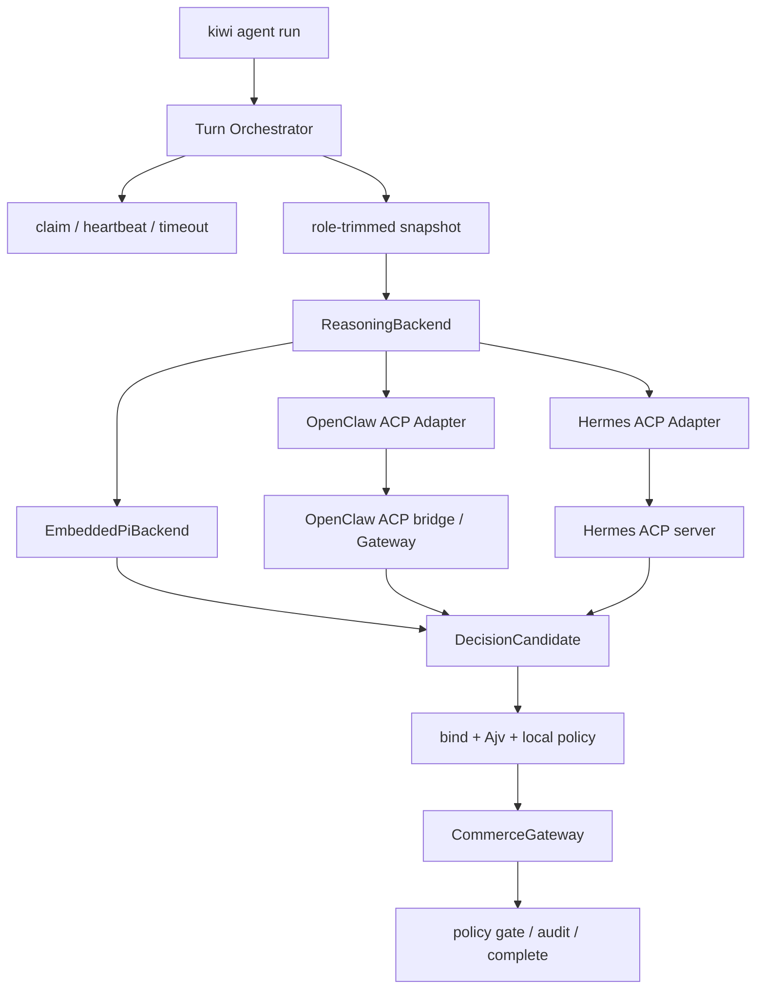

# Kiwi 外部 Agent Adapter 设计（v0.2.1）

状态：设计稿，当前 `0.1.0` 未实现。
目标：让 Kiwi 可以把 OpenClaw 或 Hermes 作为外部推理 Agent，同时保持 Kiwi 对电商状态、策略和写入的控制。

前置设计：v0.2.0 先建立推理后端无关的 Operator Control Plane、`DecisionCandidate`、审批状态机和 Embedded Pi TUI；本 Adapter 在 v0.2.1 接入同一控制面。详见 [`operator-tui-v0.2.md`](operator-tui-v0.2.md)。

## 1. 设计结论

OpenClaw/Hermes 替换的是 Kiwi 的“推理后端”，不是 Commerce Gateway。

- Kiwi 负责 claim、heartbeat、timeout、snapshot 裁剪、策略校验、幂等、审计和最终写入。
- OpenClaw/Hermes 负责理解买卖双方上下文并生成一份结构化决策候选。
- 外部 Agent 的输出始终是不可信输入，必须经过 Kiwi 的绑定校验和冻结 JSON Schema 校验后，才能提交给 Commerce Gateway。
- `CommerceClient` 接口保持不变，shopping-cli 仍是默认的电商权威后端；未来可替换为其他 CommerceGateway 实现。

ACP 适合作为外部推理连接层：OpenClaw 通过 ACP bridge 暴露 Gateway session，Hermes 通过 `hermes acp` 提供 stdio JSON-RPC ACP Server。Kiwi 自己的 Operator Control Plane 仍是用户策略和审批的权威入口。OpenClaw 的 bridge 不支持按 session 动态注入 MCP，因此本设计不依赖外部 Agent 的临时工具注入。

参考：

- [OpenClaw ACP 文档](https://docs.openclaw.ai/cli/acp)
- [Hermes 编程集成文档](https://github.com/NousResearch/hermes-agent/blob/main/website/docs/developer-guide/programmatic-integration.md)
- [Hermes ACP 文档](https://github.com/NousResearch/hermes-agent/blob/main/website/docs/user-guide/features/acp.md)

## 2. 目标与非目标

### 目标

1. 同一个 Kiwi turn 可以选择 `pi`、`openclaw_acp` 或 `hermes_acp`。
2. buyer 和 merchant 可以分别选择不同的外部 Agent。
3. 外部 Agent 能完成 ask、propose、counter、accept_nonbinding、decline、escalate。
4. 外部 Agent 失败、超时或返回非法结构时，不会产生 Commerce 写入。
5. Pi、OpenClaw、Hermes 三种后端共享完全相同的策略、幂等、重试和 no-order 语义。

### 非目标

- 不把 OpenClaw/Hermes 的原生工具直接暴露给商品磋商 turn。
- 不让外部 Agent 持有 `SHOPPING_*` Commerce token。
- 不在 Kiwi 中复制 OpenClaw/Hermes 的 session、memory 或 channel 语义。
- 不让外部 Agent 绕过 v0.2.0 的操作者审批或三层策略。
- 不在 v0.2.1 引入订单、支付、库存锁定或跨平台结算。

## 3. 组件结构



新增抽象应位于现有 `src/runtime/`，而不是 `src/commerce/`：

```text
ReasoningBackend
  ├── EmbeddedPiBackend       # 0.1.0 现有路径
  └── AcpReasoningBackend
      ├── OpenClawAdapter
      └── HermesAdapter
```

建议接口：

```text
check() -> BackendHealth
openSession(turn) -> ReasoningSession
sendTask(session, task) -> AsyncIterable<ReasoningEvent>
cancel(session) -> void
close(session) -> void
```

`ReasoningBackend` 只返回 `DecisionCandidate` 或结构化错误，不拥有 Commerce 写权限。

## 4. ACP 任务协议

Kiwi 为每个 turn 生成一个任务包。任务包包含角色裁剪后的 snapshot 和输出约束，不包含 Commerce token、模型 API key 或另一方的私有策略。

```json
{
  "type": "kiwi.negotiation.turn",
  "protocol_version": "shopping.negotiation/0.1",
  "role": "merchant",
  "conversation_id": "conv-001",
  "message_id": 2,
  "snapshot": {},
  "allowed_actions": ["ask", "counter", "accept_nonbinding", "decline", "escalate"],
  "output_format": "kiwi.decision_candidate.v1"
}
```

外部 Agent 只返回候选字段：

```json
{
  "action": "counter",
  "proposal": {},
  "open_issues": [],
  "public_message": "购买两件可以按 89 元每件提供。",
  "confidence": 0.86,
  "reason_codes": [],
  "request_human_review": false
}
```

Kiwi 自己补齐并锁定以下字段：

- `protocol_version`
- `conversation_id`
- `in_reply_to_message_id`
- 当前 claim 绑定
- 内容寻址幂等键

外部 Agent 不能伪造 conversation、message 或 protocol 绑定。

## 5. Session 生命周期

一个磋商 turn 的生命周期：

```text
claim
  -> snapshot
  -> open ACP session
  -> send task
  -> parse DecisionCandidate
  -> bind + schema + local policy validation
  -> submit_negotiation_decision
  -> rejected_retryable: 同一 session 修复
  -> accepted / human_required: complete
  -> timeout / crash / invalid output: fail 或 abandon
```

默认按 turn 创建短 session；同一 turn 内的策略修复复用 session。跨 turn 不复用外部 transcript，Marketplace conversation 才是长期权威记忆。

OpenClaw 使用 role-scoped session key，例如 `agent:kiwi-merchant:main`，需要支持 reset，避免混入其他任务历史。Hermes 使用 ACP 进程内的 session manager；Kiwi 以独立 session 绑定当前 turn。

Kiwi 只管理自己启动的 ACP bridge 子进程。OpenClaw Gateway 和 Hermes 的全局配置、模型登录及渠道服务由对应生态自行管理。

## 6. Profile 设计

保持现有 `model` 配置兼容，并新增可选的 `agent_backend`：

```yaml
agent_backend:
  kind: openclaw_acp
  command: openclaw
  args:
    - acp
    - --session
    - agent:kiwi-merchant:main
    - --reset-session
  gateway_url_env: OPENCLAW_GATEWAY_URL
  gateway_token_env: OPENCLAW_GATEWAY_TOKEN
  tool_policy: deny_all
```

```yaml
agent_backend:
  kind: hermes_acp
  command: hermes
  args:
    - acp
  env:
    HERMES_ACP_SKIP_CONFIGURED_MCP: "1"
  tool_policy: deny_all
```

共同校验规则：

- `kind` 只能是 `embedded_pi`、`openclaw_acp`、`hermes_acp`。
- command 使用 argv 启动，禁止 shell 字符串拼接。
- `args`、环境变量名、工作目录和 timeout 有严格 allowlist/上限。
- ACP backend 必须显式 `tool_policy: deny_all`。
- `SHOPPING_*` token 不能出现在 ACP 子进程环境中。
- `kiwi doctor` 必须检查命令存在、ACP 依赖、OpenClaw Gateway 或 Hermes 配置可用。

## 7. 安全与失败语义

### 安全

1. 外部 Agent 不获得 Commerce HTTP 工具和 Commerce token。
2. 外部 Agent 工作目录使用隔离目录。
3. ACP tool-call、permission request、filesystem request 默认拒绝。
4. prompt、stream 和最终文本都设字节上限。
5. 外部输出只允许严格 JSON，禁止从 Markdown 或自然语言中猜测写入意图。
6. 日志记录 backend、耗时、结果和哈希后的 session id，不记录 token 和私有策略值。

### 失败映射

| 情况                                     | Kiwi 行为                   | 退出语义  |
| ---------------------------------------- | --------------------------- | --------- |
| ACP command 不存在                       | 不 claim 写入，doctor 报错  | 配置错误  |
| Gateway/Provider 不可用                  | fail/abandon claim          | 可重试    |
| ACP 初始化或版本不兼容                   | fail/abandon claim          | 可重试    |
| 非法 JSON / schema 不通过                | 不提交 decision             | 可重试    |
| 外部 Agent 请求工具或权限                | fail closed                 | 可重试    |
| turn timeout                             | cancel，claim fail          | 退出码 10 |
| 合法 `escalate` / `request_human_review` | 提交并进入 `human_required` | 正常收尾  |

## 8. 测试与验收

### 单元测试

- ACP initialize、session/new、prompt、update、cancel 流程。
- OpenClaw session key/reset 参数。
- Hermes ACP 环境变量和 session 绑定。
- 流式 chunk 拼接、空输出、超大输出、非法 JSON。
- 外部 Agent tool-call/permission request 必须被拒绝。
- timeout 后不得 complete。
- policy rejection 修复仍受 `max_retries` 限制。

### 集成测试

使用 fake ACP server，不调用真实模型：

```text
Pi ACP stub       -> merchant counter -> buyer accept
OpenClaw ACP stub -> merchant counter -> buyer accept
Hermes ACP stub   -> merchant counter -> buyer accept
```

三条路径必须共享同一套断言：

- 两个 claim processed。
- 幂等键无重复写入。
- 库存不变。
- 不出现 order/payment/reservation。
- 策略拒绝、重试和 timeout 语义一致。

### 本机 smoke

```bash
hermes acp --check
openclaw doctor
kiwi doctor --profile examples/profiles/merchant.openclaw.yaml
kiwi agent run --profile examples/profiles/merchant.openclaw.yaml --once
```

真实 OpenClaw/Hermes smoke 不进入默认 CI，必须使用显式凭据和本地/测试 Gateway。

## 9. 分阶段交付

### v0.2.0（前置基础）

- `DecisionCandidate` schema 和绑定器。
- Operator Control Plane、审批状态机与 Embedded Pi TUI。
- `ReasoningBackend` 稳定接口和 `EmbeddedPiBackend`。
- 完整范围见 [`operator-tui-v0.2.md`](operator-tui-v0.2.md)。

### v0.2.1

- OpenClaw ACP Adapter。
- Hermes ACP Adapter。
- fake ACP server 与错误路径测试。
- profile、doctor、日志和退出码支持。
- 本机真实 OpenClaw/Hermes ACP E2E。

### v0.2.2

- managed-local 的外部 backend 生命周期检查。
- token、session 和 backend health 可观测性。

### v0.3

- 可选的受限 Commerce Tool Broker。
- 多轮长期 ACP session。
- ACP session 恢复和跨进程 resume。

## 10. 完成定义

Kiwi 只有在以下条件同时满足时，才宣称完成外部 Agent Adapter：

1. buyer 和 merchant 可分别使用 Pi、OpenClaw、Hermes，并共用同一个操作者 TUI、策略和审批路径。
2. 三种 backend 的磋商结果在同一 frozen contract 下完全一致。
3. 外部 Agent 无法绕过 Kiwi 写 Commerce 状态。
4. 非法输出、工具请求、超时和崩溃均不会 complete 未完成 claim。
5. `kiwi doctor` 能在运行前发现 ACP、Gateway、凭据和工具策略问题。
6. 真实本机 E2E 证明 `counter -> accept_nonbinding`，且没有订单副作用。
