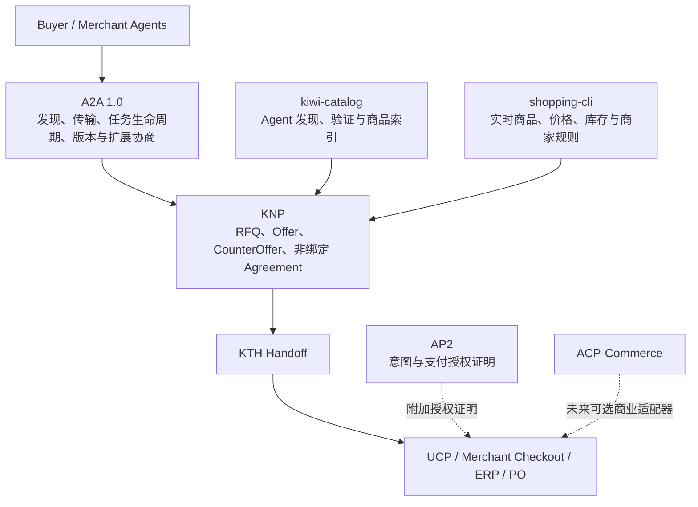

# Kiwi Agent Commerce 战略升级与执行基线 v1.0

## 0. 文档目的

本文把 Kiwi 三产品组合的市场判断、产品定位、协议边界和执行顺序统一为一份可验收的战略基线。

它回答五个问题：

1. Kiwi 应该争夺什么位置，不应该争夺什么位置；
2. `kiwi`、`kiwi-catalog`、`shopping-cli` 分别负责什么；
3. A2A、KNP、KTH、UCP、AP2、ACP-Commerce 如何正确分层；
4. 当前能力与目标状态之间还缺什么现实证据；
5. P0、P1、P2 应按什么顺序推进，如何判定真正完成。

本文不替代 KNP、KTH 或 A2A 的线协议规范，也不宣布任何产品版本发布。发生冲突时，按以下优先级判定：

1. 运行代码、自动化测试和真实互操作结果决定“当前已经具备什么”；
2. 已发布协议规范决定线协议行为；
3. `docs/CURRENT-DOCS.md` 决定文档和版本身份；
4. 本文决定产品方向、工作优先级与阶段验收标准；
5. 愿景文档只描述长期目标，不能作为当前能力证明。

相关文档：

- [Kiwi Agent Commerce Network 愿景](./kiwi-agent-commerce-network-vision-v1.0.md)
- [三产品跨仓库 P2 架构设计](./kiwi-cross-repo-p2-architecture-design-2026-08-09.md)
- [当前文档索引](./CURRENT-DOCS.md)
- [KNP 1.0 当前草案](./protocol/kiwi-negotiation-protocol-1.0-rev1.4.md)
- [KTH 0.1 当前草案](./protocol/kiwi-transaction-handoff-0.1-rev0.3.md)

---

## 1. 战略决策

### 1.1 一句话结论

> **Kiwi 应成为面向 A2A Agent 的开放、商业专用磋商扩展规范与运行时，把商家发现和实时商品事实转化为 RFQ、报价、还价与非绑定协议，并安全交接给商家自己的 checkout、ERP 或 PO 流程。**

Kiwi 不是消费者入口，不是新的电商平台，不是通用 Agent Registry，也不替商家持有资金、履约或承担最终交易责任。

### 1.2 当前阶段判断

当前已经证明的是：

- 三仓内部契约、受控组合测试和交易前链路可以运行；
- Buyer、Merchant、Catalog、商品事实、磋商和 Handoff 的主要边界已经形成；
- non-binding、审批、fail-closed 和商家自有执行边界是正确的安全基础。

当前尚未证明的是：

- 对外宣称的 A2A 1.0 与实际线协议完全一致；
- 非 Kiwi 实现能够独立实现 KNP 并成功互操作；
- 多个真实商家可以低成本接入并持续提供新鲜商品事实；
- KNP 已被 A2A 或 UCP 社区接受为公共扩展；
- 线上目录已经形成多商家网络效应。

因此，战略顺序必须是：

```text
协议声明与实际实现一致
        ↓
独立实现与第三方互操作
        ↓
一键演示与真实商家试点
        ↓
社区 RFC 与公开采用
        ↓
托管产品和商业规模化
```

在“独立互操作”完成之前，不把内部 E2E 描述为生态互操作，不把愿景描述为已落地网络。

---

## 2. 为什么现在值得推进

### 2.1 外部窗口已经出现

- A2A 已进入稳定协议与企业生产采用阶段，并形成 Agent Card、任务生命周期、扩展和兼容工具链。
- UCP 把 Agent 驱动的商品发现、结账和商家自有执行纳入同一商业框架，并提供 A2A binding。
- OpenAI、Google、Alibaba 等入口正在把购物行为迁移到 Agent，但商品事实、商家接入、复杂询价和跨系统交接仍然分散。
- 企业采购、工业品、批量采购和非标服务天然需要多属性约束、询价、条件报价、人工授权和审计记录。

这些趋势证明“Agent 代表主体参与商业流程”的方向成立，但不自动证明 KNP 已获得需求。KNP 的价值仍需通过第三方实现、真实商家和外部协议结果验证。

### 2.2 Kiwi 的机会不在消费者入口

ChatGPT、Google、Qwen 等产品拥有流量、模型和支付入口优势。Kiwi 不应复制它们的通用购物助手，而应占据它们都需要、又不适合由单个平台垄断的开放层：

```text
发现可信商家
  + 获取实时商品事实
  + 结构化 RFQ / Offer / CounterOffer
  + 形成可审计的非绑定 Agreement
  + 交接给商家自己的执行系统
```

### 2.3 第一楔子选择

优先场景：

1. 企业批量采购；
2. 工业品和参数化商品；
3. 非标服务与条件报价；
4. 跨境或多供应商 RFQ；
5. 需要人工审批和审计记录的采购流程。

普通消费品 Demo 仍然重要，但主要用于降低理解成本，不作为长期差异化来源。

---

## 3. 产品组合定位

| 组成 | 战略角色 | 当前准确表述 | 暂不应宣称 |
| --- | --- | --- | --- |
| `kiwi` | Commerce Agent runtime 与安全控制面 | 支持 Buyer/Merchant 角色、A2A 交互、KNP 磋商、审批和 Handoff 的开源运行时 | 通用消费者入口、完全自治采购平台 |
| `kiwi-catalog` | 商业 Agent 发现、验证与商品索引 | commerce-specific catalog and verification service | 已形成去中心化 Trust Network 或大规模市场网络 |
| `shopping-cli` | 商家商业事实与接入网关 | 本地商品、价格、库存及通用 ERP 数据接入层 | 已支持所有主流电商/PIM，任何商家均可十分钟接入 |
| KNP | 商业磋商扩展语义 | A2A 上的 commerce-specific negotiation profile | A2A 官方扩展、行业标准或唯一磋商方案 |
| KTH | 非绑定结果的安全交接 | 从 Agreement 到商家自有执行目的地的 Handoff 规范 | 支付协议或交易执行网络 |
| Veyquo | 可选托管和商业服务 | Kiwi 开源栈的运营实例与未来托管层 | 当前已经是成熟的商业网络或“Red Hat 阶段” |

### 3.1 三仓边界保持不变

- 三个仓库继续独立发布，不合并为 monorepo。
- `kiwi/contracts` 继续作为机器可读组合契约的权威源。
- 组合 CI 继续由 `kiwi` 编排，并固定三个仓库的精确提交。
- Catalog 只参与发现、验证和索引，不成为所有 Agent 通信的必经中心。
- shopping-cli 提供商家事实，不拥有 Buyer 的私有预算，也不替 Merchant 做越权决策。
- Kiwi 负责 Agent 生命周期、安全边界和磋商编排，不复制 Catalog 与商家数据源。

---

## 4. 协议分层与边界



### 4.1 A2A

A2A 负责：

- Agent Card 与能力发现；
- 消息、任务和状态生命周期；
- 协议版本与扩展激活；
- Agent 之间的标准通信承载。

A2A 不负责定义 Kiwi 的商业价格策略，也不拥有商家的 checkout。

### 4.2 KNP

KNP 负责：

- RFQ、Offer、CounterOffer、Clarification、Decline；
- 多属性条件、期限、数量和证据；
- 非绑定 Agreement 的形成和审计；
- human-required 与审批边界；
- 可移植的商业磋商状态语义。

UCP 已提供 A2A negotiation binding，因此 KNP 的价值主张不能是“A2A/UCP 完全没有磋商”。更准确的差异是：

> KNP 为跨商家、多属性、可审计且默认非绑定的 RFQ → Offer → CounterOffer → Agreement 提供商业专用、可独立实现的状态与证据规范。

### 4.3 KTH、UCP、AP2 与 ACP-Commerce

- KTH：描述非绑定 Agreement 如何交接给外部执行系统；
- UCP：可承载商品、购物车和 checkout 等商业执行能力；
- AP2：为意图与支付授权提供可验证 mandate，不是 checkout 本身；
- ACP-Commerce：另一种商业协议适配方向，当前只应标记为未来或实验性 adapter；
- Merchant Checkout / ERP / PO：最终执行目的地，继续由商家拥有。

这些组件不是同一层的可互换名称。任何文档、网站和演示都必须保持上述分层。

---

## 5. P0：协议真实性与外部互操作

P0 是对外推广、社区 RFC 和“生态互操作”表述的前置门槛。

### 5.1 A2A 1.0 合规

当前 Agent Card 对外声明 `protocolVersion: "1.0"`，但实现仍包含 A2A 0.3 风格的线协议：

- JSON-RPC 方法仍使用 `message/send`、`tasks/get`；
- Part 仍使用 `kind` 判别；
- Role 和 TaskState 仍使用旧式小写字符串；
- 客户端尚未完整实施 `A2A-Version`；
- KNP 尚未通过 `A2A-Extensions` 完成标准化扩展激活。

相关实现入口：

- [`src/a2a/server/card.ts`](../src/a2a/server/card.ts)
- [`src/a2a/client/client.ts`](../src/a2a/client/client.ts)
- [`src/a2a/client/types.ts`](../src/a2a/client/types.ts)
- [`src/a2a/server/server.ts`](../src/a2a/server/server.ts)

执行决定：

1. 首选实现 A2A 1.0 与 0.3 compatibility adapter 双栈；
2. 如果完整 1.0 尚未完成，立即把对外 Agent Card 降为真实支持版本；
3. 1.0 实现至少覆盖：
   - `SendMessage`、`GetTask` 等 1.0 方法名；
   - `A2A-Version` 请求头；
   - 1.0 Part、Role、TaskState 线格式；
   - KNP DataPart 映射；
   - `A2A-Extensions` 扩展激活与拒绝语义；
   - Agent Card 能力和扩展声明；
4. 保留 0.3 回归测试，兼容层不得污染 1.0 核心模型；
5. 使用官方 A2A Inspector/TCK 和至少一个独立官方 SDK 运行兼容测试。

验收标准：

- Agent Card 声明版本与实际 wire behavior 一致；
- 所有适用的官方兼容用例通过，无 P0/P1 协议错误；
- Kiwi 与一个非 Kiwi A2A 1.0 Agent 完成消息、任务、错误和扩展激活往返；
- v0.3 compatibility tests 与 v1.0 conformance tests 分开运行；
- CI 保存 Inspector/TCK、wire transcript 和版本矩阵证据。

### 5.2 KNP 扩展规范收敛

需要新增或补齐：

1. A2A 1.0 carrier mapping；
2. KNP extension URI、版本规则和激活方式；
3. capability negotiation 与不支持扩展时的 fail-closed 行为；
4. RFQ、Offer、CounterOffer、Agreement 的状态转换表；
5. 幂等、重放、过期、撤回、并发报价和 transcript 完整性规则；
6. 与 UCP negotiation、Concordia 和其他方案的差异矩阵；
7. KNP 与 KTH、UCP、AP2、ACP-Commerce 的明确边界；
8. 可由第三方独立实现的最小 conformance vectors。

### 5.3 独立实现与组合证据

仅有 TypeScript Kiwi Buyer 与 Kiwi Merchant 互通，不构成开放互操作证明。

P0 必须增加一个不导入 Kiwi runtime 的最小 Python 或 JavaScript 参考实现，至少实现：

- 读取 Agent Card；
- 激活 KNP 扩展；
- 发起 RFQ；
- 接收 Offer / CounterOffer；
- 形成或拒绝 non-binding Agreement；
- 输出可校验 transcript；
- 触发 KTH Handoff，但不执行真实交易。

组合 CI 必须验证：

```text
Independent Buyer → Kiwi Merchant
Kiwi Buyer → Independent Merchant
Independent Buyer → Independent Merchant（使用 Kiwi conformance vectors）
```

同时刷新 `portfolio.lock.json`，确保组合门禁代表三个仓库当前准备发布的精确提交，而不是历史组合。

### 5.4 P0 退出条件

P0 只有在以下条件全部满足后才能关闭：

- [ ] A2A 版本声明与实际实现一致；
- [ ] A2A 1.0 适用 Inspector/TCK 用例通过；
- [ ] KNP extension activation 与 carrier mapping 已发布；
- [ ] 至少一个独立实现完成双向互操作；
- [ ] 三仓当前组合锁与组合 CI 通过；
- [ ] 对外文案、README、网站和 Agent Card 不再存在协议版本漂移；
- [ ] 互操作证据可以由第三方重复运行。

---

## 6. P1：一键演示、商家接入与真实试点

### 6.1 `kiwi demo`

基于现有 `kiwi init`、`kiwi up`、supervisor 和受控 E2E，增加一条产品级演示路径，而不是创建平行 Demo 系统。

默认拓扑：

```text
1 Buyer
1 kiwi-catalog
3 Merchants
3 组不同价格、库存、交付期与审批规则
1 次多商家 RFQ fan-out
1 次 Offer / CounterOffer / Agreement / Handoff
```

安全要求：

- 无需模型 API Key；
- 使用确定性 fake model；
- 无需访问公网；
- 不执行真实 checkout、支付、邮件或 ERP 写操作；
- 每次运行使用隔离状态目录；
- 所有外部写操作默认需要明确审批；
- 可一条命令停止并清理本次演示资源。

体验指标：

- 安装完成后，一条命令启动完整拓扑；
- 启动成功后 3 分钟内看到首个可验证 Agreement；
- 用户可以清楚看到发现、询价、报价、审批与 Handoff 的不同阶段；
- 错误信息必须说明“当前状态、为什么不能继续、下一步可执行动作”。

### 6.2 两个标准场景

#### 场景 A：低理解成本 Demo

使用保温杯、USB-C 充电器或显示器，展示：

- 多商家发现；
- 价格、库存和配送条件比较；
- 一次还价；
- 用户审批；
- non-binding Handoff。

#### 场景 B：差异化 Demo

使用工业品、批量采购或非标服务，展示：

- 数量阶梯；
- 技术参数与替代条件；
- 交货期、质保、付款条件；
- 条件报价与人工授权；
- 多轮 CounterOffer；
- 可审计 transcript。

### 6.3 商家接入策略

先建立 Adapter SDK，不按品牌连接器逐个堆代码。

接入顺序：

1. CSV / Excel 导入；
2. 稳定的通用 REST/ERP adapter contract；
3. Shopify / WooCommerce；
4. PIM、采购系统和行业 ERP；
5. 由真实试点需求驱动的专有连接器。

“十分钟接入”只能针对已经支持的连接器逐项验证。每次验证记录：

- 从空环境到首条有效 listing 的时间；
- 必需字段和人工映射步骤；
- 同步、重试和数据新鲜度；
- 只读/写入权限边界；
- 删除或回滚路径。

### 6.4 试点范围

第一轮目标不是快速堆到十个商家，而是取得高质量外部证据：

- 3 个真实商家；
- 至少 2 种数据接入方式；
- 1 个不使用 Kiwi runtime 的外部 Buyer；
- 1 个普通消费场景；
- 1 个批量、工业品或非标采购场景；
- 至少一次由真实商品事实产生并进入 Handoff 的外部 Agreement。

### 6.5 P1 退出条件

- [ ] 新用户可在干净环境中一条命令运行完整 Demo；
- [ ] Demo 首次价值呈现不超过 3 分钟；
- [ ] 三个真实商家连续提供新鲜 listing；
- [ ] 支持连接器的接入时间有实测记录；
- [ ] 外部 Buyer 与真实 Merchant 完成至少一次可验证 Agreement；
- [ ] 未审批的外部写操作保持为零；
- [ ] 失败、重启、候选过期和审批恢复路径通过易用性测试。

---

## 7. P2：社区采用、安全 Playground 与商业层

### 7.1 社区 RFC

在 P0 完成后再向 A2A/UCP 社区提交 KNP 提案。提案应包含：

- 问题陈述，而不是“缺失层”口号；
- 与 UCP A2A negotiation、Concordia 等方案的逐项比较；
- 最小扩展范围和明确非目标；
- 线协议 schema、状态机和 conformance vectors；
- 两种语言的独立实现；
- 真实互操作 transcript；
- 安全、审批、non-binding 和 Handoff 边界；
- 已知限制与开放问题。

目标不是立即获得“官方标准”标签，而是获得外部实现、审阅意见和设计收敛。

### 7.2 Live Playground

Playground 必须晚于确定性本地 Demo，并具备：

- 每会话隔离；
- 身份与租户隔离；
- 速率限制和成本上限；
- 请求体、轮次、并发和 transcript 上限；
- 无真实支付、checkout 或 ERP 写权限；
- 滥用检测、审计、日志脱敏和自动过期；
- 可重复的固定演示场景；
- 明确标识 mock、self-operated 和 external participant。

### 7.3 Veyquo 商业层

Veyquo 可以提供：

- 托管 Catalog；
- 托管 Merchant Agent；
- 连接器与数据同步；
- 企业审批、审计和 SLA；
- 托管互操作测试；
- 可观测性和运营支持。

开源层必须持续包含：

- KNP/KTH 规范和 conformance vectors；
- 可自托管 Buyer/Merchant runtime；
- 可自托管 Catalog；
- 基础商家数据适配能力；
- 完整本地 Demo；
- 互操作和安全基线测试。

商业层不能通过私有扩展破坏公共互操作，也不能让 Veyquo 成为 Kiwi Agent 互通的必经中心。

### 7.4 P2 退出条件

- [ ] 至少两个独立团队或实现参与 KNP 互操作；
- [ ] 社区 RFC 获得可追踪的外部技术反馈；
- [ ] Playground 通过隔离、限流、越权和成本攻击测试；
- [ ] 5–10 个真实商家保持活跃和数据新鲜；
- [ ] 外部 Agreement → Handoff 指标连续数周可观测；
- [ ] 托管能力与开源协议之间不存在互操作锁定。

---

## 8. 90 天执行波次

### Wave 1：第 0–30 天——协议真实性

目标：所有公开声明与实际实现一致。

- 决定临时版本声明或 A2A 1.0 双栈方案；
- 完成 1.0 wire model、header、method 和 extension activation；
- 接入 Inspector/TCK；
- 修正文档、README、网站和 Agent Card；
- 刷新组合锁并固化三仓当前组合 CI。

退出证据：官方兼容报告、wire transcript、固定 SHA 组合绿灯。

### Wave 2：第 31–60 天——独立互操作与一键体验

目标：证明不是“Kiwi 与自己互通”。

- 发布独立 Python/JavaScript 最小实现；
- 完成双向外部互操作；
- 发布 `kiwi demo`；
- 完成两个标准 Demo；
- 发布 Adapter SDK 与 CSV/Excel 路径。

退出证据：外部实现仓库、可重复互操作脚本、三分钟 Demo 录像与测试报告。

### Wave 3：第 61–90 天——真实商家与社区反馈

目标：取得需求和采用证据。

- 完成 3 个真实商家试点；
- 完成至少一个复杂采购场景；
- 发布 KNP RFC 与差异矩阵；
- 收集外部 Agent 开发者反馈；
- 完成 Playground 安全设计和受控预览，而不是直接开放生产写入。

退出证据：真实外部 Agreement/Handoff、商家接入记录、社区审阅和下一轮产品决定。

时间波次可以因依赖调整，但阶段顺序不能颠倒。不得用网站流量或内部 mock 数量替代互操作与真实商家证据。

---

## 9. 指标体系

### 9.1 阶段指标

| 阶段 | 主指标 | 说明 |
| --- | --- | --- |
| P0 | A2A/KNP conformance pass rate | 所有适用官方和组合用例通过 |
| P0 | independent implementations | 不导入 Kiwi runtime 的独立实现数量 |
| P1 | time to first verified external agreement | 从启动接入到首个外部可验证 Agreement 的时间 |
| P1 | active real merchants | 持续提供新鲜真实商品事实的商家数 |
| P1 | supported connector onboarding time | 仅对已支持连接器测量十分钟目标 |
| P2 | verified external handoffs per week | 外部参与者产生、经校验并进入 Handoff 的协议数 |
| P2 | independent adopters | 非 Kiwi 团队、非自营实例的采用数量 |

### 9.2 North Star 定义

长期 North Star：

> **每周由外部 Agent 和真实商家形成、完成协议校验并进入商家自有执行系统的 non-binding Agreement Handoff 数。**

计入条件：

- 至少一方不是 Kiwi 自营或测试实例；
- 使用真实或明确授权的商品事实；
- transcript 和协议版本可验证；
- Agreement 未过期、未撤销；
- 已生成有效 Handoff；
- mock、回放、单元测试和重复幂等请求不计入。

原始 `agreements/week` 不作为唯一指标，因为它容易被自营流量、重试和 mock 放大。

### 9.3 安全与质量护栏

- 未审批外部写操作数：必须为 0；
- 协议版本误报：必须为 0；
- stale listing 比例；
- Handoff 失败率；
- 幂等冲突和重复执行率；
- 需要人工审批但无法恢复的候选数；
- 敏感字段泄漏与跨租户访问事件：必须为 0；
- 用户从错误信息到正确下一步的成功率。

---

## 10. 对外定位与声明纪律

### 10.1 推荐中文定位

> **Kiwi 是面向 A2A Agent 的开放商业磋商扩展规范与运行时：把商家发现和实时商品事实转化为 RFQ、报价、还价与非绑定协议，并安全交接给商家自己的 checkout 或 ERP。**

### 10.2 推荐英文定位

> **Kiwi is an open, commerce-specific negotiation profile and runtime for A2A agents. It turns merchant discovery and live catalog facts into RFQs, offers, counteroffers, and non-binding agreements that hand off to merchant-owned checkout or ERP.**

### 10.3 当前可以声明

- Kiwi 是开源的交易前 Agent Commerce runtime；
- Kiwi 保持 non-binding 和 merchant-owned execution；
- 三仓内部受控端到端与组合测试已经存在；
- KNP 是 Kiwi 提出的 commerce-specific A2A extension profile；
- Catalog、商品事实、磋商和 Handoff 已有可运行实现。

### 10.4 完成相应门槛后才能声明

| 声明 | 前置证据 |
| --- | --- |
| “A2A 1.0 conformant” | 官方 Inspector/TCK + 独立 SDK 互操作 |
| “interoperable KNP ecosystem” | 至少两个非 Kiwi 独立实现 |
| “Commerce Agent Trust Network” | 多运营方、持续验证和可观测治理证据 |
| “十分钟接入” | 针对指定连接器的多商家实测 |
| “production-ready playground” | 隔离、限流、越权、成本和隐私测试通过 |
| “A2A/UCP official extension” | 对应治理机构明确接受或发布 |

禁止把愿景、内部实现、社区提案和正式标准混为同一种事实。

---

## 11. 决策门与治理

### Gate 0：Truthful Protocol

判断问题：声明的协议版本是否就是实际线协议？

未通过时：不做 A2A 1.0 或官方互操作宣传。

### Gate 1：Independent Interoperability

判断问题：不使用 Kiwi runtime 的实现能否根据公开规范独立互通？

未通过时：不宣称生态、标准或开放网络已经成立。

### Gate 2：Merchant Time-to-Value

判断问题：真实商家能否低成本接入、持续提供新鲜事实并安全响应 RFQ？

未通过时：不扩大连接器数量，不追求 listing 数量。

### Gate 3：External Adoption

判断问题：是否存在非自营 Agent、商家和开发者的重复使用？

未通过时：Veyquo 保持试验性托管，不提前重投入规模化销售。

### Gate 4：Commercial Scale

判断问题：托管服务是否解决了被验证的运营痛点，并且不损害开放互操作？

通过后：再扩展企业 SLA、托管连接器、审计和商业支持。

每个 Gate 必须有可重复证据、负责人和明确日期；“代码已合并”不是单独的业务完成证据。

---

## 12. 主要风险与应对

| 风险 | 表现 | 应对 |
| --- | --- | --- |
| 协议版本漂移 | Card 声明 1.0，wire 仍是旧版本 | conformance CI、双栈隔离、声明门禁 |
| 把内部 E2E 当生态采用 | Buyer/Merchant 都由 Kiwi 实现 | 独立实现、第三方 SDK、外部 transcript |
| KNP 与现有方案重叠 | UCP negotiation、Concordia 已覆盖部分能力 | 缩小范围，突出 commerce-specific、non-binding、live facts、Handoff 与审批 |
| 过早建设平台 | 先做 Marketplace、计费和大规模托管 | Gate 3 前只做验证性托管 |
| Catalog 中心化 | 所有通信依赖单一 Catalog | 发现后 Direct A2A，允许多 Catalog 与静态发现 |
| 连接器失控 | 每个商家都产生专有代码 | Adapter SDK、通用 contract、需求驱动连接器 |
| 演示产生真实副作用 | 意外 checkout、邮件或 ERP 写入 | deterministic fake、sandbox、审批、默认无凭证 |
| 指标被 mock 污染 | Agreements 数量好看但无真实参与者 | verified external handoff 严格口径 |
| 文档与代码漂移 | README、网站、Agent Card 版本不一致 | CURRENT-DOCS、release checklist、自动声明扫描 |
| Veyquo 形成私有锁定 | 开源用户必须依赖托管服务 | 公共 conformance、可自托管核心、开放适配接口 |

---

## 13. 明确不做

在本战略周期内不做：

- 通用消费者购物超级入口；
- 通用 Agent Registry；
- Kiwi 托管支付、资金或履约；
- 所有商业协议的统一抽象层；
- 未经真实需求验证的大量品牌连接器；
- 依赖 Veyquo 才能运行的私有 KNP；
- 用 AI 自由文本替代线协议状态机和安全审批；
- 未完成隔离与成本控制的开放式生产 Playground；
- 以 listing 数、内部 Agent 数或 mock Agreement 数作为网络效应证明。

---

## 14. 战略升级完成定义

整个战略升级不能以“P0/P1/P2 代码全部合并”作为完成标准。只有同时满足以下现实证据，才可以宣布本轮战略升级完成：

### 协议

- A2A 对外版本与 wire behavior 一致；
- KNP extension mapping、版本和 conformance vectors 公开；
- KTH、UCP、AP2、ACP-Commerce 边界一致且可验证。

### 互操作

- 至少两个独立实现完成互操作；
- 互操作测试不依赖私有服务或 Kiwi 内部模块；
- 第三方可以按公开文档重复结果。

### 产品

- 一键本地 Demo 达成三分钟 Time-to-Wow；
- 错误、审批、过期和重启恢复路径可理解；
- 真实商家接入与商品新鲜度得到验证。

### 安全

- 默认无未经审批的外部副作用；
- 身份、租户、凭证、日志和 transcript 边界通过安全测试；
- Handoff 仍为 non-binding，真实执行由商家系统拥有。

### 生态

- 有外部开发者、Agent 或商家采用证据；
- 社区提案清楚说明与既有方案的关系；
- 对外声明均可以由公开证据支持。

### 商业

- Veyquo 的托管能力解决已验证的运营痛点；
- 商业层不破坏开源协议和自托管能力；
- 核心指标从内部演示转向 verified external handoffs。

---

## 15. 最终执行原则

1. **先真实，再传播**：先让声明与实现一致，再扩大声音。
2. **先互操作，再生态**：一个实现不是生态，内部 E2E 不是标准采用。
3. **先楔子，再平台**：先解决复杂 RFQ，再扩展通用商业网络。
4. **先证据，再规模**：先有三个高质量真实商家，再追求数量。
5. **先安全边界，再自治**：默认审批、non-binding、fail-closed 不因演示便利而削弱。
6. **开放协议不等于中心平台**：Catalog 可替换、通信可直连、执行归商家。
7. **商业化建立在开放互操作之上**：Veyquo 提供运营价值，不控制协议通行权。

本战略最重要的近期动作只有一个：

> **完成 A2A 1.0 真实性与独立互操作 P0；在此之前，不把营销、Marketplace 或大规模托管建设放到主线上。**

---

## 16. 外部参考

- [A2A 1.0 Specification](https://github.com/a2aproject/A2A/blob/main/docs/specification.md)
- [What’s New in A2A v1.0](https://a2a-protocol.org/latest/whats-new-v1/)
- [A2A Roadmap, Inspector and TCK](https://a2a-protocol.org/latest/roadmap/)
- [A2A Extensions](https://a2a-protocol.org/dev/topics/extensions/)
- [UCP Overview](https://ucp.dev/2026-04-08/specification/overview/)
- [UCP A2A Checkout and Negotiation](https://ucp.dev/2026-01-23/specification/checkout-a2a/)
- [AP2 Mandates](https://ucp.dev/2026-01-11/specification/ap2-mandates/)
- [A2A Agent Discovery](https://a2a-protocol.org/latest/topics/agent-discovery/)
- [Linux Foundation A2A Adoption Update](https://www.linuxfoundation.org/press/a2a-protocol-surpasses-150-organizations-lands-in-major-cloud-platforms-and-sees-enterprise-production-use-in-first-year)
- [OpenAI Product Discovery and Merchant-Owned Checkout](https://openai.com/index/powering-product-discovery-in-chatgpt/)
- [SAP Sourcing Assistant](https://www.sap.com/uk/use-cases/joule-assistant/sourcing-assistant)
- [Concordia A2A Community Proposal](https://github.com/a2aproject/A2A/discussions/1725)

