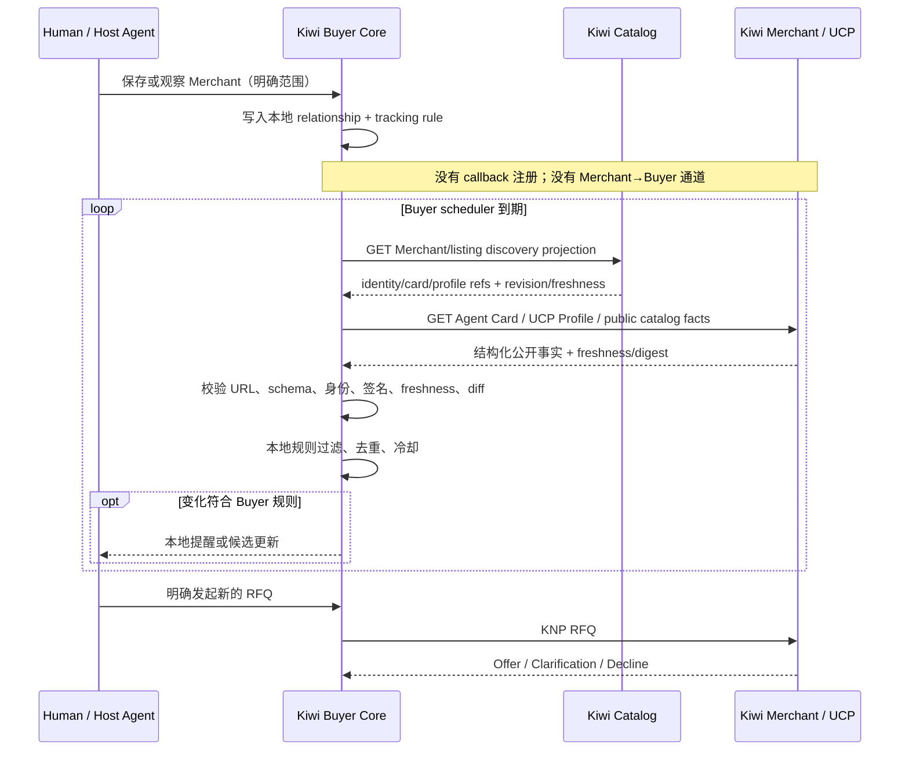
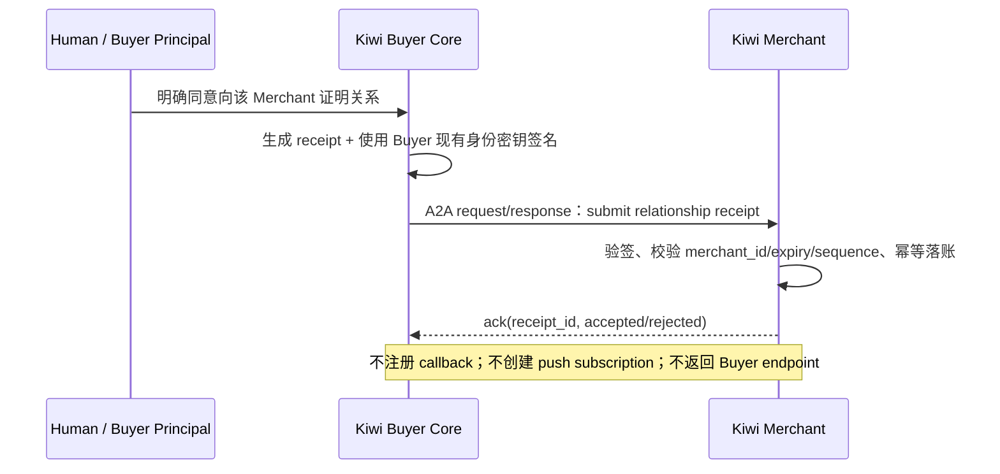

# Kiwi Buyer ↔ Merchant 主动拉取关系设计 v0.1

## 0. 一句话决定

Kiwi 的“订阅”不是 Merchant 向 Buyer 推送消息，也不只是 Buyer 保存一份
Agent Card；它是 **Buyer Core 本地持有、由 Buyer 主动执行的长期供应商关系与观察规则**。

Merchant 只发布公开、只读、结构化的商业事实。Buyer 按自己的时间、范围、预算和
隐私策略主动拉取、验证、比较并决定是否提醒人类。Merchant 不获得 Buyer 的回调地址，
不能把消息、提示词、工具指令或营销内容写入 Buyer。

核心不变量：

> **Relationship belongs to Buyer. Facts remain at Merchant. Pull is initiated by Buyer. No merchant-to-buyer delivery channel exists.**

## 1. 背景与目标

Kiwi 当前已经具备：

- 通过 kiwi-catalog 发现 Merchant、Agent Card 和 UCP Profile；
- Buyer 主动发起 RFQ、读取任务、磋商和 handoff；
- Buyer 侧持久任务、观察、tracking rules 和 restart-safe scheduler；
- Merchant 侧记录真实入站买家触达、询价与谈判统计；
- Agent Card、UCP Profile、远程文本全部按不可信输入处理。

现有链路主要服务一次任务：发现 → 询价 → 读取结果。本文增加的产品语义是：一次真实
交互后，Buyer 可以把 Merchant 保存为长期供应商，并在以后主动观察它的公开能力变化，
从而形成“再次发现”和“重复询价”的关系复利。

目标：

1. Buyer 可以保存、观察、暂停和删除供应商关系；
2. Buyer 可以限定观察范围，例如 SKU、品类、区域、交期或可用性；
3. 所有网络读取由 Buyer 发起，Merchant 永远不能主动投递；
4. 远程变化只有经过结构校验、信任校验和 Buyer 本地规则后，才能成为本地提醒；
5. 保存关系不会绕过 Merchant verification、采购约束、授权或人工审批；
6. MVP 复用当前 Catalog / UCP / Agent Card / scheduler，不把新协议作为真实采用前置条件。

非目标：

- 不建设营销消息、私信、广播、Webhook 或 Push Notification 系统；
- 不允许 Merchant 触发 Buyer RFQ、谈判、accept、handoff、订单或付款；
- 不把“关注数”作为未经验证的公开社交指标；
- 不建立由 Kiwi Network 拥有的中心化 Buyer–Merchant 关系图；
- 不把 Agent Card、kiwi-catalog 或观察 feed 变成价格、库存或订单的权威 truth source；
- 不修改 KNP/1.0 的询报价与磋商边界。

## 2. 产品语义：不是一种“粉丝”，而是三种 Buyer 本地关系

### 2.1 Saved Supplier

Buyer 保存 Merchant 身份，供未来 sourcing 时重新解析和候选召回。

- 不定期拉取；
- 不产生提醒；
- 不提高信任等级；
- 只作为候选召回信号。

### 2.2 Watched Supplier

Buyer 为 Merchant 建立主动观察规则。

- 定期拉取指定 SKU、品类、服务区域或能力；
- 只有符合本地规则的事实变化才生成本地 observation；
- 通知频率、冷却和有效期完全由 Buyer 控制；
- Merchant 不知道 Buyer 是否正在观察，除非 Buyer 另行明确授权关系回执。

### 2.3 Preferred Supplier

Buyer 明确把 Merchant 设为某个采购范围内的偏好供应商。

- 只形成排序中的可解释软偏好；
- 不能绕过 verification/freshness、硬约束、价格比较或 MerchantHardPolicy；
- 不能自动 accept agreement、handoff、下单或付款；
- 关系过期、身份指纹变化或长期不可达时降级为 `review_required`。

“粉丝”可以作为市场传播语言，但协议与代码应使用 `supplier_relationship`、
`saved`、`watched`、`preferred`，避免把商业授权误解为社交关注。

## 3. 为什么只保存 Agent Card 不够

Agent Card 解决的是“这个 Agent 是谁、支持什么接口、去哪里连接”，不是“为什么观察、
观察什么、多久检查、发生什么才提醒”。它还是可变的远程公开元数据，不能成为 Buyer
关系状态的唯一权威。

Buyer 应保存 Agent Card 的 **引用与已验证指纹**，而不是把某次 Card 快照永久当真：

- `agent_card_url`：以后重新解析的入口；
- `last_verified_fingerprint`：检测身份承载字段变化；
- `last_verified_at` / `fresh_until`：缓存和复核边界；
- `merchant_id` / canonical domain：稳定关系对象；
- 当前 Card 快照只作为有 TTL 的 cache。

真正的订阅还必须保存：

- 关系类型与人类授权来源；
- 观察范围和过滤条件；
- 拉取频率、下次检查时间、冷却时间和过期时间；
- Catalog/UCP/Agent Card 的 ETag、revision、digest 或游标；
- 最近一次成功、失败、退避和身份变化状态；
- Buyer 本地通知策略。

因此：

> 保存 Agent Card URL 是建立关系所需的一部分，但不是订阅本身。

## 4. 权威边界

| 状态 | 唯一权威 | Merchant 是否可写入 Buyer |
|---|---|---|
| Buyer–Merchant 关系 | Buyer Core 本地 store | 否 |
| 观察范围、频率、冷却、暂停 | Buyer Core 本地 store | 否 |
| Buyer 私有偏好、预算、任务 | Buyer Principal / Buyer Core | 否 |
| Merchant 身份与可达性证据 | Agent Card + trust records + catalog verification | 只能发布公开证据，不能改 Buyer 判定 |
| 商品、库存、价格、交期 truth | Merchant UCP / ERP / PIM / Commerce endpoint | 只能响应 Buyer 的读取或 RFQ |
| 发现投影 | kiwi-catalog | 不能替代 Merchant truth |
| 本地提醒 | Buyer scheduler + policy evaluator | 否 |
| 实际 RFQ / Negotiation | Buyer 明确任务 + KNP | Merchant 只能响应已收到的请求 |

Kiwi Buyer 不开放任何“订阅回调 URL”。Merchant 不保存 Buyer endpoint、push token、
Webhook secret 或 Host 会话地址。

## 5. Pull-only 数据流



重要区分：Merchant 返回 Buyer 主动请求的 HTTP/A2A 响应是正常 request/response，
不是 push。只有 Buyer 明确发起新的 RFQ 后，Merchant 才进入 KNP 对话。

## 6. Buyer 本地数据模型

建议不要把关系硬塞进现有 `mcp_tasks`。Task 是一次商业任务，Relationship 是跨任务、
生命周期更长的 Buyer 私有状态。两者可以位于同一 Buyer Core SQLite，但使用独立表。

### 6.1 `supplier_relationships`

| 字段 | 说明 |
|---|---|
| `relationship_id` | 稳定 ID，例如 UUIDv7 |
| `principal_id` | Buyer 所代表的个人或企业；私有 |
| `merchant_id` | 已解析的稳定 Merchant 标识 |
| `canonical_domain` | 重新发现与 same-origin 校验依据 |
| `agent_card_url` | Agent Card 引用，不是永久快照 |
| `ucp_profile_url` | 可选 UCP Profile 引用 |
| `relationship_type` | `saved` / `watched` / `preferred` |
| `scope_json` | SKU、品类、品牌、区域、能力和 query；不发送给 Merchant |
| `policy_json` | interval、cooldown、notification policy、privacy mode |
| `consent_source` | `human_explicit` / `delegated_policy`；默认要求人类明确同意 |
| `status` | `active` / `paused` / `review_required` / `expired` / `deleted` |
| `created_at` / `updated_at` / `expires_at` | 生命周期 |

### 6.2 `supplier_observation_state`

| 字段 | 说明 |
|---|---|
| `relationship_id` | 对应关系 |
| `source_type` | `catalog_search` / `agent_card` / `ucp_profile` / `ucp_catalog` / future `merchant_manifest` |
| `source_url_or_ref` | 拉取来源 |
| `etag` / `last_modified` | 支持时用于 Conditional GET |
| `source_revision` / `content_digest` | 规范化内容版本与去重 |
| `last_checked_at` | 最近检查时间 |
| `last_success_at` | 最近成功时间 |
| `next_check_at` | restart-safe scheduler 权威时间 |
| `failure_count` / `backoff_until` | 失败退避 |
| `last_verified_fingerprint` | Agent Card 身份指纹 |
| `snapshot_json` | 上次规范化快照，用于计算 listing/profile diff（M1 实现补充） |
| `unchanged_count` | 连续无变化计数，支撑 §8 无变化降频（M1 实现补充） |

### 6.3 `supplier_observations`

只存规范化事实差异，不保存可执行远程内容：

- `listing_added` / `listing_updated` / `listing_withdrawn`；
- `capability_changed`；
- `availability_hint_changed`；
- `lead_time_hint_changed`；
- `profile_or_identity_changed`；
- `freshness_changed` / `unreachable`。

每条 observation 带来源、抓取时间、内容 digest、fresh-until 和验证结果。过期 observation
可用于历史趋势，不能用于当前价格、库存或交期断言。

## 7. 拉取来源与分阶段实现

### 7.1 MVP：不新增 Merchant feed 协议

第一版可以完全复用现有能力：

1. 保存 `merchant_id + agent_card_url + ucp_profile_url`；
2. 把“观察范围”转换为现有 Buyer tracking rules；
3. scheduler 到期后重跑限定 Merchant 的 catalog query；
4. 必要时主动拉取 Agent Card、UCP Profile 和 Merchant 权威商品 endpoint；
5. 对规范化结果计算 digest，与上次 observation 比较；
6. 只有 Buyer 本地规则命中才产生本地提醒。

优点：不要求 Merchant 增加任何写通道或新协议，能先验证“保存关系是否带来重复询价”。

### 7.2 可选优化：只读 Merchant Observation Manifest

只有真实 Pilot 证明全量拉取成本或变化发现延迟成为问题后，再考虑只读 manifest。建议
草案入口：

```text
GET https://merchant.example/.well-known/kiwi-merchant-observation.json
```

它只能声明公开只读来源，例如：

```json
{
  "schema_version": "0.1",
  "merchant_id": "merchant_123",
  "agent_card_url": "https://merchant.example/.well-known/agent-card.json",
  "ucp_profile_url": "https://merchant.example/.well-known/ucp",
  "current_revision": "rev_20260823_17",
  "updated_at": "2026-08-23T08:00:00Z",
  "fresh_until": "2026-08-24T08:00:00Z",
  "changes_url": "https://merchant.example/kiwi/public-changes?after={cursor}"
}
```

约束：

- 默认必须 HTTPS、same-origin；跨域来源必须经过独立 domain/identity 验证；
- 只允许 GET/HEAD，不允许 Buyer 注册 callback；
- 支持 `ETag`、`If-None-Match`、`Last-Modified` 和游标分页；
- 响应有严格 schema、条数、字段长度和 body 大小上限；
- 不允许 HTML、Markdown、提示词、工具名、操作建议或任意“给 Agent 的指令”；
- `summary/title` 等已有商业文本仍按不可信数据显示，不能进入 system/developer prompt；
- manifest/change feed 只是变化索引，当前事实仍需在 Merchant 权威 endpoint 复核；
- Merchant 可以改变公开事实，但不能指定 Buyer 何时拉取、如何通知或采取什么动作。

这个 manifest 不是 A2A `pushNotifications`。Agent Card 中即使存在该标准字段，Kiwi
关系能力也必须忽略或明确拒绝 Merchant→Buyer push。

## 8. Scheduler 行为

现有 `TaskScheduler` 已具备数据库恢复、请求预算、规则合并、去重、冷却和退避的基础。
Relationship scheduler 应复用同一确定性机制：

1. 从 `next_check_at` 选择到期关系；
2. 应用全局 `max_requests`、每域名并发和最小轮询间隔；
3. 重新解析 catalog record，检查 administrative/freshness；
4. 安全拉取 Agent Card/UCP/公开 facts；
5. 检测 Agent Card 指纹变化；变化时不得静默沿用旧信任，关系进入 `review_required`；
6. 规范化、计算 digest、写入 observation；
7. 本地求值 scope/rule；
8. 多条变化合并成一次本地通知；
9. 失败按 transient/permanent 分类，指数退避并加入 jitter；
10. 重启后只依靠数据库恢复，不依赖 Host session 或进程内 timer。

默认建议：

- 普通 watch 最短间隔以小时计，不做分钟级轮询；
- 无变化逐步放慢，活跃采购任务可临时提高频率；
- 关系和规则必须有 expiry，长期无使用自动请求人类复核或暂停；
- Merchant 高频制造无意义 revision 时，Buyer 本地降频或暂停。

## 9. 安全与隐私

### 9.1 远程输入永远不可信

所有 Agent Card、UCP vendor metadata、listing、manifest、change event 和人类可读字段：

- 先过 SSRF/DNS、redirect、超时、body 上限和 JSON schema；
- 再过 secret scanning、identity/fingerprint、签名和 freshness；
- 只映射到固定 DTO 字段；
- 不拼进 system prompt，不允许远程声明工具调用或授权；
- 不允许远程变化直接创建 RFQ、counteroffer、accept 或 handoff。

### 9.2 Pull 仍可能泄露观察者元数据

直接访问 Merchant 时，Merchant 可能看到来源 IP、时间和 User-Agent。默认策略应是：

- 被动观察优先通过 kiwi-catalog 的公开投影和缓存；
- 对 Merchant 直连不发送稳定 `X-Buyer-Id`，除非 Buyer 明确同意；
- 不在 query string 中携带 Buyer 身份、预算、客户名或私有需求；
- 需要更强隐私时可使用 Buyer 自选代理或未来的匿名缓存，但 Kiwi Network 不因此拥有关系图。

### 9.3 默认没有“关注者名单”是有意设计

在纯 pull-only、默认匿名的模型中，Merchant 无法准确知道谁保存或观察了自己。Merchant
可以看到真实到达自己的、经过认证的 RFQ/谈判触达；不能把页面访问或轮询 IP 宣称为
“AI 粉丝”。

商家需要“可验证关注数”时，Buyer 可以在用户明确授权后主动发送 signed relationship
receipt。它只证明某个经过认证的 Buyer 当前声明了一段关系，不改变默认 pull-only
模型，也不产生任何反向触达权。完整设计见下一节。

## 10. 可验证关注数：Buyer-signed Relationship Receipt

### 10.1 语义

Relationship Receipt 是 Buyer 对 Merchant 的一份有期限、可续期、可撤销的签名声明：

> “我当前将你保存为 saved / watched / preferred supplier；你可以把这份有效声明计入
> 自己的私有关系统计，但不能因此联系我、向我推送或获得我的观察范围。”

它不是订阅建立条件。Buyer 即使从不发送 receipt，也可以在本地保存和观察 Merchant。
发送 receipt 的唯一新增效果是让 Merchant 获得一条可验签、可去重、会过期的关系证据。

### 10.2 发起与传输

整个流程只能由 Buyer 发起：



建议复用已经通过签名 KNP/A2A 交换建立的 Buyer sender identity 与 trust record，不为
receipt 引入第二套身份或密码。Merchant 只接受与自己已有认证交换身份相符的签名；不能
仅凭 payload 中自报的 Buyer ID 计数。

如果未来需要独立 capability，可定义单独的 A2A relationship-receipt extension；它不属于
KNP action 词表，也不改变 KNP/1.0。Merchant 可在 Agent Card 中声明支持该 extension，
但 `pushNotifications` 必须保持 `false`。提交是一次有界 request/response，Merchant 只
返回确认，不创建 Task callback、Webhook 或后续发送权限。

### 10.3 Receipt 数据结构

建议 wire payload：

```json
{
  "schema_version": "0.1",
  "receipt_id": "rr_01J...",
  "relationship_id": "rel_01J...",
  "merchant_id": "merchant_123",
  "action": "establish",
  "relationship_type": "watched",
  "sequence": 1,
  "issued_at": "2026-08-23T08:00:00Z",
  "expires_at": "2026-09-22T08:00:00Z",
  "counting_visibility": "merchant_private",
  "merchant_push_allowed": false,
  "grants": []
}
```

约束：

- `action` 只有 `establish` / `renew` / `revoke`；
- `relationship_type` 只有 `saved` / `watched` / `preferred`；
- sender identity 取自已验签的 A2A/HTTP Message Signature 上下文，不信任 payload 自报；
- `merchant_id` 必须与实际接收方一致，防止 receipt 被跨 Merchant 重放；
- `sequence` 对同一 `relationship_id` 单调递增，旧序列不能覆盖新状态；
- `expires_at` 必须有协议上限；v0.1 建议最长 30 天，并由 Buyer 主动续期；
- `counting_visibility` v0.1 固定为 `merchant_private`，不自动授权公开展示；
- `merchant_push_allowed` 必须为 `false`，`grants` 必须为空数组；
- schema 使用 `additionalProperties: false`，禁止夹带 callback URL、push token、邮箱、
  Host session、预算、query、SKU 观察范围或 Buyer 私有偏好；
- payload 与 A2A sender/recipient、时间和防重放字段一起签名，复用现有 JCS、signature、
  nonce/replay 与 trust verifier；不另造弱化签名算法。

`merchant_push_allowed: false` 不是实际安全边界的唯一来源。真正的边界仍然是 Buyer 不
暴露接收端、Merchant 没有发送工具、网络层没有 callback；该字段用于让审计和跨实现
TCK 能显式验证语义。

### 10.4 续期、撤销与离线语义

- `establish`：首次声明关系；
- `renew`：Buyer 在过期前主动刷新有效期，可升级或降级 relationship type；
- `revoke`：Buyer 主动告诉 Merchant 不再计数；必须引用同一 `relationship_id` 并使用
  更高 sequence；
- Buyer 本地删除关系立即停止 pull，不依赖远端 revoke 成功；
- 若 Merchant 离线导致 revoke 无法送达，远端 receipt 最迟在 `expires_at` 自动失效；
- 因此 receipt 必须短期有效、定期由 Buyer 主动续期，禁止永久关注凭证；
- identity key 被撤销、trust 降级或 Merchant 身份变更时，receipt 投影进入 invalid，
  不能继续计入 verified count。

### 10.5 Merchant 本地存储

Merchant 建议使用追加式 ledger + 当前投影，而不是覆盖历史：

`buyer_relationship_receipts`：

| 字段 | 说明 |
|---|---|
| `receipt_id` | 幂等主键 |
| `relationship_id` | Buyer 为该 Merchant 生成的关系 ID |
| `buyer_identity` | 从已认证 transport/signature 得到，不取 payload 自报值 |
| `merchant_id` | 接收方绑定 |
| `action` / `relationship_type` / `sequence` | 关系状态事件 |
| `issued_at` / `expires_at` | 有效窗口 |
| `verified_at` / `trust_level` | 验签与信任证据 |
| `signature_digest` | 审计引用，不保存私钥或凭据 |
| `source_exchange_id` | 与既有 Buyer 认证交换关联；可选 |
| `status` | `active` / `revoked` / `expired` / `invalid` |

Merchant 不保存 Buyer callback、Agent endpoint、Host 会话、观察条件或 Principal Memory。

### 10.6 可验证关注数的计算

`verified_relationship_count` 的定义：

```text
COUNT(DISTINCT authenticated_buyer_identity)
WHERE latest_relationship_projection.status = active
  AND latest_receipt.signature_verified = true
  AND latest_receipt.expires_at > now
  AND buyer_identity.trust_not_revoked = true
  AND merchant_id = current_merchant
```

同一 Buyer 的重复 submit/renew 只计一次；`saved`、`watched`、`preferred` 可以分别展示，
但总数按 Buyer identity 去重。以下不能计入：

- 未验签、自报 Buyer ID 或匿名请求；
- 已过期、已撤销、序列回退或重放 receipt；
- Agent Card 拉取、网页 PV、轮询 IP、catalog 搜索曝光；
- 本地 seeded buyer、第一方演示或测试 fixture；
- 被吊销密钥或失效 trust identity。

签名身份不天然等于一个真实企业。为抵抗 Sybil，Merchant dashboard 应至少区分：

- `signed relationships`：签名有效；
- `verified buyer relationships`：Buyer 身份达到约定 verification/trust level；
- `repeat-RFQ relationships`：同一认证 Buyer 已产生重复真实 RFQ。

不应把三个层级压成一个夸大的“粉丝数”。

### 10.7 可见性与隐私

Receipt 默认只授权 Merchant 在自己的私有运营面计数，不授权：

- 向公众展示 Buyer 名单；
- 将 Buyer identity 出售、共享或上传到中心化 follower graph；
- 公开展示可反推出单个 Buyer 的细分统计；
- 用 receipt 关联 Buyer 的预算、搜索词、SKU 观察范围或历史对话；
- 将 receipt 当成营销、自动报价或发送通知的同意。

如果未来要公开聚合数字，必须是另一项明确授权与隐私设计，不能从
`merchant_private` receipt 隐式推导。

### 10.8 安全不变量与 TCK

至少覆盖：

1. 缺少签名、签名错误、sender identity 不匹配 → reject；
2. receipt 的 `merchant_id` 与接收方不匹配 → reject；
3. 相同 `receipt_id` + 相同 payload → 幂等 ack，不重复计数；
4. 相同 `receipt_id` + 不同 payload → integrity error；
5. 旧 sequence、过期 receipt、超长有效期 → reject；
6. `merchant_push_allowed != false` 或 `grants` 非空 → reject；
7. 出现 callback/webhook/push token/Host session 等未知字段 → schema reject；
8. revoke 后立即不计数，旧 establish 重放不能恢复；
9. key/trust 被撤销后不再计入 verified count；
10. Merchant 没有任何由 receipt 派生的 Buyer 发送接口。

### 10.9 产品展示

Merchant 端建议展示：

```text
已验证 AI Buyer 关系       18
其中：watched              11
      preferred             4
      saved                 3
30 天内重复询价 Buyer        5
未来 7 天将过期的关系         2
```

同时明确标注：

> 这些关系由 Buyer 主动签名声明。它们不提供 Buyer 联系方式，也不允许商家推送；
> 商家只有在 Buyer 再次主动询价时才能响应。

## 11. API 与交互建议

先提供 Buyer-owned 本地命令，不急着扩大 Northbound MCP 工具面：

```text
kiwi buyer supplier save <merchant-id>
kiwi buyer supplier watch <merchant-id> --query "USB-C 扩展坞" --region 杭州
kiwi buyer supplier prefer <merchant-id> --scope office-it --expires 90d
kiwi buyer supplier list
kiwi buyer supplier pause <relationship-id>
kiwi buyer supplier remove <relationship-id>
kiwi buyer supplier attest <relationship-id> --visibility merchant-private --expires 30d
kiwi buyer supplier receipt-status <relationship-id>
kiwi buyer supplier revoke-attestation <relationship-id>
```

创建 `watched` / `preferred` 默认要求人类明确确认。删除应立即停止后续拉取并清除未来
调度；若存在有效 relationship receipt，则先 best-effort 发送 revoke，但远端不可达不
阻塞本地删除，远端计数最终由 expiry 清除。历史 RFQ、Agreement 和审计记录按原有
retention 保留，不因删除关系被篡改。

Host Agent 可以自然语言调用这些 Buyer-owned 操作，但 Host approval 仍只是五层授权
交集的一层。Merchant 永远没有对应的 `send_to_follower` 或 `notify_buyer` 工具。

## 12. 排序与行动边界

保存关系只能影响候选生成和排序解释，例如：

```text
“该 Merchant 是你在 office-it 范围内明确保存的供应商，最近一次成功 RFQ 为 12 天前。”
```

它不能：

- 把未验证或 stale Merchant 排到合格 Merchant 之前；
- 覆盖预算、区域、交期、合规或排除条件；
- 将历史报价视为当前报价；
- 因 Merchant 公共字段变化自动发起询价；
- 自动接受非绑定协议或进入交易 handoff。

默认动作边界：观察与本地提醒可 `AUTO`；新 RFQ 沿用现有 DelegationPolicy；
AcceptNonbinding 和 handoff 仍为 `ASK`；支付仍为 `NEVER`。

## 13. 实施顺序与证据门

### M0：无协议验证

- 在真实 RFQ 结束后询问 Buyer 是否愿意保存该 Merchant；
- 暂用现有 tracking task + merchant filter 验证重复观察；
- 记录保存率、7/30 天再次使用和重复 RFQ；
- 不修改 Merchant，不宣传已实现“粉丝网络”。

### M1：Buyer-owned Relationship Store — IMPLEMENTED 2026-08-23

- 增加独立 `supplier_relationships` 与 observation state；
- 复用 scheduler、catalog source、safe-http、trust fingerprint；
- 增加本地 save/watch/pause/remove；
- 对身份变化、stale/unreachable、噪音更新提供明确状态。

实现：`src/agent/supplier/store.ts`、`src/agent/supplier/scheduler.ts`、
`src/product-supplier.ts`、`src/agent/memory/schema.ts`（MIGRATION_6）、
`tests/agent-supplier.test.ts`；kernel 接线见 `src/agent/kernel.ts`。

### M2：只读变化 manifest（条件触发）

仅当真实 Pilot 显示全量拉取成本或变化发现延迟是主要摩擦时实现。先固定 schema、
same-origin、签名、分页、大小上限和 TCK；不增加 callback。

### M3：可验证关系回执（Buyer opt-in）

商家需要可验证关注数，这一产品要求已进入设计，协议见第 10 节。实现排在 M1 关系存储
之后，并继续受 Buyer 明确授权、可验证身份和外部 Pilot 证据门控制。默认不披露；未发送
receipt 不影响 Buyer 本地 pull-only 关系成立。

建议进入 M1 的最小证据：

1. 至少 2 个外部 Buyer principal 主动保存 Merchant；
2. 至少 1 个 Buyer 因保存/观察关系完成第二次真实 Qualified RFQ；
3. 至少 1 家外部 Merchant 明确确认“重复 AI 买家关系”会提高其持续运行意愿；
4. 全过程无 Merchant push、无 Buyer 私有条件泄露、无授权违规。

## 14. 指标

Buyer 私有指标：

- save-after-RFQ conversion；
- active watched/preferred relationships；
- 7/30 天关系复用率；
- relationship-assisted Qualified RFQ；
- 重复 Merchant / Buyer；
- 通知命中率、暂停率和删除率；
- identity-change review 与 stale/unreachable 比例。

Merchant 可见指标保持现实证据：

- 已认证 distinct buyers；
- 入站 RFQ / negotiation / response；
- repeat RFQ buyers；
- Agreement / handoff；
- 只有收到 Buyer 主动关系回执时，才可另计 opt-in relationship receipts。

禁止把以下指标称为“粉丝”：Agent Card 拉取量、页面 PV、轮询 IP、catalog 搜索曝光、
未认证 buyer id、第一方演示或 seeded traffic。

## 15. 被否决的方案

### A. 只把 Agent Card 放进一个列表

否决：缺少 scope、授权、调度、freshness、身份变化、diff、通知和生命周期；Card 变化时
还可能静默连接到错误端点。

### B. Merchant Webhook / A2A Push Notification

否决：创建 Merchant→Buyer 可达通道，带来垃圾营销、提示词注入、身份暴露、callback
SSRF、凭据管理和 Host 会话所有权冲突。

### C. Merchant 把“更新消息”写到 kiwi-catalog，Buyer 被动接收

否决：把 discovery index 变成消息中转和营销平台，破坏 catalog 不拥有商业 truth、
不强制中转的边界。Catalog 可以被 Buyer 主动搜索或作为公开缓存，但不能投递。

### D. Kiwi Network 维护中心化 follower graph

否决：关系不再属于 Buyer，形成隐私和平台锁定风险。未来若有统计需求，只接受 Buyer
主动授权、最小披露、可撤销的关系回执或聚合证明。

## 16. 当前决策

| 决策 | 状态 |
|---|---|
| 关系状态属于 Buyer Core | PROPOSED — RECOMMENDED |
| Merchant→Buyer push / callback 永久禁止 | PROPOSED — RECOMMENDED |
| Agent Card 只作身份与连接引用，不作订阅本体 | PROPOSED — RECOMMENDED |
| MVP 复用 catalog/UCP/Agent Card + tracking scheduler | PROPOSED — RECOMMENDED |
| Merchant observation manifest | DEFERRED — EVIDENCE GATED |
| Buyer 主动 signed relationship receipt | DESIGNED — OPT-IN / IMPLEMENTATION EVIDENCE GATED |
| 中心化 follower graph | REJECTED |

## 17. 与现行 Kiwi 边界的关系

- Buyer 仍是 Host-native，但关系与 scheduler 状态由 Buyer Core 持久化，Host 只投影；
- Merchant 仍是 Standalone-first，只发布自身公开事实，不依赖 Host 或 Buyer；
- kiwi-catalog 仍只负责 Merchant discovery/routing 与公开投影；
- UCP 仍负责 Merchant 商业能力和商品/交易 truth；
- KNP 仍只在 Buyer 主动发起时处理 RFQ 与商业磋商；
- Agreement、handoff、订单和支付边界不变；
- 该提案不应阻塞当前“外部 Merchant endpoint + 真实 Hermes Buyer RFQ”证据门。

## 18. 相关实现与文档

- `docs/CURRENT-DOCS.md`
- `docs/kiwi-product-strategy-implementation-alignment-2026-08-17.md`
- `docs/agent-runtime-v0.3.md`（tracking rules / scheduler / observations）
- `compatibility/merchant-three-plane.md`
- `compatibility/ucp-knp-boundary.md`
- `src/agent/buyer/scheduler.ts`
- `src/agent/buyer/task-store.ts`
- `src/agent/supplier/store.ts`（M1 实现）
- `src/agent/supplier/scheduler.ts`（M1 实现）
- `src/agent/memory/schema.ts`（MIGRATION_6，supplier 三表）
- `src/buyer-core/store.ts`
- `src/discovery/resolve.ts`
- `src/discovery/agent-card/`
- `src/discovery/catalog-source/`
- `src/net/safe-http.ts`
- `src/trust/records/`
- `src/merchant/stats-store.ts`
