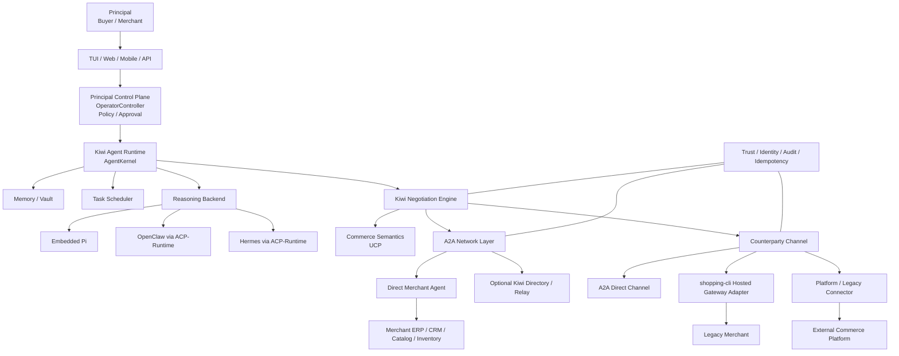
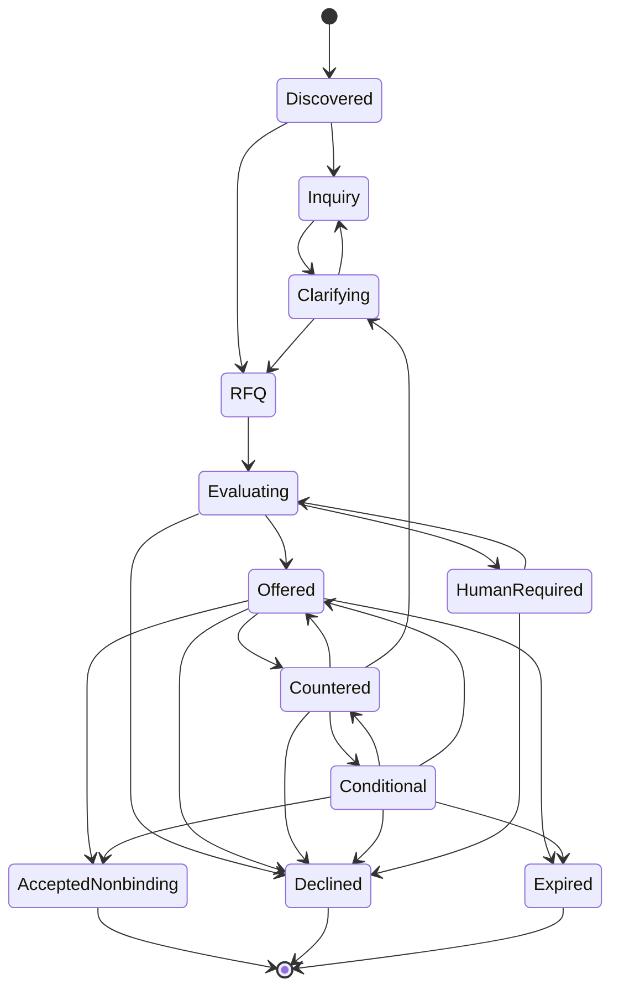

# Kiwi A2A Agent Commerce Network 总体架构框架 v1.0

> 本文是 Kiwi 下一阶段的“母文档”。  
> 它继承 Kiwi v0.2 / v0.3 已实现的 Agent Runtime、安全控制面、长期记忆、任务调度、磋商执行与 shopping-cli 能力，同时把 Kiwi 从“以 Gateway 为中心的电商 Agent”升级为一个**开放的 Agent Commerce Network**。
>
> v1.0 的核心目标不是订单和支付，而是把“交易前沟通、询价、报价、还价、条件协商、非绑定共识”变成可以跨 Agent、跨厂商、跨运行时互操作的协议能力。

---

## 0. 文档性质与来源边界

本文包含两类内容。

### 0.1 继承自现有 Kiwi 的能力

以下部分不是推倒重来，而是作为 v1.0 的可信底座继续保留：

- `AgentKernel`
- 主对话 Session 与隔离 Task Session
- `Principal Memory`
- `Private Vault`
- Buyer / Merchant 固定角色隔离
- `Task Scheduler`
- Buyer 搜索、跟踪、比较、咨询、磋商能力
- Merchant Capability Pack
- `OperatorController`
- `manual / supervised / autopilot`
- `HardPolicy / SessionStrategy / TurnInstruction`
- `ActionCandidate / DecisionCandidate`
- Approval Gate
- shopping-cli 的 claim / heartbeat / idempotency / audit
- 凭据隔离与 Credential Broker
- Pi 作为 Embedded Runtime
- OpenClaw / Hermes 作为外部 reasoning backend
- no-order / no-payment / no-refund / no-reservation 安全边界

### 0.2 v1.0 新增架构

本文新增：

- A2A Protocol v1.0 原生 Client / Server
- A2A Agent Card 与 Agent Discovery
- UCP Profile 与 UCP capability negotiation
- UCP-over-A2A binding
- Kiwi Negotiation Extension
- Direct Agent-to-Agent Commerce
- Counterparty Channel 抽象
- shopping-cli Hosted / Legacy Adapter
- Negotiation Ledger
- Agent Trust / Identity / Reputation 边界
- 协议级幂等、确认与恢复
- 未来 AP2 / UCP Checkout / Agentic Commerce Protocol 接口边界

---

# 1. 产品重新定义

## 1.1 v0.3 的定义

Kiwi v0.3 是：

> 一个代表 Buyer 或 Merchant、拥有长期记忆、任务能力和私有策略的 Agent-first 电商运行时。

这个定义继续成立。

## 1.2 v1.0 的新定义

Kiwi v1.0 进一步定义为：

> **Kiwi 是一个开放的 Agent Commerce Network Runtime，允许 Buyer Agent 与 Merchant Agent 在交易前直接发现、沟通、询价、报价、谈判并形成结构化的非绑定商业共识。**

Kiwi 不再以某一个 Gateway 为产品中心。

Kiwi 的核心资产变为四个部分：

1. **Principal Agent Runtime**  
   长期代表用户或商家。

2. **Negotiation Intelligence**  
   理解目标、偏好、限制，并形成谈判策略。

3. **Negotiation Protocol**  
   把自然语言沟通转成结构化、可验证、可恢复的商业协商状态。

4. **Trust & Control**  
   确保 Agent 的行为始终在委托人授权范围内。

---

# 2. 战略定位

Kiwi 不应成为另一个封闭电商平台，也不应成为另一个必须经过的中央 API Gateway。

Kiwi 更适合成为：

> **Agent Economy 中的交易前协商层。**

标准协议负责：

```text
A2A
= Agent 怎么互相通信

UCP
= 电商双方使用什么标准商业对象和能力

AP2
= 用户如何可验证地授权 Agent 付款

ACP-Commerce
= 某些 Agent 平台与 Seller Checkout 如何互操作
```

Kiwi 重点负责：

```text
Kiwi Negotiation
= 买卖双方在成交之前到底怎么谈
```

包括：

```text
Need
→ Inquiry
→ RFQ
→ Offer
→ CounterOffer
→ ConditionalOffer
→ Clarification
→ Agreement
→ Checkout Handoff
```

v1.0 截止于：

```text
Accepted Non-binding Agreement
```

不进入订单和支付。

---

# 3. 六条总体设计原则

## 3.1 Protocol-first，而不是 Gateway-first

如果远端 Merchant 支持标准 Agent 协议：

```text
Kiwi Buyer Agent
       ↕
    Direct A2A
       ↕
Merchant Agent
```

不得强制经过 Kiwi 中央 Gateway。

Gateway 仅服务于：

- Legacy Merchant
- Hosted Merchant
- 平台 API 转译
- 离线 Agent
- 企业内网代理
- 需要托管身份与审计的客户

---

## 3.2 Open Network，Optional Infrastructure

Kiwi 可以提供：

- Agent Directory
- Hosted Relay
- Hosted Merchant Agent
- Trust Registry
- Observability
- Enterprise Policy Service

但这些都必须是**可选基础设施**。

协议本身不得要求：

```text
Buyer → Kiwi Cloud → Merchant
```

唯一合法路径。

---

## 3.3 LLM 负责理解，Protocol 负责事实

LLM 可以理解：

> “如果我买 200 个，你能不能再便宜一点，而且分两批发？”

但真正进入 Agent-to-Agent 商业状态的必须是结构化对象：

```json
{
  "type": "counter_offer",
  "quantity": 200,
  "requested_unit_price": 83500,
  "currency": "CNY",
  "fulfillment": {
    "batches": 2
  }
}
```

自然语言不是商业状态的唯一真相源。

---

## 3.4 Private Intent 与 Public Commitment 永远分离

以下内容属于 Private Principal State：

- Buyer 最高预算
- Buyer 急迫程度
- Merchant 成本
- Merchant 最低成交价
- 用户个人偏好
- Merchant 客户分层策略
- 内部推理
- 私有联系人信息

远端 Agent 只能收到经过 Policy 编译和 Disclosure 检查后的：

- Inquiry
- Offer
- Public Terms
- Clarification
- CounterOffer
- Agreement

---

## 3.5 Reasoning Backend 与 Network Protocol 分离

Kiwi 内部可以使用：

```text
Embedded Pi
OpenClaw
Hermes
其他未来 Runtime
```

这些属于：

```text
ReasoningBackend
```

它们不是 Kiwi 对外 A2A 网络协议。

因此必须明确区分两个容易混淆的 “ACP”：

### ACP-Runtime

本文用 `ACP-Runtime` 表示：

> OpenClaw / Hermes 使用的 Agent Client Protocol 类运行时连接。

用途：

```text
Kiwi Runtime ↔ 外部 Reasoning Agent
```

### ACP-Commerce

本文用 `ACP-Commerce` 表示：

> Agentic Commerce Protocol，面向 Agent 应用与 Seller Checkout 的商业协议。

用途：

```text
Shopping Application ↔ Seller Checkout
```

**代码、文档和配置中禁止只写裸 `ACP`。**

---

## 3.6 Fail Closed 继续作为 Kiwi 的基本性格

任何以下情况不得产生远端正式商业写入：

- Agent Card 验证失败
- Capability 不兼容
- Schema 不通过
- 远端身份异常
- 本地 HardPolicy 不满足
- Approval 缺失
- 幂等状态不确定
- 协议版本未知
- 结构化 payload 与自然语言冲突
- Restricted Memory 可能泄露
- 远端要求越过 Kiwi 产品边界

---

# 4. 总体分层架构



---

# 5. 关键架构变化

## 5.1 从 `CommerceConnector` 升级为 `CounterpartyChannel`

v0.3：

```text
Role Capability Pack
    ↓
Commerce Connector
    ↓
shopping-cli / external platform
```

v1.0：

```text
Negotiation Engine
    ↓
CounterpartyChannel
    ├── A2ADirectChannel
    ├── ShoppingCliHostedChannel
    ├── PlatformApiChannel
    └── FutureRelayChannel
```

建议接口：

```ts
interface CounterpartyChannel {
  discover(target): Promise<CounterpartyProfile>;
  openContext(input): Promise<RemoteContext>;
  send(message): Promise<ChannelResult>;
  getState(ref): Promise<RemoteState>;
  subscribe?(ref): AsyncIterable<RemoteEvent>;
  close?(ref): Promise<void>;
}
```

上层 Negotiation Engine 不应知道：

> 这次是在直连 Agent，还是通过 shopping-cli。

---

## 5.2 shopping-cli 的新定位

shopping-cli 不删除。

它从：

> 唯一 Commerce Gateway

升级为：

> **Kiwi Hosted Commerce Adapter + Legacy Compatibility Layer**

承担：

- 不支持 A2A 的 Merchant 接入
- Agent 身份托管
- conversation queue
- claim / heartbeat
- 幂等
- 审计
- Legacy `shopping.negotiation/0.1`
- 与旧版 Kiwi 的兼容

未来拓扑：

```text
                 ┌── Merchant Agent (A2A)
Kiwi Buyer ──────┤
                 ├── shopping-cli Hosted Merchant
                 └── Platform API Merchant
```

---

# 6. A2A Network Layer

## 6.1 每个可联网 Kiwi 都是一个 A2A Agent

Buyer Kiwi 与 Merchant Kiwi 都应能够按部署模式暴露：

```text
/.well-known/agent-card.json
```

以及 A2A endpoint。

本地-only Kiwi 可以只作为 A2A Client，不强制开放公网 Server。

---

## 6.2 Agent Card

Merchant Agent Card 至少描述：

- Agent 名称
- Agent 版本
- Provider
- A2A supported interfaces
- authentication / security schemes
- streaming capability
- push notification capability
- skills
- extensions
- UCP support
- Kiwi Negotiation support

示意：

```json
{
  "name": "Example Merchant Agent",
  "description": "Merchant sales and negotiation agent",
  "version": "1.0.0",
  "supportedInterfaces": [
    {
      "url": "https://merchant.example/a2a",
      "protocolBinding": "JSONRPC",
      "protocolVersion": "1.0"
    }
  ],
  "capabilities": {
    "streaming": true,
    "extendedAgentCard": true,
    "extensions": [
      {
        "uri": "https://<kiwi-domain>/extensions/negotiation/1.0",
        "required": false
      }
    ]
  },
  "skills": [
    {
      "id": "commerce_negotiation",
      "name": "Commerce Negotiation",
      "description": "Inquiry, RFQ, offer and pre-transaction negotiation"
    }
  ]
}
```

注意：

`https://<kiwi-domain>/...` 是架构占位符。  
正式发布协议前必须改为 Kiwi 实际控制的稳定 HTTPS namespace。

---

# 7. UCP Integration Layer

## 7.1 UCP 是 Commerce Semantic Base

Kiwi 不应重新定义已经由 UCP 定义的标准商业对象。

例如未来：

- Cart
- Checkout
- Fulfillment
- Order
- Buyer context
- Payment-related commerce structures

优先采用 UCP。

Kiwi 只扩展 UCP 当前没有完整标准化的：

> **Pre-transaction Negotiation**

---

## 7.2 UCP Profile

支持 UCP 的 Merchant 发布：

```text
/.well-known/ucp
```

其中声明：

- UCP version
- Shopping service
- transport
- endpoint
- capabilities
- custom capability / extension

A2A 模式下：

```text
UCP Profile
    ↓
transport = a2a
    ↓
Agent Card URL
    ↓
A2A Agent
```

因此 Agent Discovery 有两条标准入口：

```text
Merchant Domain
   ├── /.well-known/ucp
   └── /.well-known/agent-card.json
```

---

# 8. Kiwi Negotiation Extension

## 8.1 定位

`Kiwi Negotiation` 是 v1.0 的核心创新。

它不是新的 transport。

它作为：

- A2A Extension
- UCP Vendor Capability
- 本地 Negotiation Domain Model

存在。

内部协议名可以继续采用：

```text
kiwi.negotiation/1.0
```

但对外 UCP capability 必须使用 Kiwi 实际控制域名对应的 reverse-domain namespace。

例如占位：

```text
com.<kiwi-domain>.negotiation
```

---

## 8.2 Negotiation 基本对象

### Inquiry

一般咨询。

```text
“这个商品什么时候能到？”
“支持企业发票吗？”
```

### RFQ — Request For Quote

结构化询价。

```json
{
  "type": "rfq",
  "items": [
    {
      "sku": "SKU-001",
      "quantity": 200
    }
  ],
  "requested_terms": {
    "delivery_before": "2026-08-20T18:00:00Z"
  }
}
```

### Offer

卖方正式的非绑定报价。

```json
{
  "type": "offer",
  "offer_id": "off_01...",
  "items": [
    {
      "sku": "SKU-001",
      "quantity": 200,
      "unit_price": {
        "currency": "CNY",
        "amount_minor": 85000
      }
    }
  ],
  "valid_until": "2026-08-06T12:00:00Z"
}
```

### CounterOffer

对上一 Offer 的结构化反报价。

### ConditionalOffer

带条件的报价：

```text
如果数量 ≥ 500
则单价 = X

如果分两批交付
则第二批交期 = Y
```

### Clarification

缺失字段或歧义澄清。

### AcceptedNonbindingAgreement

双方对当前 terms 达成一致，但：

```text
不是订单
不是支付
不是库存锁定
不是法律上的自动成交
```

它只是未来 checkout / contract / order handoff 的输入。

---

# 9. Negotiation Envelope

所有 Kiwi Negotiation payload 外层统一使用：

```json
{
  "protocol": "kiwi.negotiation/1.0",
  "exchange_id": "ex_01...",
  "context_ref": "...",
  "message_id": "msg_01...",
  "in_reply_to": "msg_00...",
  "actor": "buyer",
  "action": "counter_offer",
  "created_at": "2026-08-05T12:00:00Z",
  "payload": {},
  "public_message": "如果订购 200 件，希望单价调整为 835 元，并分两批交付。",
  "digest": "sha256:..."
}
```

原则：

- `payload` 是商业事实。
- `public_message` 是面向人类的表达。
- 发生冲突时，正式协议语义以结构化 `payload` 为准。
- `digest` 用于幂等、审计和重放检测。
- Restricted 信息不得出现。

---

# 10. A2A Binding

## 10.1 Message 用于互动

普通协商优先映射为：

```text
A2A Message
  + Text Part
  + Data Part (Kiwi Negotiation Payload)
```

例如：

```text
Text:
“200 件可以再优惠，但需要分两批交付。”

DataPart:
ConditionalOffer {...}
```

---

## 10.2 contextId

一个持续协商过程映射为：

```text
A2A contextId
```

Kiwi 本地建立：

```text
negotiation_id ↔ remote contextId
```

不得假设远端 `contextId` 可被客户端自行生成或解析。

---

## 10.3 Task

对于需要异步处理的场景使用 A2A Task：

- 人工审批
- 企业采购审批
- 长时间库存确认
- 定制商品核价
- 后台商务人员介入
- 供应链交期确认

例如：

```text
RFQ
 ↓
Task: working
 ↓
Merchant internal approval
 ↓
Task: completed
 ↓
Offer Artifact
```

---

# 11. Negotiation 状态机



重要：

```text
AcceptedNonbinding
≠ OrderCreated
```

---

# 12. Negotiation Ledger

v0.2 / v0.3 中：

> Marketplace Conversation 由 shopping-cli 保存，是权威公开状态。

在 Direct A2A 世界里，不能再假设存在一个中心数据库。

因此 v1.0 引入：

> **Negotiation Ledger**

它不是区块链，也不是新的中央服务器。

每个 Kiwi 本地保存：

- 发出的结构化消息
- 收到的结构化消息
- A2A message / task reference
- remote contextId
- digest
- ack / result
- capability version
- identity snapshot
- public transcript
- 状态转换
- error / retry / replay evidence

Ledger 是：

```text
append-only + content-addressed + auditable
```

---

## 12.1 Authority 规则

### Hosted / shopping-cli 路径

权威状态仍然优先来自 shopping-cli Gateway snapshot。

### Direct A2A 路径

权威状态由：

```text
远端 A2A response
+
本地已确认 exchange record
```

共同形成。

本地模型输出永远不是权威远端状态。

---

# 13. 新的状态域

v1.0 建议明确七个状态域：

1. **User Chat Session**  
   用户与 Kiwi 的私人聊天。

2. **Principal Memory**  
   经过治理的长期偏好、事实、约束。

3. **Private Vault**  
   Restricted secrets。

4. **Task State**  
   搜索、跟踪、咨询、谈判等任务。

5. **Operator Control State**  
   策略、模式、审批、暂停、人工接管。

6. **Reasoning Session**  
   Pi / OpenClaw / Hermes 的短期推理上下文。

7. **Negotiation Ledger / Remote Context**  
   对外 A2A 商业状态。

绝不允许：

```text
Remote Message
→ 直接成为 Principal Memory
```

必须经过分类、证据和记忆治理。

---

# 14. Agent Runtime 保持不变的核心

## 14.1 AgentKernel

继续作为单 Kiwi 实例的生命周期与并发所有者。

新增职责：

- 处理 A2A inbound event
- 管理 direct remote contexts
- 协调 Agent Discovery
- 选择 CounterpartyChannel
- 驱动 Negotiation Engine

---

## 14.2 Memory / Vault

继续遵循：

```text
明确陈述
> 已确认记忆
> 多任务重复行为
> 单次行为
> 模型猜测
```

远端 Agent 不得访问：

- 完整 Principal Memory
- Vault
- Buyer 私有预算
- Merchant 底价
- 内部策略

只有 Policy 编译后的最小公开事实可以进入 A2A。

---

## 14.3 Task Scheduler

继续负责：

- Price tracking
- Availability tracking
- RFQ follow-up
- Offer expiration
- Negotiation timeout
- Human approval timeout
- Agent reconnect
- A2A Task poll / subscribe
- Retry budget

---

# 15. Operator Control Plane

原 v0.2 的三层策略继续保留。

```text
HardPolicy
   ↓
SessionStrategy
   ↓
TurnInstruction
```

并新增：

```text
NetworkDisclosurePolicy
```

用于控制：

- 哪些个人属性可发送
- 是否暴露地区
- 是否暴露需求紧迫度
- 是否可发送联系方式
- 是否允许 Merchant 看到 Buyer organization
- 是否允许远端要求额外 identity proof

---

# 16. Approval Gate

v1.0 中所有外部商业 Action 仍必须形成：

```text
ActionCandidate
```

而不是：

```text
LLM text → HTTP request
```

流程：

```text
Reasoning
   ↓
NegotiationCandidate
   ↓
Bind current context
   ↓
Schema Validation
   ↓
HardPolicy
   ↓
Disclosure Policy
   ↓
Counterparty Capability Check
   ↓
Approval Gate
   ↓
CounterpartyChannel.send()
```

---

# 17. Trust & Identity Layer

v1.0 不尝试发明一个全球身份标准。

优先使用标准网络能力：

- HTTPS
- OAuth 2 / OIDC
- mTLS（企业可选）
- A2A security schemes
- Agent Card signature verification
- Domain ownership
- Key rotation

Kiwi 自己增加：

```text
CounterpartyTrustRecord
```

可以记录：

- domain
- agent card fingerprint
- provider
- first_seen
- last_seen
- capability versions
- successful exchanges
- invalid schema count
- timeout rate
- disputed terms count
- trust status

---

## 17.1 Trust 不等于 Recommendation

一个 Merchant Agent：

```text
protocol-compliant
```

不代表：

```text
商品一定好
价格一定便宜
商家一定值得购买
```

Kiwi 必须把：

```text
Protocol Trust
Merchant Reputation
Product Ranking
```

作为三个独立维度。

---

# 18. Discovery

Kiwi v1.0 支持四类发现。

## 18.1 Direct Domain Discovery

```text
merchant.com
  ↓
/.well-known/ucp
  ↓
A2A Agent Card
```

## 18.2 Configured Agent

用户或企业直接配置 Agent Card URL。

## 18.3 Platform Discovery

通过现有平台搜索商品后，Connector 返回：

```text
merchant_agent_endpoint?
ucp_profile?
```

## 18.4 Optional Kiwi Directory

Kiwi 可以未来提供公共 Directory：

```text
search:
  category
  geography
  capabilities
  trust
```

但 Directory 只是：

```text
discovery index
```

不能成为协议运行的单点依赖。

---

# 19. Buyer 端完整路径

```text
用户：
“我要采购 200 台显示器，
预算 30 万，
最好 7 天内到。”

        ↓

Principal Memory
+ HardPolicy
+ Task Context

        ↓

Buyer Search / Discovery

        ↓

发现 10 个候选 Merchant

        ↓

读取 UCP Profile / Agent Card

        ↓

Capability Intersection

        ↓

向 5 个 Agent 发 RFQ

        ↓

异步收 Offer

        ↓

Kiwi Ranker 比较：
price
delivery
warranty
reputation
terms

        ↓

对 Top 3 自动 Counter

        ↓

Merchant ConditionalOffer

        ↓

Buyer HardPolicy + Strategy

        ↓

AcceptedNonbindingAgreement

        ↓

用户确认：
“选择 B 商家”

        ↓

selected_nonbinding

        ↓

v1.1:
Checkout Handoff
```

---

# 20. Merchant 端完整路径

```text
Merchant Principal
        ↓
Private business strategy
        ↓
Catalog / Inventory / Cost / Floor Price
        ↓
Merchant Kiwi Agent

收到 RFQ
        ↓
Validate Buyer / capability / schema
        ↓
Retrieve authorized business facts
        ↓
Negotiation Strategy
        ↓
OfferCandidate
        ↓
Merchant HardPolicy
        ↓
Approval / Autopilot
        ↓
A2A Offer
        ↓
CounterOffer
        ↓
Re-evaluate
        ↓
AcceptedNonbindingAgreement
```

Merchant 的：

```text
cost
floor price
margin target
customer segmentation
```

永不进入 Buyer 可见消息。

---

# 21. Hosted / Legacy Path

Legacy Merchant 不需要立即实现 A2A。

```text
Buyer Kiwi
   ↓
A2A-like internal negotiation model
   ↓
ShoppingCliHostedChannel
   ↓
shopping.negotiation/0.1
   ↓
shopping-cli
   ↓
Merchant integration
```

由 Adapter 完成：

```text
kiwi.negotiation/1.0
↕
shopping.negotiation/0.1
```

这使 Kiwi 可以在不破坏现有实现的情况下升级。

---

# 22. `shopping.negotiation/0.1` 迁移原则

现有 frozen contract 不立即删除。

v1.0 进入兼容期：

```text
shopping.negotiation/0.1
= legacy wire contract

kiwi.negotiation/1.0
= canonical internal + A2A domain contract
```

Adapter 负责转换。

当旧字段无法无损表达新能力时：

```text
fail closed
```

不得偷偷丢字段。

---

# 23. Reliability 基线整改

在开始 A2A 网络开发前，建议先完成现有代码评审中的可靠性修复。

## P0

### Claim escape recovery

claim 后任意 transient exception：

```text
best-effort abandon / fail
```

不得悬置 300 秒。

### Fake claim semantics

Fake Commerce Client 必须与正式 claim 契约一致。

in-flight 同键重放不能再次：

```text
claimed = true
```

---

## P1

### `--once` signal cleanup

SIGINT / SIGTERM 必须能：

```text
abort
→ abandon unfinished claim
```

### Log redaction

覆盖：

```text
shopping_agent_token=
env[SHOPPING_AGENT_TOKEN]=
```

等写法。

### Filesystem privacy

包含 Commerce / Memory / Ledger 的目录：

```text
0700
```

文件默认：

```text
0600
```

---

# 24. 推荐代码模块重构

```text
src/
├── agent/
│   ├── kernel/
│   ├── session/
│   ├── memory/
│   ├── vault/
│   ├── task/
│   ├── buyer/
│   └── merchant/
│
├── operator/
│   ├── controller/
│   ├── strategy/
│   └── approval/
│
├── reasoning/
│   ├── backend.ts
│   ├── embedded-pi/
│   ├── openclaw-acp-runtime/
│   └── hermes-acp-runtime/
│
├── a2a/
│   ├── client/
│   ├── server/
│   ├── discovery/
│   ├── agent-card/
│   ├── auth/
│   └── extensions/
│
├── ucp/
│   ├── profile/
│   ├── capability/
│   └── binding/
│
├── negotiation/
│   ├── protocol/
│   ├── schema/
│   ├── engine/
│   ├── state-machine/
│   ├── ledger/
│   ├── policy/
│   └── ranking/
│
├── counterparty/
│   ├── channel.ts
│   ├── a2a-direct/
│   ├── shopping-cli-hosted/
│   └── platform-api/
│
├── trust/
│   ├── identity/
│   ├── card-verification/
│   ├── reputation/
│   └── audit/
│
├── commerce/
│   └── legacy/
│
└── protocol/
    ├── legacy-shopping-negotiation/
    └── kiwi-negotiation/
```

---

# 25. 核心接口

## AgentDiscovery

```ts
interface AgentDiscovery {
  resolve(input: DiscoveryInput): Promise<CounterpartyProfile>;
}
```

## NegotiationEngine

```ts
interface NegotiationEngine {
  start(intent: NegotiationIntent): Promise<NegotiationSession>;
  ingest(event: CounterpartyEvent): Promise<NegotiationDecision>;
  prepareAction(sessionId: string): Promise<ActionCandidate>;
}
```

## NegotiationLedger

```ts
interface NegotiationLedger {
  append(event: NegotiationEvent): Promise<void>;
  getSession(id: string): Promise<NegotiationSnapshot>;
  verifyChain(id: string): Promise<VerificationResult>;
}
```

## TrustService

```ts
interface TrustService {
  verifyAgentCard(card): Promise<IdentityResult>;
  assessCounterparty(profile): Promise<TrustAssessment>;
}
```

---

# 26. v1.0 Security Invariants

以下是不允许被任何新协议破坏的硬不变量：

1. 一个 Kiwi 实例只代表一个 Principal Role。
2. Buyer 与 Merchant 私有 Memory / Vault / Credential 永不共享。
3. 外部 Agent 不获得本地工具任意执行权。
4. ACP-Runtime backend 不获得 Commerce credential。
5. A2A remote Agent 不获得 Principal Memory。
6. LLM 输出不能直接成为网络写入。
7. 所有正式写入都经过 schema + bind + policy + approval。
8. 未知协议版本 fail closed。
9. 远端内容始终视为 untrusted input。
10. `public_message` 不能绕过结构化 payload。
11. 相同 exchange 重放必须幂等。
12. v1.0 绝不创建订单。
13. v1.0 绝不执行支付。
14. v1.0 绝不退款。
15. v1.0 绝不锁库存。
16. 不保存原始 chain-of-thought。
17. 日志不包含 secret / token / private threshold。
18. Agent Card 不放静态 secret。
19. Direct A2A 失败不能自动降级到一个权限更宽的通道。
20. Legacy Adapter 不允许提升旧协议权限。

---

# 27. v1.0 产品边界

## 支持

- Agent discovery
- Merchant capability discovery
- Product / merchant inquiry
- RFQ
- Offer
- CounterOffer
- ConditionalOffer
- Clarification
- Expiration
- Human review
- Async negotiation
- Non-binding agreement
- Buyer selection
- Search / compare / rank / track
- Merchant catalog / inventory facts
- Hosted legacy negotiation
- Direct A2A negotiation

## 不支持

- Order creation
- Checkout execution
- Payment
- Refund
- Inventory reservation
- Contract execution
- Escrow
- Payment credential handling

---

# 28. v1.1 之后的交易闭环

v1.1 再进入：

```text
AcceptedNonbindingAgreement
       ↓
UCP Cart / Checkout
       ↓
User Authorization
       ↓
AP2 Mandate
       ↓
Payment
       ↓
Order
```

ACP-Commerce 可以作为特定 Seller Checkout ecosystem 的兼容 Adapter。

Kiwi 不把任何一个支付/checkout protocol 绑定为唯一实现。

---

# 29. AP2 Integration Boundary

AP2 不应进入 v1.0 Negotiation Core。

预留接口：

```text
AuthorizationProvider
```

未来：

```ts
interface AuthorizationProvider {
  createIntentMandate(...);
  verifyIntentMandate(...);
  authorizeCheckout(...);
}
```

Negotiation Engine 只产出：

```text
NegotiatedTerms
```

支付授权系统把它转换成：

```text
Intent / Cart / Payment authorization
```

---

# 30. 版本路线

## v0.3 — Agent-first Runtime

状态：现有基础。

目标：

- Memory
- Task
- Search
- Tracking
- Consultation
- Negotiation
- Merchant Capability

---

## v0.4 — Protocol Refactor

不改变用户体验，先内部重构：

- `CounterpartyChannel`
- canonical `kiwi.negotiation/1.0`
- Negotiation Ledger
- shopping-cli legacy adapter
- reliability P0/P1 fixes

---

## v0.5 — Native A2A

加入：

- A2A Client
- A2A Server
- Agent Card
- direct Agent negotiation
- A2A Task / context mapping
- security schemes

---

## v0.6 — UCP Interop

加入：

- `/.well-known/ucp`
- UCP Profile resolver
- UCP capability negotiation
- UCP-over-A2A binding
- vendor negotiation extension advertisement

---

## v0.7 — Open Network

加入：

- multi-merchant RFQ fan-out
- discovery
- trust records
- cross-agent interoperability tests
- optional directory

---

## v1.0 — Kiwi A2A Agent Commerce Network

完成：

```text
Buyer Agent
   ↕
open A2A
   ↕
Merchant Agent
```

完整交易前协商闭环。

---

## v1.1 — Transaction Handoff

- UCP Cart
- UCP Checkout
- AP2 Authorization
- ACP-Commerce Adapter
- order handoff

---

# 31. 测试体系

## 31.1 Protocol Unit Tests

- every negotiation object schema
- unknown fields policy
- version compatibility
- digest
- idempotency
- replay
- parent linkage
- offer expiry
- invalid state transition
- structured/text conflict

---

## 31.2 A2A Interop Tests

至少：

```text
Kiwi Buyer ↔ Kiwi Merchant
Kiwi Buyer ↔ reference A2A Merchant
reference A2A Buyer ↔ Kiwi Merchant
```

覆盖：

- SendMessage
- streaming
- Task
- contextId
- timeout
- cancellation
- extended Agent Card
- extension negotiation

---

## 31.3 UCP Tests

- profile discovery
- unsupported capability
- version mismatch
- A2A transport selection
- vendor capability advertisement
- profile cache invalidation

---

## 31.4 Legacy Compatibility

必须验证：

```text
v1 Kiwi
 ↔ shopping-cli
 ↔ old Kiwi / old Merchant
```

行为不回归。

---

## 31.5 Security Tests

- prompt injection from Merchant
- malicious Agent Card
- malicious UCP profile
- memory exfiltration
- budget leakage
- floor price leakage
- SSRF endpoint
- redirect attack
- invalid certificate
- replay attack
- duplicated action
- cross-role credential read
- forged contextId
- forged offer ID

---

## 31.6 Reliability Tests

- A2A response accepted but client timeout
- send retry
- duplicate response
- server restart
- Buyer restart
- Merchant restart
- network partition
- push notification loss
- Task poll recovery
- concurrent workers
- approval timeout

---

# 32. v1.0 完成定义

只有以下全部成立，Kiwi 才能宣布：

> **Kiwi A2A Agent Commerce Network v1.0**

1. Buyer 与 Merchant 都可以独立成为 A2A Agent。
2. 两边不需要共享 Kiwi Gateway 即可直接完成完整磋商。
3. 可以通过 Agent Card 发现能力。
4. 可以通过 UCP Profile 发现 Commerce transport / capability。
5. Kiwi Negotiation Extension 能表达 Inquiry / RFQ / Offer / CounterOffer / ConditionalOffer / Clarification / Non-binding Agreement。
6. 多轮谈判可通过 A2A `contextId` 恢复。
7. 异步任务可通过 A2A Task 恢复。
8. 所有对外 Action 经过 HardPolicy 与 Approval。
9. Private Memory / Vault 不进入远端上下文。
10. shopping-cli 旧路径继续可用。
11. `shopping.negotiation/0.1` 可以通过 Adapter 与新模型共存。
12. direct A2A 与 hosted Gateway 使用同一 Negotiation State Machine。
13. 同一业务 exchange 具有幂等和审计语义。
14. Buyer / Merchant 可以使用不同 reasoning backend，而协议结果一致。
15. Pi / OpenClaw / Hermes 不改变 A2A wire semantics。
16. 所有安全测试通过。
17. 所有恢复 / replay / timeout 测试通过。
18. 不产生任何订单。
19. 不产生任何支付。
20. 不产生任何库存预留。

---

# 33. Kiwi 真正的技术壁垒

如果只把 Kiwi 做成：

```text
LLM
→ shopping API
```

它很容易被平台原生 Agent 能力替代。

如果做成：

```text
Gateway
→ Merchant APIs
```

它会面对大型电商平台和支付平台的基础设施竞争。

Kiwi 更值得建立的壁垒是：

```text
Principal Memory
+
Negotiation Intelligence
+
Negotiation Protocol
+
Trust / Policy
+
Open A2A Interoperability
```

最终 Kiwi 不只是：

> “帮用户买东西的 Agent。”

而是：

> **“代表一个真实经济主体，在开放 Agent 网络里理解需求、寻找交易对手、谈判条件并形成可信商业共识的 Agent。”**

---

# 34. 一句话总架构

```text
Kiwi v1.0
=
Principal Agent Runtime
+
A2A Interoperability
+
UCP Commerce Semantics
+
Kiwi Negotiation Protocol
+
Policy / Trust / Approval
+
Optional Hosted Legacy Infrastructure
```

其中：

```text
shopping-cli
```

从 Kiwi 的“中心”

变成 Kiwi 网络中的：

```text
Hosted / Legacy Adapter
```

而：

```text
Kiwi Negotiation
```

成为真正的核心协议资产。

---

# Appendix A — 现有 Kiwi 文档继承关系

## `agent-runtime-v0.3.md`

继续作为：

- Agent Runtime
- Memory
- Vault
- Task
- Buyer / Merchant Capability

的详细设计基础。

## `operator-tui-v0.2.md`

继续作为：

- Operator Control Plane
- Strategy
- Approval
- mode
- TUI

的详细设计基础。

## `external-agent-adapters-v0.2.md`

继续作为：

- ACP-Runtime
- Pi / OpenClaw / Hermes ReasoningBackend

的详细设计基础。

其概念不得再与对外 A2A 网络层混合。

## `reviews/code-review-2026-08-04.md`

其中的：

- claim recovery
- fake claim semantics
- signal cleanup
- log redaction
- filesystem permission

进入 v0.4 前置整改项。

---

# Appendix B — 外部标准基线

本文总体设计参考的外部协议基线：

- Agent2Agent Protocol (A2A) — 1.0.0
- Universal Commerce Protocol (UCP) — 2026-04-08 specification family
- Agent Payments Protocol (AP2)
- Agentic Commerce Protocol (ACP-Commerce)

设计原则：

> **标准解决的事情，Kiwi 不重复发明；标准尚未解决好的交易前协商，Kiwi 才建立自己的协议资产。**
