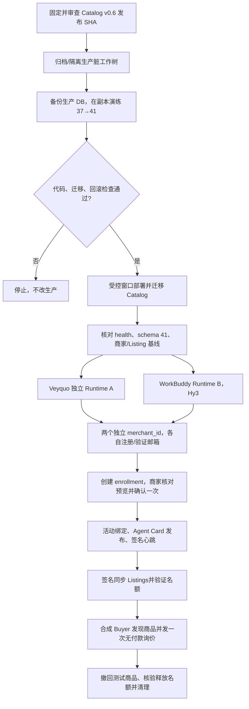

# 商家接入与商品名额真实环境验收计划 v0.6

日期：2026-09-28
状态：**计划已按 v0.6 更新；真实环境验收未启动。**本文以 [v0.6 设计](./merchant-onboarding-listing-capacity-v0.6.md)、Catalog [账号文档](../../kiwi-catalog/docs/accounts.md) 和 [商品名额说明](../../kiwi-catalog/docs/listing-entitlements.md) 为准。v0.5 中“新商家申请 Listings、管理员审批 token 后发布”的流程已退为历史，不用于本计划。

## 1. v0.6 验收目标

验证新商家从注册、邮箱验证、Runtime 接入，到活动绑定、Agent Card 上线、商品 Listings 同步和 Buyer 询价的完整路径；验证 free 方案名额、治理限制、迁移和清理行为。

新商家发布权限由三项状态共同决定：

1. Catalog 商家账号有效且邮箱已验证；
2. 当前 Runtime 有活动绑定，并关联已发布 enrollment；
3. Catalog 中该商家的方案、可用名额和治理状态允许发布。

新账号无需提交 token request 或等待常规 Listings 人工审批；Runtime 不接收 owner token。管理员仍可调整额度或治理暂停账号/Listing。`/v1/merchant-publications` 的公开声明资料是另一条路径，买家结果固定 `inquiry_available=false`，不作为可询价 Listing，也不占 Listings 名额。

## 2. 当前基线与开工门槛

| 项目 | 已核对状态 | 对验收的影响 |
| --- | --- | --- |
| Kiwi | `main` 为 `f886c14` | 已包含 v0.6 商家发布编排和跨仓脚本更新；`tests/product-publish.test.ts` 大幅缩减，需核对旧覆盖是否已迁到新测试 |
| Catalog | 本机追踪的 `origin/main` 为 `d14bb3d`；v0.6 额度代码位于本地 `refactor/admin-move-out` 分支（含 `87c67d4`、`55e7839` 等提交），工作树还有 admin 路由重构的暂存/未暂存改动 | 先形成干净、已审查、CI 通过的 Catalog v0.6 发布 SHA；不把当前脏工作树直接部署 |
| 生产 Catalog | `kiwi-catalog.service` active，`/health` 成功；HEAD `aa116c9`；SQLite `user_version=37` | v0.6 目标 schema 为 41；部署代码会在数据库连接初始化时执行缺失迁移 |
| 生产脏工作树 | 完整归档已保存在服务器 root-only 目录；SHA-256 `85f13b4ccb84e0ac3823ed4eeaedc99d3bd385a726489510d9be3f3a410b53f8` | 144 个目标文件与已合并代码内容相同；39 个不同、45 个目标文件缺失、19 个额外 untracked 文件无法从 Git/系统记录追溯到具体操作者。归属决策仍待确认；不覆盖原目录 |
| WorkBuddy | 截图中的 `Kiwi商家云运行时M1` 已发布，URL 为 `kiwi-merchant-runtime.app.workbuddy.host`；尚未探测 | 先确认这是可运行 Node Runtime、具备 HTTPS 和持久数据目录的实例；若是静态应用则不能视为 Kiwi Runtime |
| 费用与模型 | 总额上限 ¥50、最长 2 小时；WorkBuddy 与 CodeBuddy 均指定 Hy3 | 使用已有额度，不购买新套餐/加量包；运行前后记录余额和账单，超限或无法计量即停止 |
| CodeBuddy CLI | 本机 `2.158.0`；一次本地 smoke 为 4 passed、记录 0.01 积分 | 该 smoke 使用的是 DeepSeek，不代表 Hy3 E2E；后续 Harness 明确选择 Hy3 并限制工具白名单 |

### 生产发布前置检查

1. 确认当前生产脏改动的归属；或明确同意将未知改动仅保留在上述归档中，使用独立干净 release 目录部署，原目录保持不动。
2. 固定两仓确切提交和制品摘要；审查、合并 Catalog v0.6 entitlement 代码及当前 admin 路由重构，并通过 lint/typecheck/全量测试/CodeQL。
3. 对生产 SQLite 做一致性备份；在副本上从 schema 37 演练至 41，验证备份可恢复、迁移审计正确。
4. 迁移 40 会为现有 ACTIVE Listings 超过 free 上限的商家设置临时覆盖额度并留审计；迁移 41 仅把未自定义的 free 默认值从 10 调至 20。必须核对迁移前后商家、绑定、公开条目计数及已有自定义额度。
5. 旧代码拒绝打开高于自身支持版本的数据库。回滚需要恢复兼容的应用版本与数据库备份成对进行；不得只回退代码。

## 3. E2E 流程

### A. 注册、邮箱验证与 free 名额

- 用两个隔离商家身份分别覆盖 Veyquo Runtime 与 WorkBuddy Runtime；每个商家使用独立 Catalog `merchant_id`，不要让两个 Runtime 共用一个商家身份。
- 新注册字段：商家名称、电话、邮箱、密码必填，微信选填。注册即创建 `merchant_id`、`merchants` 影子行和 free 权益；不创建 token request 或待审批申请。
- 未验证邮箱时登录/公开 Listings 必须被拒绝。验证邮箱后检查 admin dashboard 已能看到账号，并用 `GET /v1/accounts/me` 核对 `listing_capacity` 的 `active_used=0`、`active_limit=20`、剩余名额。
- 独立验证公开声明资料路径：发布后可被公开搜索，但 `inquiry_available=false`，不生成 Agent Card / A2A 端点，也不增加 Listings 名额。

### B. Runtime enrollment 与绑定

- **Veyquo A**：先核对当前账号验证状态、活动绑定、公开商品和现有业务；禁止轮换已有密钥或暂停整店。若存在真实在售内容，只用专用测试商品。
- **WorkBuddy B**：优先把 M1 当只读模板；只有确认其数据可丢弃且 Runtime/持久化机制符合要求时才直接使用。否则创建独立临时实例，不覆盖 M1；模型选 Hy3。
- 两边分别运行 `kiwi merchant connect`/WorkBuddy 接入，核对配对码和冻结公开预览，各由商家确认一次。验收持钥轮询、邮箱账号归属、HTTPS endpoint challenge、活动绑定和 Agent Card 发布。
- 确认实例私钥位于各自持久目录且不进入镜像/环境输出；重启或 WorkBuddy 休眠唤醒后仍使用同一密钥和绑定。首轮不演练丢钥、换钥或破坏性恢复。

### C. Listings 名额和签名发布

| 用例 | 操作 | 预期 |
| --- | --- | --- |
| 默认额度 | 新账号查询 `/v1/accounts/me` | free / 20 名额，初始已用 0 |
| 签名发布 | Runtime 发布一条合成 `product`，再自查 | Catalog 验证账号、邮箱、活动绑定、已发布 enrollment、治理和额度；成功后已用 +1；请求不含 owner token |
| 更新/幂等 | 对同一稳定商品键重复同步、内容更新、重试 | 更新原行，不重复占额；幂等重放返回原结果 |
| 产品类型共享 | 对同一测试商家发布 `product` 和 `capability` | 两种类型共用同一容量上限 |
| 到达上限 | 只对空的测试商家设置 per-merchant `limit_override=1`，发布第二个新商品 | 被拒绝并返回 `LISTINGS_CAPACITY_EXCEEDED`；不更改全局 free 方案 |
| 撤回/重发 | 撤回一条后核对 `active_used`，再重新发布 | 撤回释放名额；重新发布再次检查当前额度 |
| freshness/state | 测试 stale ACTIVE、WITHDRAWN、SUSPENDED | stale ACTIVE 仍占名额；WITHDRAWN/SUSPENDED 不占名额 |
| 降额 | 将测试商家额度降到低于当前占用 | 不自动隐藏现有 ACTIVE；允许更新/撤回，拒绝新增与重新上架 |
| 方案暂停/治理 hold | 暂停测试商家权益；另测 listing `governance_hold` | 方案暂停时允许签名自查/撤回、拒绝发布；治理 hold 不能靠 Runtime 重发解除，需管理员先解除 |
| 账号 owner-token | 对 account-backed 测试商家用旧 token 路径，含 legacy flag 开启的隔离副本用例 | 账号商家不能靠 owner token 发布；新 Runtime 也不能接收 token |

生产环境仅对专用测试 merchant 写入临时 `limit_override`，所有调整和复位都检查审计事件。全局 free 限额调整、制造 21 条真实 Listing 的迁移场景，只在数据库副本测试。

### D. Buyer 与失败用例

- 使用合成 Buyer ID，发现两家 Agent Card 和测试 Listings，验签后各发一次询价；不付款、不下真实订单、不占真实库存。
- 负向用例：邮箱未验证、错误/过期配对码、enrollment 未发布、错误 merchant/agent、跨商家签名、错误 key/kid/binding、JWS 过期/重放、额度满、账号暂停、治理 hold、绑定撤销。
- Kiwi publish 编排必须在没有已发布 enrollment 时 fail closed，不回退 owner token；空投影不得默认触发全量 reconcile 下架。运行前确认测试 `shopping-cli` DB 非空且只含测试 SKU。

### E. 迁移副本和生产迁移验证

在数据库副本中覆盖：schema 39→40→41；已有 ACTIVE 数量大于 20 时 grandfather override 等于当前占用且写审计；未自定义 free 默认从 10 升至 20；管理员自定义 plan limit / merchant override 均保留。对迁移前后进行结构、计数和审计核对，不读取或导出生产商家明细。

### F. 清理与证据

- 撤回测试 Listings、下架/撤回测试名片、清除测试 merchant 的额度覆盖并确认回到方案额度；撤销测试 enrollment/binding 和临时凭据。
- 仅删除本轮新建且确认可丢弃的 WorkBuddy 实例/Session；M1 保留作参考。检查无残留 Runtime、公开 Listing、额外费用和超限积分。
- 记录脱敏的 commit/制品摘要、迁移版本、merchant 代号、listing ID、绑定/enrollment 状态、API 结果、审计 ID、账单/积分前后值与清理回执。production Catalog 的审计/访问日志可能保留，不承诺物理擦除。

## 4. 当前自动化覆盖与补齐项

- Kiwi `verify-enrollment-cross-repo.mjs` 已覆盖：注册后 free `active_limit=20`、一条签名 Listing 发布后已用 +1、签名撤回后已用回到 0。它不覆盖容量满、迁移或 production 网络路径。
- Catalog `tests/test_listings_binding_auth.py` 已有额度上限/幂等更新、并发不能超额、邮箱验证、治理 hold、owner token 不控制签名发布、绑定/JWS 校验、签名自查与撤回等用例。
- Catalog `tests/test_listing_entitlements.py` 有 plan 与单商家 override 分离、迁移 grandfather、v41 默认升级并保留管理员自定义值。
- 计划仍需明确覆盖 stale ACTIVE 占额、WITHDRAWN/SUSPENDED 的名额计算、`product`/`capability` 共额、账号 owner-token 在 legacy flag 下仍 fail closed，以及迁移后后台展示/审计回执。
- Kiwi `tests/product-publish.test.ts` 在 `f886c14` 中由约 950 行缩到 26 行；新 `product-publish-enrollment.test.ts` 覆盖绑定签名成功路径。合并/部署前应确认旧测试中的 shopping CLI 版本拒绝、重定向拒绝、发布错误报告和空投影保护已由新测试覆盖。

## 5. 开工阻断项

1. Catalog v0.6 quota 实现尚未进入本机追踪的 `origin/main`（当前仍为 `d14bb3d`）；当前本地 `refactor/admin-move-out` 还有 staged/unstaged admin 路由改动。先完成代码审查、测试和合并，固定干净 SHA。
2. 生产 `/opt/kiwi-catalog` 的脏改动已安全归档，但未提交作者无法追溯。仍需决定如何处置：按未归属遗留改动保留在归档并只部署到独立干净 release 目录，或先补充其作者/用途。未确认前不部署、不迁移。
3. schema 37→41 的副本演练、生产 DB 一致性备份、回滚验证都通过后，才进入真实商家 E2E。
