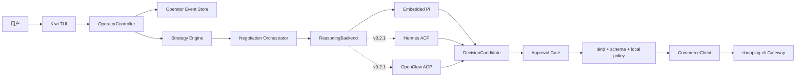
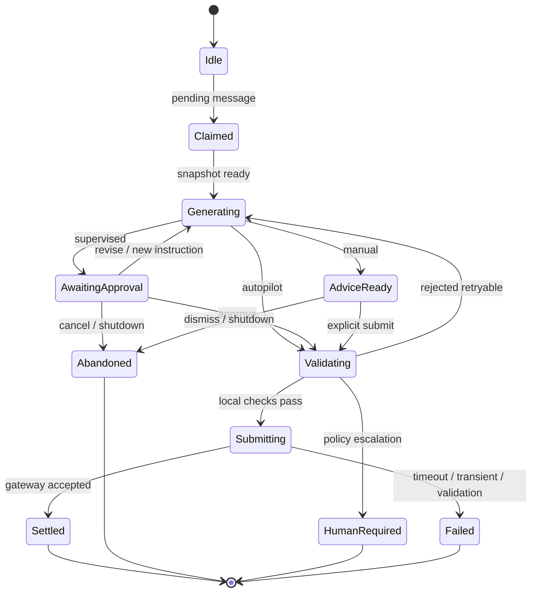

# Kiwi 操作者 TUI 与策略控制设计（v0.2）

状态：v0.2.0 操作者控制面与 TUI 已在当前工作树实现（`src/operator/` 与 `kiwi tui` 命令）。候选生成当前由确定性 `DeterministicNegotiationRunner` 完成（与 fake 模型共用纯规则函数，prepare/submit 分离）；Embedded Pi 候选后端是已文档化的下一集成钩子，Hermes / OpenClaw ACP Adapter 仍为 v0.2.1 设计、未实现。
目标：让 Kiwi 成为可被用户持续指导的独立电商 Agent。用户可以在 TUI 中指导自己的 buyer 或 merchant、设置私有策略、审阅候选行动并随时暂停或接管，同时保留 Kiwi 现有的策略门、幂等、审计和 Commerce 安全边界。

## 1. 设计结论

Kiwi TUI 不是 JSONL 日志的图形包装，也不是通用聊天助手。它是买方或商家自己的**电商磋商驾驶舱**：

- 用户与自己的 Kiwi Agent 私下交流，表达目标、偏好和本轮指令。
- Kiwi Agent 读取 Marketplace 的权威磋商状态，形成结构化 `DecisionCandidate`。
- 根据运行模式，候选决策自动提交、等待用户批准，或只作为建议展示。
- 任何正式对外消息仍必须经过 Kiwi 本地校验和 shopping-cli 权威策略门。
- Buyer 与 Merchant 保持两个独立身份、独立进程、独立 token 和独立 TUI；一个进程不得同时持有双方凭据。

0.1.0 已经完成安全执行底座。v0.2 的核心工作不是重写 negotiation runtime，而是在它之前增加 `Operator Control Plane`（操作者控制面）和可暂停的审批状态机。

## 2. 产品模型

| 产品          | 用户关系                        | 主要职责                                   |
| ------------- | ------------------------------- | ------------------------------------------ |
| Hermes        | 用户指导通用 Agent 完成多种任务 | 通用操作、工具调用、技能与会话             |
| Kiwi Buyer    | 用户指导自己的采购 Agent        | 询价、比较、压价、交付与售后条件判断       |
| Kiwi Merchant | 商家指导自己的销售 Agent        | 报价、库存说明、时效承诺、折扣与售后策略   |
| shopping-cli  | 买卖双方共享的 Commerce Gateway | 电商语义、权威会话状态、策略门、写入与审计 |

Kiwi 借鉴 Hermes 的可对话和可恢复体验，但保持电商垂直边界：TUI 中的用户指令不能直接变成交易对手可见消息，也不能绕过硬策略。

## 3. 目标与非目标

### 目标

1. Buyer 和 Merchant 都可以用独立 TUI 长期前台运行。
2. 用户可以用自然语言设置会话策略和下一轮指令。
3. 用户可以查看对方消息、Agent 分析、候选决策、公开草稿、策略命中和风险提示。
4. 支持 `autopilot`、`supervised`、`manual` 三种运行模式。
5. 支持批准、驳回、重算、编辑公开草稿、暂停、恢复和转人工。
6. 重启后恢复操作者会话、有效策略和待审批状态。
7. 保留 `kiwi agent run` 作为无 TUI 的 headless 运行方式。
8. TUI 与未来 Web、移动端共用同一个 `OperatorController`，避免把业务逻辑写死在终端组件中。

### 非目标

- 不在 v0.2 引入订单、支付、库存锁定或退款执行。
- 不把 Buyer 与 Merchant 合并到一个持有双方 token 的进程。
- 不允许自然语言直接覆盖预算上限、商家底价等硬约束。
- 不把 TUI transcript 当作 Marketplace 的权威磋商记录。
- 不在 UI 层直接调用 Commerce API 或复制策略门。
- 不要求外部 Agent Adapter 才能使用 TUI；v0.2.0 以确定性 runner 跑通（不依赖模型凭据），Embedded Pi 候选后端留作下一集成钩子。
- 不在 v0.2.0 改变 shopping-cli 0.1 的 Buyer token 单会话范围；Buyer TUI 一次绑定一个 conversation，多会话凭据与队列编排留到 v0.3。

## 4. 总体架构



边界要求：

- `Kiwi TUI` 只渲染状态和发出操作者命令。
- `OperatorController` 管理策略、模式、审批和生命周期，不直接构造 Commerce HTTP 请求。
- `ReasoningBackend` 只返回不可信的 `DecisionCandidate`，不持有 Commerce token。
- `Negotiation Orchestrator` 继续负责 claim、heartbeat、timeout、重试和结算。
- `CommerceClient` 与 shopping-cli Gateway 继续负责唯一正式写入路径。

## 5. 三个状态域必须分离

### 5.1 Marketplace Conversation

买卖双方正式消息和权威电商快照。由 shopping-cli 保存，是跨进程恢复 A2A 磋商的唯一业务真相源。

### 5.2 Operator Session

用户与自己 Agent 的私有会话，包括策略说明、审批记录、暂停状态和解释请求。由 Kiwi 本地保存，永远不自动发送给交易对手。

### 5.3 Reasoning Session

模型完成一个 turn 所需的短期上下文。默认按 turn 创建；同一 turn 内修复可复用，跨 turn 从 Marketplace snapshot 与已编译策略重新构建。

这三个状态域不能合并。特别是用户对 Agent 说的“我的最高预算是 500 元”属于 Operator Session；交易对手只能看到经过策略门检查后的公开回复。

## 6. 消息与事件类型

建议把操作者控制面建模为追加式事件流，而不是直接修改一份无历史状态：

```text
OperatorEvent
  ├── operator.message
  ├── strategy.patch.proposed
  ├── strategy.patch.applied
  ├── strategy.patch.rejected
  ├── mode.changed
  ├── negotiation.paused
  ├── negotiation.resumed
  ├── candidate.generated
  ├── candidate.approved
  ├── candidate.rejected
  ├── candidate.revised
  ├── decision.submitted
  └── turn.settled
```

每个事件至少包含：

- `event_id`
- `occurred_at`
- `agent_id` 与 `role`
- 可选的 `conversation_id`、`message_id`、`candidate_id`
- 类型化 payload 与 `visibility: private | public_draft | public_sent`
- 操作者身份来源，例如 `local_tui`

私有事件库可以在 0600 文件中保存用户与自己 Agent 的对话，以支持会话恢复；API key、Commerce token 和其他 secret 在任何情况下都不得进入事件。普通日志、turn report 和导出结果只能得到脱敏摘要，不能读取 `visibility: private` 的原文或私有策略值。

## 7. 三层策略模型

### 7.1 硬约束 `HardPolicy`

长期、可执行、不可被模型突破的安全边界，例如：

- Buyer 最高总价、目标 SKU、数量、最晚送达时间、必需售后条款。
- Merchant 最低单价、最大自动折扣、报价有效期、库存来源。
- no-order、no-payment、no-reservation 等产品级边界。

当前 profile 中的 `buyer_policy` / `merchant_policy` 是硬约束的起点。任何放宽硬约束的变更都必须结构化校验，并要求用户显式确认。

### 7.2 会话策略 `SessionStrategy`

作用于一个操作者会话或一个指定磋商，例如：

- 优先争取包邮。
- 不主动暴露急迫程度。
- 库存低于 5 件时转人工。
- 对新客户最多自动让价一次。

会话策略影响模型如何选择候选行动，但不能扩大 `HardPolicy` 的权限。

### 7.3 单轮指令 `TurnInstruction`

只作用于下一次决策，例如：

- 这一轮只问交期，不接受报价。
- 如果对方不同意包邮，就接受当前非约束性方案。
- 重新解释为什么当前报价不满足要求。

单轮指令在一次候选决策被提交、驳回或取消后失效，避免旧指令意外影响后续 turn。

## 8. 自然语言策略编译

用户输入不能直接拼进 negotiation system prompt。建议流程：

```text
用户自然语言
  -> StrategyCompiler
  -> StrategyPatch（结构化候选）
  -> schema + 权限 + 风险校验
  -> TUI 展示差异
  -> 自动应用或显式确认
  -> EffectiveStrategy
```

`StrategyPatch` 必须区分：

- `tighten`：收紧约束，例如降低 Buyer 预算上限，可确认后应用。
- `soft_preference`：增加不突破硬约束的偏好，可按配置直接应用。
- `relax`：放宽约束，例如提高预算或降低商家底价，必须二次确认。
- `forbidden`：试图取消 no-order、安全门或身份隔离，始终拒绝。

以下变化必须显式确认：

1. 提高 Buyer 预算上限。
2. 降低 Merchant 最低售价。
3. 放宽交期或售后要求。
4. 从 `supervised` / `manual` 切换为 `autopilot`。
5. 将可能包含私有信息的文字放入 `public_message`。

## 9. 三种运行模式

| 模式         | Agent 行为                       | 正式提交                     |
| ------------ | -------------------------------- | ---------------------------- |
| `autopilot`  | 在硬策略内自动分析、生成并提交   | 通过所有策略门后自动执行     |
| `supervised` | 自动分析并生成候选决策和公开草稿 | 用户明确批准后执行           |
| `manual`     | 只给出分析、风险和建议           | 不自动提交，用户必须主动发起 |

默认模式应为 `supervised`。首次使用或发生以下风险时，即使当前是 `autopilot`，也应进入审批：

- `human_review_on` 命中。
- 候选决策为 `accept_nonbinding`、`decline` 或 `escalate`，且 profile 要求审阅。
- 模型置信度低于阈值。
- 策略之间冲突或 snapshot 缺少关键字段。
- 对方消息含可疑提示注入、异常售后承诺或超出 capability 的要求。
- 本地或服务端策略门返回 `human_required`。

## 10. 可暂停的 turn 状态机

0.1.0 是“模型生成后立即 submit”。v0.2 把生成和提交拆开（prepare/submit 分离，已在当前工作树实现）：



等待用户审批期间必须继续 heartbeat，避免 claim 被 stale recovery 抢走。若 TUI 退出或审批超过有界超时，默认 `abandonClaim`，不得把未批准候选标成 complete。

## 11. TUI 信息架构

```text
┌ Kiwi Buyer · buyer-001 · Supervised ─────────────────────────┐
│ 会话 CONV-0002   状态: 等待我方决定   模型: deepseek-v4-flash │
├────────────────────┬──────────────────────────────────────────┤
│ 当前会话            │ 与 Merchant 的正式磋商                  │
│ > CONV-0002        │ Merchant: 2 件，每件 89 元，3 日内发货   │
│ Buyer 0.2 单会话    │                                          │
│                    │ Kiwi 分析                                │
│ 当前策略            │ · 总价在硬约束范围内                     │
│ 数量: 2             │ · 售后条款满足                           │
│ 最晚送达: 8月10日   │ · 可以继续争取包邮                       │
│ 审批模式: 监督      │                                          │
├────────────────────┴──────────────────────────────────────────┤
│ 公开草稿: 价格可以接受，请确认是否可以包邮。                   │
│ [批准发送] [要求重算] [编辑] [暂停] [拒绝]                     │
├───────────────────────────────────────────────────────────────┤
│ 对 Kiwi 说：先争取包邮，如果不同意就接受当前报价。             │
└───────────────────────────────────────────────────────────────┘
```

界面必须用明显标签区分：

- `私有`：仅用户和自己的 Kiwi 可见。
- `公开草稿`：批准后可能发送给交易对手。
- `已发送`：已经进入 Marketplace 的权威记录。
- `硬约束`：模型无权突破。
- `建议`：仅供用户参考，不代表已提交。

“Kiwi 分析”只展示基于 snapshot、策略命中和公开 `reason_codes` 生成的简洁决策说明，不展示或持久化模型原始思维链。

## 12. CLI 与交互命令

建议保留现有命令并新增：

```bash
# 明确进入 TUI
kiwi tui --profile buyer.yaml
kiwi tui --profile merchant.yaml

# 可选快捷方式：提供 profile 且没有子命令时进入 TUI
kiwi --profile buyer.yaml

# 现有 headless 路径保持兼容
kiwi agent run --profile buyer.yaml
kiwi agent run --profile buyer.yaml --once
```

TUI 同时接受自然语言和明确命令：

```text
/strategy                查看当前有效策略及其来源
/mode supervised         切换运行模式
/approve                 批准当前候选决策
/reject [原因]           驳回当前候选并记录原因
/revise <指令>           带新指令重新生成
/pause                   停止领取新消息
/resume                  恢复领取消息
/why                     解释当前候选与策略命中
/history                 查看操作者事件和正式磋商历史
/usage                   查看模型调用与 token 用量
/quit                    安全退出并结算或 abandon 在途 claim
```

命令应调用 `OperatorController` 的类型化方法，不在 TUI 组件中复制状态转换。

## 13. 建议的内部接口

```text
OperatorController
  start() -> AsyncIterable<OperatorViewEvent>
  sendOperatorMessage(text) -> StrategyPatch | TurnInstruction | Explanation
  setMode(mode) -> ModeChangeResult
  approve(candidateId) -> TurnResult
  reject(candidateId, reason?) -> void
  revise(candidateId, instruction) -> DecisionCandidate
  pause() -> void
  resume() -> void
  shutdown() -> ShutdownResult

StrategyEngine
  compile(text, context) -> StrategyPatch
  assessRisk(patch, effectivePolicy) -> StrategyRisk
  apply(patch) -> EffectiveStrategy
  buildTurnContext(snapshot, instruction?) -> CompiledTurnStrategy

ApprovalGate
  route(candidate, mode, policy, risk) -> auto_submit | await_approval | advice_only
```

TUI 只依赖 `OperatorViewEvent` 和这些类型化命令。未来 Web、桌面或移动端可以复用同一控制器。

## 14. 持久化与恢复

建议每个 Kiwi 身份使用独立私有数据目录：

```text
<instance>/agents/<agent_id>/
  operator-events.jsonl       # 追加式私有事件库，0600
  operator-state.json         # 当前模式、暂停状态、版本化快照，0600
  strategies/                 # 会话策略和来源，目录 0700
  pending-approvals/          # 未决候选，只含脱敏/结构化内容，目录 0700
```

恢复规则：

1. Marketplace snapshot 始终覆盖本地缓存的对外会话状态。
2. `operator-state.json` 通过事件流校验或重建，损坏时 fail closed。
3. 待审批候选恢复后必须重新获取 snapshot，确认 `conversation_id`、`message_id`、claim 和 `next_actor` 仍匹配。
4. 任何不再匹配的候选标记为过期，不得提交。
5. 策略文件和状态文件都带 schema/version；未知字段或未知版本拒绝加载。

## 15. 与 Pi、Hermes、OpenClaw 的关系

### v0.2.0：确定性 Runner（Embedded Pi 为下一集成钩子）

当前工作树中，控制面与 negotiation runtime 之间的安全缝是 `NegotiationRunner` 接口：prepare 只 claim、取 snapshot 并生成不可信候选，不做任何 Commerce 写入；submit 复用与 headless turn 相同的门（buyer 本地策略门 -> 网关权威策略门 -> claim 结算）。v0.2.0 交付的 `DeterministicNegotiationRunner` 与 fake 模型共用同一组纯规则决策函数，TUI 因此不依赖任何模型凭据即可运行。Pi Agent Core 已提供消息、stream、abort、steering、follow-up queue 和自定义 UI-only message 等底层能力；下一集成钩子是把现有一次性模型循环封装为遵循同一 prepare/submit 契约的 `PiNegotiationRunner`（Embedded Pi 候选后端），仍只暴露 Commerce 的两个受限工具。

### v0.2.1：Hermes / OpenClaw

Hermes ACP 和 OpenClaw ACP 作为 `ReasoningBackend` 实现接入。外部 Agent 只生成 `DecisionCandidate`，不获得 Commerce token、文件工具或任意 HTTP 权限。操作者控制面、策略编译和审批状态机不随推理后端变化。

完整 Adapter 边界见 [`external-agent-adapters-v0.2.md`](external-agent-adapters-v0.2.md)。

## 16. 安全不变量

1. 一个 Kiwi 进程只代表一个身份和一个角色。
2. 操作者私有消息永远不自动复制到 `public_message`。
3. 模型、TUI 和外部 Agent 都不能绕过 `HardPolicy`。
4. 所有正式写入仍走 `submitNegotiationDecision` 和 Gateway 权威策略门。
5. 等待审批、超时、退出和崩溃不会 complete 未提交的 claim。
6. 公开草稿提交前重新做 schema、绑定、预算/底价、交期、售后和泄露检查。
7. 重放批准命令保持幂等，同一 `candidate_id` 不产生重复正式消息。
8. 日志、事件、错误和用量报告不包含 token、API key 或私有阈值值。
9. Buyer 与 Merchant 的本地目录、进程环境和 token 不共享。
10. TUI 不能引入订单、支付、退款或库存预留的隐藏路径。
11. TUI 不显示、记录或导出模型原始思维链，只提供可审计的决策摘要与理由代码。

## 17. 失败与退出语义

| 情况                        | 行为                                                  |
| --------------------------- | ----------------------------------------------------- |
| TUI 正常退出、无在途 claim  | 保存状态并退出 0                                      |
| TUI 退出、候选等待审批      | best-effort abandon claim，候选保留为过期审计记录     |
| 审批超时                    | 默认 abandon，不自动批准                              |
| 模型或外部 backend 暂时失败 | fail/abandon claim，保留可重试状态                    |
| StrategyPatch 非法          | 不应用，向用户解释具体字段和风险                      |
| 恢复时候选绑定已过期        | 标记过期并重新生成，不提交旧候选                      |
| Gateway 已接受但响应丢失    | 依赖内容寻址幂等键重放并完成 claim                    |
| 操作者请求突破产品边界      | fail closed，保留拒绝事件，不改变策略或 Commerce 状态 |

## 18. 测试与验收

### 单元测试

- 三层策略优先级和作用域。
- `tighten`、`soft_preference`、`relax`、`forbidden` 风险分类。
- Buyer 预算和 Merchant 底价放宽必须确认。
- 私有操作者消息不能进入公开草稿或 Commerce request。
- 三种模式的 Approval Gate 路由。
- approve/reject/revise/pause/resume 状态转换与非法转换。
- 等待审批期间 heartbeat 持续且不重叠。
- 退出、超时和 abort 的 claim 结算。
- 事件流恢复、损坏文件和未知版本 fail closed。
- 过期候选不能提交，重复批准保持幂等。
- TUI snapshot / reducer 测试，不调用真实模型。

### 集成测试

1. Buyer supervised：Merchant 报价 → 生成草稿 → 用户批准 → 正式 counter。
2. Buyer revise：用户追加“先争取包邮” → 旧候选失效 → 新候选提交。
3. Merchant manual：Agent 给出建议但 Gateway 消息数不变。
4. Autopilot 风险升级：命中 `human_review_on` 后进入待审批而非自动提交。
5. TUI 重启：恢复策略和待审批状态，重新校验 snapshot 后继续。
6. 双安装隔离：Buyer TUI 无法读取 Merchant token、策略和本地事件。
7. 真实 shopping-cli Gateway 下完成 `counter -> accept_nonbinding`，库存不变且无订单副作用。

## 19. 分阶段交付

### v0.2.0：TUI 基础版（已在当前工作树交付）

- `OperatorController` 与追加式事件模型。
- 三层策略和 `StrategyPatch` 风险校验。
- `DecisionCandidate` 与 Approval Gate。
- `autopilot`、`supervised`、`manual`。
- Buyer / Merchant 独立 TUI。
- approve、reject、revise、pause、resume、why、history、usage。
- prepare/submit 分离的可暂停 turn（以确定性 runner 交付）。
- 操作者状态和待审批恢复。
- 保持 headless CLI 兼容。

### v0.2.1：外部 Agent 后端

- `ReasoningBackend` 稳定接口。
- Hermes ACP 与 OpenClaw ACP Adapter。
- 三种 backend 共用同一策略、审批、安全和审计路径。
- fake ACP 集成测试与真实本机 smoke。

### v0.3

- 多会话并发队列与风险排序。
- Buyer 多会话凭据管理与 conversation 切换。
- 策略模板、版本和回滚。
- 远程 Web / 桌面 / 移动控制面。
- 可选的长期外部 Agent session 和受限 Commerce Tool Broker。

## 20. 完成定义

Kiwi 只有在以下链路全部有现实测试证据时，才宣称具备“像 Hermes 一样可互动、但专注电商买卖双方”的能力：

1. 用户启动独立 Kiwi Buyer 或 Merchant TUI。
2. 用户能用自然语言设置策略，例如“最多买两件，先争取包邮，不接受更晚交付”。
3. 对方消息到达后，Agent 生成分析、候选决策和明确标记的公开草稿。
4. `supervised` 模式下，未获得批准前 Gateway 没有新增正式消息。
5. 用户可以批准、追加指令重算、暂停或转人工。
6. 正式决策仍经过现有绑定、schema、本地策略和 Gateway 权威策略门。
7. 重启后能够恢复操作者策略和待审批工作，但过期候选不会被错误提交。
8. Buyer 与 Merchant 两个真实独立安装可以交替磋商，双方私有策略和凭据不泄漏。
9. 不运行 TUI 时，Kiwi 仍能作为 headless Agent 独立运行。
10. 全链路仍然不创建订单、不支付、不锁库存。
