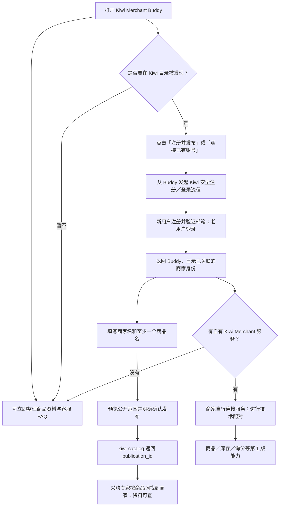

# Kiwi Merchant Buddy 第 1 版产品流程设计：应用内注册与自有服务可选连接

状态：产品设计稿，待 WorkBuddy 预览验证；2026-09-17。已根据平台核验结果决定采用**买方、商家两个连接器**。买方“Kiwi 采购询价”已发布；新增商家连接器、共享商家入口及 Buddy 应用的发布状态另行验收。

基线：[第 0 版设计](v0-ai-cs-and-pull-subscriptions-design.md)及 [M0 开发任务](merchant-buddy/v0-m0-catalog-to-expert-development-brief.md)。本文件保留第 0 版的公开资料、采购专家发现、AI 客服准备和买家主动拉取式关注，重点修订“从 Buddy 打开到注册/发布”的入口，并增加可选的商家自有服务连接。本文的“第 0/1 版”是**产品能力分期**，不要与仓库 `workbuddy-buddy-app-dev-plan.md`、`merchant-buddy-v2-dev-plan.md` 中历史工程里程碑 V1/V2 混用。

## 1. 一句话定义与关键决策

商家打开 Kiwi Merchant Buddy 后，即可使用不依赖专属服务器的资料整理、AI 客服准备和原有店铺运营辅助；可在 Buddy 引导下**完成 Kiwi 目录注册、邮箱验证、公开资料发布并返回 Buddy**，无需自行寻找 Kiwi 官网。只有商家希望启用实时商品、库存、询价、7×24 接待等能力时，才连接其自己部署的 Kiwi Merchant 与 `shopping-cli`。

1. `kiwi-catalog` 运行在 Kiwi 运营的服务器上。注册是自助建号和邮箱验证，不需要 Kiwi 人工批准；注册获得稳定 `merchant_id`，但**注册不等于公开发布，也不等于可被搜索**。
2. Kiwi Merchant / `shopping-cli` 运行在商家自己的服务器上。商家管理自己的服务**不需要 Kiwi 或 WorkBuddy 审批**。若让 WorkBuddy 远程调用该服务，商家还需完成一次技术性连接/配对，防止任何知道地址的人访问私有数据；配对不是平台审批。
3. 目录账号连接、商家自有服务连接、WorkBuddy 平台的应用授权是不同的动作，界面文案和凭证不得混在一起。商家无专属服务器时，既能使用第 0 版，也能注册/发布到目录；不能被自有服务绑定弹窗卡住。
4. 买方“Kiwi 采购询价”专家仍只做采购。商家 Buddy 不获得采购能力；第 0 版公开资料只可查、不可实时询价；第 1 版商家服务健康且已开通询价时才显示可实时询价。
5. 买家关注仍然是**买家主动关注、主动拉取**公开更新。商家不得主动推送，也不能获得关注者身份列表。
6. WorkBuddy 侧采用**两个连接器**：保留已发布的“Kiwi 采购询价”（买方），新增“Kiwi 商家运营”（商家）。商家连接器同时承载第 0 版目录能力和第 1 版自有服务连接，不再另拆目录/自有服务连接器。买方维持现有 ID、source、stdio 运行方式和专家依赖；商家侧独立走远程 MCP + OAuth。两者共用 `kiwi-catalog` 的公开资料和商家标识，凭据、私有任务与权限分别管理。

## 2. 三个边界：身份、目录、商家自有服务

| 对象 | 运行与数据归属 | 用户要做什么 | 结果与限制 |
| --- | --- | --- | --- |
| WorkBuddy / Buddy 应用 | WorkBuddy 侧；提供对话、场景和连接器入口 | 打开应用，按需连接能力 | WorkBuddy 的应用授权不等于 Kiwi 商家注册，也不能代替商家服务器的凭据 |
| `kiwi-catalog` | Kiwi 运营的共享服务器；保存账号与商家明确发布的公开资料 | 在 Buddy 引导下注册或登录、验证邮箱，确认发布 | 分配 `merchant_id`；公开资料可进入专家搜索；私有账号字段不自动公开 |
| 商家自有 Kiwi Merchant + `shopping-cli` | 商家自己的服务器；保存真实商品、库存、询价、审批与运营状态 | 商家自行部署/管理；需要 Buddy 代操作时再配对 | 不需要 Kiwi 人工批准；服务必须验证调用方，不能因为“商家拥有服务器”就开放匿名 MCP |

**OAuth 的准确作用**：商家连接器访问私有资料时，商家确认允许 WorkBuddy 以其已验证身份、在限定 scope 内调用商家服务。现有买方连接器继续使用本地 stdio，不因商家上线而新增 OAuth 要求。OAuth 不负责商家服务器部署，也不是“批准商家使用自己的服务器”。自有服务仍需技术配对与服务端凭据校验；商家写操作继续“生成候选 → 商家管理页确认 → 执行”，不能把连接成功等同于批准所有变更。

## 3. 从打开 Buddy 到被采购专家发现

### 3.1 首次打开：先有价值，再选择连接

- 首页明确提供“整理现有店铺商品”“准备 AI 客服 FAQ”“注册 Kiwi 并发布商品”“连接我自己的 Kiwi Merchant 服务”四类入口。前两项不要求目录账号或专属服务器；涉及淘宝/京东实际 API 操作时，仍须相应平台独立授权，不能把文案整理说成自动上架。
- 如果 WorkBuddy 首次弹出应用授权/连接器绑定框，用户应能理解它与 Kiwi 注册的关系；理想流程允许“稍后连接”，并继续第 0 版无账号任务。**能否如此配置须以 Buddy 预览实测为准**，不能仅靠提示词宣称可跳过。
- 不以聊天消息收集 Kiwi 密码、邮箱验证码、商家服务器密钥或 `shopping-cli` 凭据；聊天只承载解释、状态和非敏感资料草稿。

### 3.2 注册/登录：在 Buddy 中发起，完成后回到 Buddy

1. 商家点击“注册并发布”；若已注册则选择“连接已有账号”。Buddy 通过新增的“Kiwi 商家运营”连接器发起商家目录授权流程；由 Kiwi 运营的安全页面提供“注册 / 登录”双入口。用户**不需要自行访问 Kiwi 官网或另找注册链接**，也不需要先安装买方连接器。
2. 新用户填写商家名、邮箱、密码并验证邮箱；老用户登录。账号服务从真实登录会话取得 `merchant_id`，不能由模型、URL 参数或用户输入任意指定。
3. 完成后恢复同一次连接流程，商家确认 WorkBuddy 可访问的最小目录权限；成功回到 Buddy，显示“已连接商家：名称”。注册失败、验证超时、拒绝授权时保留前面的非敏感草稿，提供重试，不误报已连接。
4. “在 Buddy 中完成注册”是**应用内引导和回到应用的连续体验**；WorkBuddy 官方文档当前明确的是 MCP OAuth 打开浏览器授权，并未承诺原生对话内注册表单。因此注册页可能在浏览器/授权窗口中呈现，是否可嵌入应用窗口须预览验证。无论呈现方式如何，密码必须只输入 Kiwi 受控的安全表单。

### 3.3 发布：注册之后再发生的显式动作

- 商家填写公开商家名、至少一个商品名，可选类目、简介和确认安全的公开店铺链接；Buddy 可帮忙起草，但默认是私有草稿。
- 发布前展示公开预览，说明采购专家和买家将看到什么；电话、邮箱、订单、客户资料、内部底价、库存与凭据不自动公开。商家明确确认后，目录写入 `MerchantPublication`，返回 `publication_id`、版本、发布时间及可撤回入口。
- 已注册但未发布、只保存草稿、发布失败、已撤回或治理挂起的商家不进入正常专家搜索。公开结果标记“商家声明资料”、更新时间及 `inquiry_available=false`。买方 RFQ 在服务端被拒绝，不能仅依赖专家文案。
- 商家升级到第 1 版时保留同一个 `merchant_id` 与既有关注关系；公开资料与实时商品数据分开标来源，冲突时让商家确认，不静默覆盖。

## 4. 可选升级：连接商家自己的服务

第 1 版连接发生在**账号/目录流程之外**：商家可以先注册发布再部署服务，也可以先拥有服务再来注册目录；无论哪种顺序，目录身份不自动取得服务器控制权。

能力范围沿用现有 Merchant 实现，不把第 1 版缩成“仅有库存与询价”：

| 能力组 | 第 0 版：仅 Buddy + 目录 | 第 1 版：已连接自有服务 |
| --- | --- | --- |
| 商品运营 | 整理商品文案、资料导出；确认后发布商品名等基本资料到目录 | 商品列表/详情，商品创建和修改候选，CSV 导入与批量撤回任务 |
| 库存与店铺状态 | 不声称拥有实时库存、价格或店铺 API 控制权 | 库存读取与调整候选，上下架/销售状态候选；实际可执行性以 `shopping-cli` 能力探测为准 |
| 询价与接待 | 采购专家只能看公开资料，不能向该商家发实时 RFQ | 7×24 A2A 接待、磋商记录、人审队列、待批准裁决与运营策略变更候选 |
| 分析与呈现 | 公开资料/FAQ 准备与来源标注 | 经营摘要、操作任务状态、展示资源；后端不可用时明确“不可得” |
| 执行控制 | 公开资料须商家确认发布 | 写操作先生成候选，商家经独立管理确认页批准后才执行；Buddy/模型不能自批 |

第 1 版的完整能力以现有 `kiwi_merchant_*` 工具及对应管理入口为准，不能把“技术配对成功”文案写成“已自动获得所有平台店铺权限”。

1. Buddy 显示“连接我的 Kiwi Merchant 服务”向导：说明服务器需由商家部署并保持运行，`shopping-cli` 在该服务器端，不会因安装 Buddy 自动安装到用户电脑。
2. 商家在商家连接器引导的安全配对流程中登记服务地址，并在其服务端生成连接凭据或一次性配对码；共享商家入口验证地址、服务身份、凭据、可用能力与版本，再将服务绑定至已验证的 `merchant_id`。不能仅靠模型参数或客户端自填 URL 决定请求路由。服务未部署或不健康时，只将第 1 版工具置为不可用，**第 0 版和目录发布继续可用**。
3. 已配对后开放商家商品、库存、询价、人审队列、经营摘要与变更候选等现有能力。读取和写入须按该商家服务自身的主体、租户及权限校验；高风险写操作仍须管理页确认。
4. 商家服务的 7×24 接待由其服务器运行时负责，**不依赖 Buddy 窗口一直打开**。Buddy 是运营入口，不是长期接待进程；停止商家服务后应如实标“实时询价不可用”。
5. 商家可断开连接、轮换凭据、换服务器；不得因为改连接而把 A 的请求路由到 B。新服务认领当前 `merchant_id` 时需要证明控制权；该证明属于防冒用的技术安全检查，不是 Kiwi 对商家自有服务的人工审批。

### 两个连接器：保留买方，新增商家

2026-09-17 的[平台核验](merchant-buddy/workbuddy-connector-platform-verification-2026-09-17.md)确认：已发布买方连接器在用户电脑上运行本地 stdio MCP，未配置 OAuth。用户据此选择独立发布商家连接器，避免将商家注册上线与买方传输、登录和任务存储迁移捆绑。此决定取代此前“一份连接器承载买卖双方”的方案。

| 连接器 | 身份与运行方式 | 使用入口 | 职责 |
| --- | --- | --- | --- |
| Kiwi 采购询价（已发布） | ID `oc_bd73f860e3e2b5d3`；`source=kiwi-sourcing`；本地 stdio，`npx @harrylabsj/kiwi@0.8.0`；现有连接层无 OAuth | Kiwi 采购询价专家 | 保留既有搜索、询价、任务、磋商与审批；公开资料发现、关注等后续买方功能按独立兼容版本交付 |
| Kiwi 商家运营（新增） | 新连接器 ID 由平台生成；拟用 `source=kiwi-merchant`，上架前核对唯一性；远程 HTTPS MCP + OAuth | Kiwi Merchant Buddy | 第 0 版注册/登录、公开资料发布/撤回；第 1 版配对自有服务后读取商品、库存、询价并生成变更候选 |

这里的“两个”是**买方 + 商家**。第 0/1 版商家共用一个商家连接器；无自有服务器的商家能先完成目录注册和发布，升级后继续沿用同一 `merchant_id`。

商家连接器配置一个受信任的远程 MCP 入口，服务端连接共享 `kiwi-catalog` 并按已验证租户路由到商家专属实例。独立连接器解决买卖双方的运行方式与版本依赖问题，**多商家隔离、服务认领、OAuth 和安全路由仍需实现**。现有 Veyquo 单实例包不能直接作为通用商家包发布。详见[商家连接器发布门槛](merchant-buddy/generic-merchant-connector-release-plan.md)。

采购专家只声明买方连接器依赖，Buddy 只声明商家连接器依赖；服务端工具注册表分别限定买方与商家操作，不依赖同一连接器的场景识别或提示词来划分权限。一个用户可以安装两者，但买方身份不能直接取得商家权限，商家令牌仍须绑定 `merchant_id` 和 scope。

## 5. 状态、文案与失败恢复

| 状态 | Buddy 应展示的事实 | 可做 / 不可做 |
| --- | --- | --- |
| 未连接目录 | “可先整理资料；注册后才可发布到 Kiwi” | 可做私有草稿；不可宣称已发布或已被专家发现 |
| 注册中/邮箱待验证 | “账号尚未完成验证” | 可继续私有工作；发布按钮不可执行 |
| 已注册、未发布 | “已连接商家账号，尚未公开商品” | 可编辑、预览、确认发布；专家搜索不可见 |
| 已发布、无自有服务 | “资料可查，暂不支持实时询价” | 买家可搜索/看公开资料/按既有规则关注；不可发起 RFQ 或读取实时库存 |
| 已发布、服务已连接且健康 | “资料可查；实时能力以服务状态为准” | 开放已授权的商品/询价运营；写变更先产候选，仍须商家确认 |
| 自有服务离线/凭据失效 | “实时能力暂不可用；公开目录仍可用” | 提供重连/诊断；不返回过期库存冒充实时结果，不丢目录发布 |

拒绝目录 OAuth、关闭授权窗口、邮箱验证失败、目录暂不可达和自有服务离线都必须有明确恢复路径。注销目录账号或撤销连接时，清除对应访问凭据；已发布内容的撤回/治理流程需独立处理，不应默认为“断开连接即删除公开资料”。

## 6. 与买方专家、AI 客服及原有店铺的连续性

- 采购专家继续按第 0 版设计合并公开资料与可实时询价商家，同一 `merchant_id` 不应显示两个商家主体；来源、更新时间与可询价状态是强制字段。第 0 版商家被搜索到，不意味着已部署 Agent 或承诺实时报价。
- 买家明确关注后才形成 `BuyerFollow`；之后只能由买家主动调用更新查询。商家编辑未公开草稿、内部任务、询价记录、订单和价格底线都不进公共事件流，也不存在商家推送 API。
- Buddy 中的 AI 客服第 0 版仍以资料整理、FAQ 草稿、模拟问答为主；商家审核公开后，买方专家可依据公开 FAQ 回答。真正外部渠道自动接待需专属常驻服务及渠道授权，不能由注册目录或安装 Buddy 自动获得。
- 淘宝、京东 POP 店等原有业务可继续运营；Buddy 的文案/资料辅助不等于获得平台 API 权限。若以后接入真实上架、订单和库存同步，应分别申请对应平台授权。

## 7. 实施切片与产品验收门槛

本节定义后续实施顺序；本次仅修订文档。

1. **商家入口与注册闭环**：Buddy 通过新增商家连接器进入远程 OAuth；Kiwi 安全页提供注册/登录、邮箱验证和回到 Buddy 的连续体验。预览验证取消、重试和首次绑定，不要求新商家部署服务器。
2. **目录发布与发现闭环**：商家身份、私有草稿、公开预览、确认发布、回执与撤回完成后，由买方专家搜索验证同一商品及 `merchant_id`；第 0 版 RFQ 在服务层拒绝。若现有已发布买方版本尚未支持该目录搜索/关注能力，单独安排保持 stdio 的买方功能更新，不把它表述为已上线。
3. **新增商家连接器发布**：验证两个独立商家 A/B 的授权与资料隔离，包只声明商家工具，使用与 `kiwi-sourcing` 不同的 source 和新平台 ID。通过解析、OAuth 预览与审核后，Buddy 绑定这个新 ID；采购专家继续使用原买方 ID。
4. **自有服务可选升级**：商家在同一个商家连接器内配对其服务器；验证能力探测、离线恢复、跨商家隔离和管理页审批。保留目录资料及买家关注关系。
5. **7×24 与买方回归**：关闭 Buddy 后商家服务器仍接待，服务离线后不再显示可实时询价；现有买方连接器的启动、任务及审批行为保持可用。

**原 WP3“买方工具远程化”从本轮商家交付依赖中移出**，当前不修改买方包的传输、鉴权、身份或状态存储。买方公开资料搜索/关注等必要业务增量仍可独立排期验证；未来如单独决定买方远程化，再解决平台迁移与旧任务兼容问题。

完成定义：新商家从 Buddy 注册、验证邮箱、发布商品后可被采购专家发现；有自有服务的商家无需 Kiwi 人工批准即可安全配对、使用现有 Merchant 运营能力并由服务器持续接待。商家上线不要求买家迁移本地运行时或重新授权。

## 8. WorkBuddy 预览与已核实的外部条件

1. 验证 Buddy 的应用级授权与新增商家连接器 OAuth 绑定如何呈现、能否延后；首次体验不能被商家专属服务器连接阻塞。应用回调和商家连接器回调分别配置。
2. 验证商家 OAuth 窗口中的注册、邮箱验证和回跳恢复；关闭窗口或失败后提供明确重试入口。
3. **已核实现状并调整决策**：`oc_bd73f860e3e2b5d3` / v1.0.0、`source=kiwi-sourcing`、本地 stdio + Node 22、最低 WorkBuddy 5.0.0、连接层无 OAuth。原 ID 更新入口存在，但跨传输/OAuth 迁移兼容性未获确认。现决定保留买方并新增商家连接器，**此未知项不再阻塞商家开发或上架**；历史证据见[平台核验记录](merchant-buddy/workbuddy-connector-platform-verification-2026-09-17.md)。
4. 核对新增商家 source 的唯一性、新平台 ID、真实 HTTPS 入口及其 OAuth 回调；若采用 `kiwi-merchant`，按该 source 配置回调，不能复用买方 `kiwi-sourcing` 的回调。
5. 验证两个连接器的专家/Buddy 依赖、工具注册与权限独立；商家 A/B 配对的服务归属由服务端校验，不能仅凭输入 `merchant_id` 认领。

## 参考

- [第 0 版总设计](v0-ai-cs-and-pull-subscriptions-design.md)、[M0 开发任务](merchant-buddy/v0-m0-catalog-to-expert-development-brief.md)
- [WorkBuddy Buddy 应用官方文档](https://open.workbuddy.cn/docs/buddy-app)：首页场景胶囊、内置连接器 OAuth、首次绑定与预览。
- [WorkBuddy 连接器官方文档](https://open.workbuddy.cn/docs/connector)：MCP/OAuth、单连接器单 MCP Server、更新包的兼容要求。
